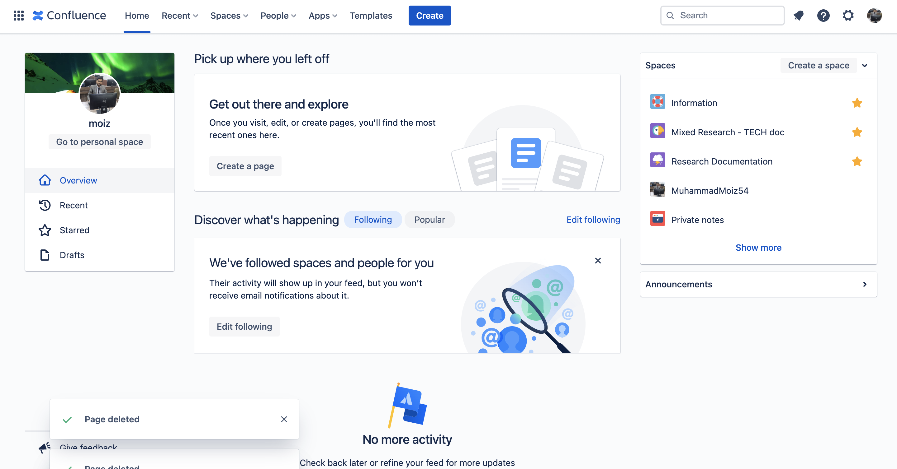
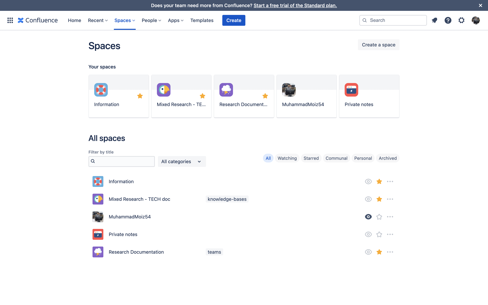

# Confluence

reason not to use confluence for writing notes and making documentations is that its is very cpu intensive and require fast internet to run smoothly and very slow processing to perform any tasks Its irritating me when writing docs that's why not using.. loader keeps moving when deleting spaces and pages etc.

confluence is best for making your project technical documentation

it has pre build template as well for free

usage:

- PRDS Product requirement documents creation
  https://www.atlassian.com/software/confluence/templates/product-requirements

- Project plan
  https://www.atlassian.com/software/confluence/templates/project-plan

- Meeting notes

- Blog post

There are 100s of confluence Templates available to use.
https://www.atlassian.com/software/confluence/templates

my personal space

https://muhammadmoiz.atlassian.net/wiki/templates?space=~5bd054641582cc3b70155e11&template=com.atlassian.confluence.plugins.confluence-business-blueprints%3Aaws-architecture-diagram-blueprint

you can create space in confluence

space is just like collection of files / folder

