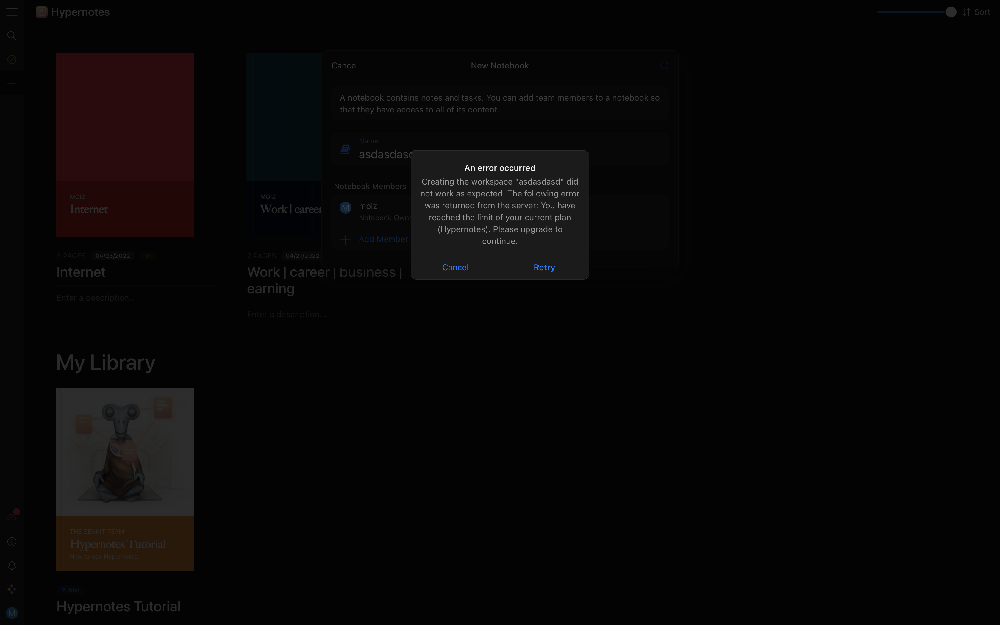
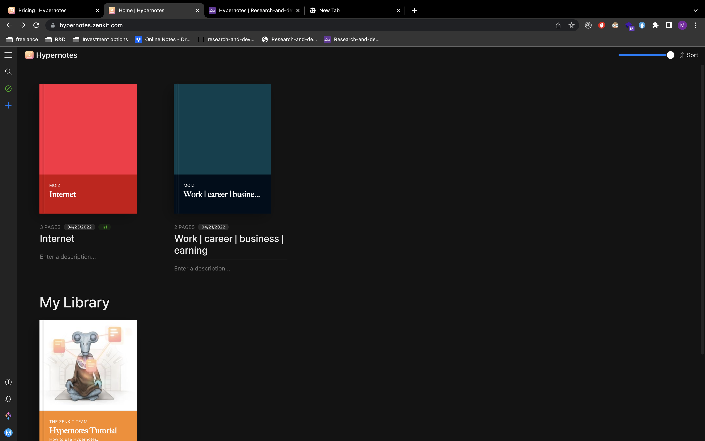
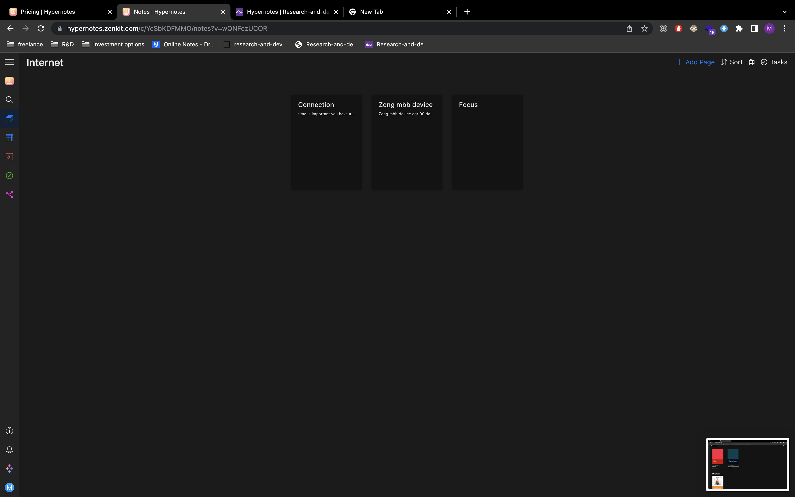
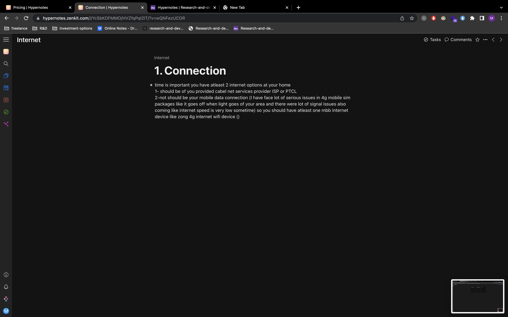

# Hypernotes

I have tried hypernotes but its not free you can create only 3 notebook (means collection of files aka folder) not more than 3 the free plan will exceeded you have to purchase paid plan in order to make new folder or notebook.

pathetic service for free plan they are showing me this error for creating third note

this is their workflow

1.  

2.  

3.  

they have both dark and light theme but this service is not free thats why I quit it and I want my all data at one place so after docusaurus I deleted this account because docusaurus is free and best tool so far.

pricing:

https://zenkit.com/en/hypernotes/pricing/
