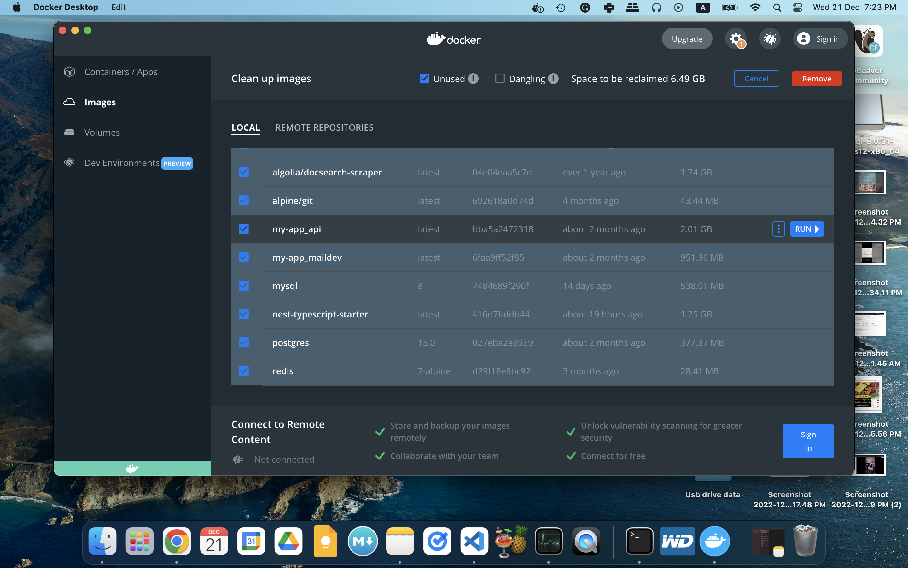

# Docker Desktop

you can use docker Desktop
to

- stop running containers and remove containers as well
- removed images , like unused images
- and much more explore for more

e.g taken on mac

**Docker developer enviornment**

https://youtu.be/9TM4Ry986oY
