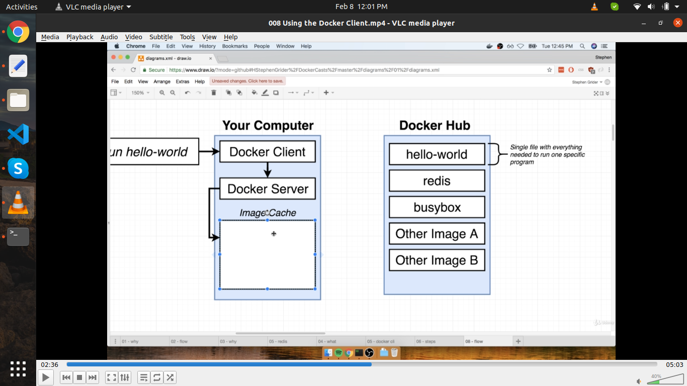

# Learning Docker

### CheatSheet Images & Containers Udemy course

<!-- import ReactPDFViewer from '../../../../src/pages/ReactPDFViewer/index.js'
import pdfFile from "./assets/Cheat-Sheet-Images-Containers.pdf";

<ReactPDFViewer pdfFile={pdfFile}/> -->


When we run docker build it make image of the container
Image we create to use in all other systems like on other PC or server just be jus publishing image to docker hub or we can manually transfer image and use it

Images that contain the code , the setup , the meat you could say
And containers are then the running instances of those images

Docker commands cheat sheet

https://phoenixnap.com/kb/list-of-docker-commands-cheat-sheet

Every instruction in docker is

**layer based architecture**

Whenever you build an image docker caches every instruction result and when you done rebuild an image it will use these cash results it there is no need to run instructions again and this is called a `layer based architecture`

Every instruction represent a layer in your docker file and these layers are cashed
And an image is build up from multiple layers based on these different instructions in addition an image is read only (means code cant change unless you re build an image again)
Container layer
Container is new extra layer on top of the image which is that running application that running code basically the result of executing the command which is specify in docker file

https://www.youtube.com/watch?v=d-PPOS-VsC8&ab_channel=Academind

E.g


When ever one layer changes all other layers are also rebuild (after the change command in docker file) OR in other words all subsequent layers are also rebuild
To be clear : All layers AFTER the changing layer!

But here is a performance drawbag here
If we change something in our code then it also run npm install on every build we make after code change because we first copy our code in docker image and then run npm install so that why it run npm install when there is any change in copy layer becuase npm install command runs after copy command
but we dont install any dependency but just a code change so it shouldn’t run npm install when we do change in our code

E,g


After we move npm install command before copy command


We did optimize our docker build process by just move copy layer after npm install layer

You can test these changes by running build command and check that command is re run or cashed

Summary

Image made up of code and enviornment and setup steps
Image is template/ blue print of your container (like a die of a product like a class to an object)
By using image we can use multiple container
We can instanciate / run multiple container based on an image

The image is the thing that contains your code and so on
The container as you learned its just an extra thin layer on top of the image but still the container in the end ease your running application based on in an image but then once it is running stand alone and independent from other containers that might be running .

I wanna emphasise though that a container doesn’t copy over the code and evn from the image into a new container or file that is not whats happening  
A container will use the env storied in an image an then just add the extra layer on top of it this running node server process for example and allocate resources, memory and so on to run that application but will not copy that code
So our code and the node env is not getting copied 3 times here if one image and 2 containers it exists only once in the image and the containers then utilize that image and the code in it
This is how dockers manage this and that off course very efficient


There are to mode in docker

1. `attached mode` (app running in foreground and stuck to terminal)
   Attached simply means that we are listening to output of that container for example print on console

2. `detached mode` (running in background and exit from terminal)

Diff between docker run command and docker start command

docker run -p 8080:80 image-name //this by default run in attached mode
docker start image-name // this by default run in detached mode

We can run docker run in detached mode by added extra flag -d for run in detached mode

E.g

docker run -p 8080:80 -d image-name // it return container id in response

**Docker attach command :**

You can attach yourself to a detached container again by running
docker container attach container_name

E.g

1. docker ps //fot get image name
2. docker attach image-name

For stop and restart a container
1-docker stop image-name

For restart

2. docker start image-name

Or we can us docker logs command to see the logs of the container

We can follow by adding -f

docker logs -f image-name

**Restart docker container in attach mode (-a flag)**

docker start -a image-name

Complete udemy docker and kubernetes course

**Learn Docker from Stephen grider**


**Docker commands:**

1. Docker run hello-world

   

   

   

Docker run hello-world override-command

E.g

Docker run hello-world echo hello moiz

Docker run hello-world ls

Ls here is override command

Docker ps --all

Show all containers that we have created


Docker create hello-world (this will return container_id)

Docker start -a container_id

-a command is going to make docker actually watch for output from your containe rand printed out to your terminal

-a is attached to the container and watch for output and printed out at my terminal

The difference between docker run and docker start command is that

By default docker run is going to show you the logs and the information coming out of container

By default docker start is the opposite

Docker start is not gonna show you information to the terminal coming out of container

Docker ps --all (list of containers that had stopped)

To Delete all stop containers

Docker systems prune

It shows some warning

- this will clear
- all stop containers
- all unused networks
- all dangling images
- all build cache (it is any image that you pulled/fetched from docker hub)

Docker logs container-id


Docker stop cmd issue **SIGTERM** (terminate signal)
SIGTERM is a message that's going to be receive by the process essentially to shut down on its own time

Sigterm is used any time you want to stop a process inside of your containerand shut the container down and you want to give that process inside there a little bit of time to shut down and do a little bit of cleaning up or may be save some files emit some message or something like that

Docker kill cmd issue **SIGKILL** signal to the primarly running process inside the container its means you have to shut down right now and you don’t get do any additional work.

So ideally we do stop a container using the docker stop cmd in order to get the running process inside of it a little bit of time to shut its off down.

If docker stop wont work then you can use docker kill command

One kind of interesting thing about docker stop is
When you issue docker stop to a container if the container doesn’t automatically stop in 10s then docker is going to automatically fallback to issuing the docker kill command.

Docker stop is (recommended ) to give process a time to smoothly shutdown

Docker rm image_id

E.g docker rm 1e57a07e3783

Docker ps

docker exec -it image_id redis-cli

docker exec -it 1e57a07e3783 redis-cli

**-it flag in docker:**

E.g

docker exec -it 1e57a07e3783 redis-cli

**The purpose of the IT flag.**

Here it flag made up of to flags -i and -t

-i means standard input (STDIN)

And -t means to nicely format input format

Here docker exec -it same as docker exec -i -t

Or we can run below command but this will not nicely formated

Docker exec -i image_id redis-cli


The most common use of docker it command is that
A very common thing that you are going to want to do is to get shell access or terminal access to your running container .
In other words you are going to run commands inside your container without having to re run docker exec docker exec again and again all then.

Run docker container in separate terminal
And run that container using
Docker run container name
Like docker run redis

Open up new terminal and run this command to get full terminal access of running container

Docker exec -it container-id sh

Here “sh” is used to get shell access in unix environment of that container in this case redis container


Control +C won’t exit you can re try using CTRL +D for exit

What is sh ?

Sh is the name of the program its a program that is being executed inside of our container
Sh is a command processor or a shell that something that allows us to type commands in and how than we executed inside that container

Bash for mac os

Powershell for windows

What is difference between kernel and shell?

The main **difference between kernel and shell** is that the kernel is the core of the operating system that controls all the tasks of the system while the shell is the interface that allows the users to communicate with the kernel.

Or use on your custom container

Docker run -it hello-world/ busybox sh

Between 2 containers they don’t automatically share the file system


You can verify by opening 2 or more than conatiner **with sb command in separate terminals**

**D should be small in all commands of docker.**

Like run

Run on terminal 1

Docker run -it busybox sh

Or

docker run -it hello-world sh

Run on terminal 2

Docker run -it busybox sh

Or

docker run -it hello-world sh

Create file in one container from terminal

Touch myfile

And check in other terminal you won't find the same file in 2nd or 3rd container
Because these are completely separate file system docker run

2 running container completely separately file systems and isolated to each other


Docker folder in app dir in its own/virtual file system


Docker -compose

docker build -t muhammadmoiz/docker-compose:latest .

docker run muhammadmoiz/docker-compose (you don’t necessarily have to specify tag on run command but its optional)

OR

docker run muhammadmoiz/docker-compose:latest

**Make separate container running at redis server**

Steps

docker run redis (its gonna reach out to the docker hub and pull down redis instance and will start up the copy of redis on our local machine and boom just like that there is a redis server)

**Each docker container have isolated to other docker container they dont have any communication.**

One use case of Docker compose is that it is use for network connection between containers


Docker cli is not recommended

because its a real pain in the neck to do we make use of docker cli to setup some networking it involve a handful of different commands that have to be re rewrite every single time you startup your different containers now off course we could make some type of little script to run all that stuff for us but you know certainly its gonna involve a lot of typing and a lot of thought on how we’re going to setup all this networking stuff.

I have just about never seen people in industry even make an use of docker cli build in networking features to connect two containers together.

Much more frequently what you are going to see in what you and I going to do in this course we are going to make use of a separate cli tool called **docker-compose** its a separate tool that gets installed along with docker.


The big purpose of docker compose it not going to automate some of these long winded commands its also to make sure that we have the ability to easily startup multiple docker containers at the same time and connect them together in some automated fashion.


In docker compose we are going to write down the commands more or less in a special syntax the yml file we will be feeded to the docker cli and Docker cli will parse that docker.yml files and create all the different containers with the correct configuration the we specified


Sampe docker compose file code:


Notice we have not done and network layer related work its done by docker compose out of the box


**docker-compose up**

The very first line its creating network to join those diff containers together
Creating network "docker-compose_default" with the default driver

**docker-compose up --build** (for build or rebuild) after doing any change in code

**Launch in background**

docker-compose up -d (d for detach)

**Stop Containers**

docker-compose down


process.exit(0) //we exited because we wanted to


Recommend way is that open local server in new tab when ever you run docker-compose run command
Because something chrome doesn't get all new changes on restart page

**You have to make build again using docker-compose run --build only whenever you do change in code not dockerfile change no need to rebuild**

**Always : recommended** if you are running a web server that should be available all the time in production like

**On-failure:** if are work with worker process

For print status of both server using( on opening in new terminal)

**docker-compose ps** // same thing as docker cli

Docker-compose ps command will check and get all your running containers using docker-compose.yml file in your current working directory its not like docker ps command will get all running docker processes/containers but it will get by point to path of working directory

If you run docker-compose ps command to other dir that don’t have any docker-compose.yml file so it show you error of which working dir you are talking about we can’t find docker-compose.yml file

**Docker deployment :**

```jsx showLineNumbers
// for creating docker image on dev
"docker-build-dev": "docker build -f Dockerfile.dev ."
```

**Docker build took more time to make build .**

If you have node_modules installed in your local working directory then docker have 2 dependencies on of local node_modules folder in current directory and second one is docker dependencies that he install through npm install command and this will take more time to make docker build

The fix is that you can delete node_modules from current local working directory then docker build will be executed very fast because it has one only depency to install that is his actual dependency that is necessary to install.

### NodeJS Debugging in Docker

Ref : https://www.youtube.com/watch?v=ktvgr9VZ4dc&ab_channel=ThatDevOpsGuy


Or in deep flow diagrams :


### Docker issues

**When i run this with node:alpine I got stuck at running command not making build**

**docker file for running docker locally**

```bash showLineNumbers

FROM node:alpine

WORKDIR '/app'

COPY package.json .
RUN npm install

COPY . .

CMD [ "npm","run","start" ]

```

**I have fixed this issue by changes node:alpine to node:12.18.1 or any version name except alpine**

# docker file for running docker locally

```bash showLineNumbers

FROM node:12.18.1

WORKDIR '/app'

COPY package.json .
RUN npm install

COPY . .

CMD [ "npm","run","start" ]
```


**what is volume in docker**

What are Docker Volumes? Volumes are the preferred, and extensively used, mechanisms for persisting data generated by Docker containers. Docker volumes basically create a link between one of the local folders on the system and the folder on the docker container.

https://techblog.geekyants.com/understanding-docker-volumes-1#:~:text=as%20one%20package.-,What%20are%20Docker%20Volumes%3F,folder%20on%20the%20docker%20container.

**Docker Volumes:**

Volumes in docker are used to get real time changes when developing application with docker
Volumes done this real time changes of our code to deployed docker container it that volume used references its just mapping folder inside the container to the folder outside the docker container its just like port mapping inside and outside the docker container e.g -p 3000:3001


When we colon it means we want to map a folder inside the container to a folder outside the container like here -v ${pwd}:/app
Pwd :present working dir

When we do not use the colon and we just list the folder inside the container we essentially saying we want this to be a placeholder for the folder that is inside the container
Don't try to make it up against anything like here -v /app/node_modules

**-v /app/node_modules**

This above command tell that do not copy node_modules from outside directory/working dir to inside dir/ container dir because it not present in our current working directory we have deleted to make build faster

Not required if we have installed node_modules in our current working directory project

**I faced some issue when I try to run my image using volume to hot reload**

And that issue is that I have a folder name have space in its name

And when I run this PWD command in

**docker run -p 3000:3000 -v /app/node_modules -v $(pwd):/app image_id**

**I got error of no such file found**

I had fixed the issue by just removing the space from folder name and replaced with an underscore and again made new build and run same command and boom now my hot reloading works

**The sole purpose of docker compose is to make executing docker run easier**

**Docker compose used to simple our complex queries that we have to run from terminal again and again**

**In docker compose correct indentation is very important in order to run your app**

This is not same as (correct one)

```bash showLineNumbers
version: "3"
services:
web:
build: .
ports: - "3000:3000"
volumes: - app/node_modules - .:/app
```

This (wrong one)

```bash showLineNumbers

version: "3"
services:
web:
build: .
ports: - "3000:3000"
volumes: - app/node_modules - .:/app
```

Docker compose up command here will took some time to RUN npm install when making build
Please wait some time to get it done by docker compose
Wait 5 min for docker to install packages

**We dont need to have this**
**COPY . .**
**Instruction when we are running our app in volume** mode because volume will copy those file from our root dir and get reference to it

And tract both container and root directory should be sync if any thing have changed in root dir obviously we can only change root dir not container dir which is make when we run docker build command and that will be sync with our root dir because build will be made by root dir

So you can emit this line from docker file but you can not remove package.json because docker need to install dependencies in container

Removing copy source code to docker container instruction from docker file is not **recommended** because when you will deploy your app on production you need to have this COPY instruction available in dockerfile otherwise your app wont work

**You can only remove this line in development mode with volume**

E.g

```bash showLineNumbers

# docker file for running docker locally

FROM node:12.18.1

WORKDIR '/app'

COPY package.json .

RUN npm install

# COPY . .

CMD [ "npm","run","start" ]

```

This will only work in development with docker volume mode not in production mode

### Docker run with test command

**To run a specific command inside of that container that starts up or to just override the existing command all we have to do is append the command that we actually want to run on the end of the docker run command**

You can append or override

E.g

**Docker run image_id npm run test**

Steps commands are

```bash showLineNumbers
Docker build -f Dockerfile.dev .

Docker run image_id npm run test

Or

Docker run -it image_id npm run test (this is better one to get full command access)
```

### Setup Getting started

1 Installation of docker in linux

ref : https://www.digitalocean.com/community/tutorials/how-to-install-and-use-docker-on-ubuntu-20-04 recommended

https://docs.docker.com/engine/install/debian/#install-using-the-repository

2 Dockerizing a Node.js web app

https://nodejs.org/en/docs/guides/nodejs-docker-webapp/

## Learning docker again

**Image and container**

image is blue print of a container you can make multiple container using an image
or

image is class and container is its object and as in OOP we can make multiple objects of class same as we can make multiple containers of an image in docker same concept applies here.

container will not copy code from image but container allocate resources to run an image like memory and so on to run that application but will not copy that code image do copy code just once.


### Docker commands

> Add --help to see all options

```bash showLineNumbers
to create docker image
$ docker build .

to run docker container from created image
$ docker run -p 3001:3000 <image_id generated by build command>
```


**Images are read only**

every time you make change in code you have to rebuild image of that code

### CMD in docker

This `CMD` command will only run when we run docker container by executing docker run image command
to our container will start our application by using this command inside this `CMD` array

CMD ["node","server.js]
