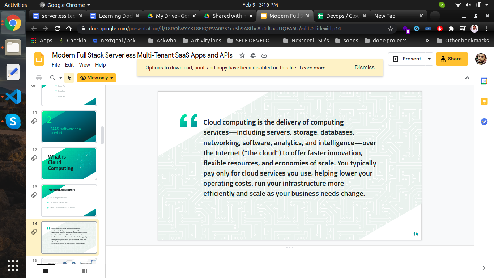

# DevOps, Cloud Computing

## DevOps (development + operations)

**what are the roles and responsibilities of devops engineer **

- Typical responsibilities for devOps engineers include:
- building and setting up new development tools and infrastructure
- understanding the needs of stakeholders and conveying this to developers
- working on ways to automate and improve development and release processes
- testing and examining code written by others and analysing results
- ensuring that systems are safe and secure against cybersecurity threats
- identifying technical problems and developing software updates and ‘fixes’
- working with software developers and software engineers to ensure that development follows established processes and works as intended
- planning out projects and being involved in project management decisions.

## Cloud Computing

What is cloud computing ?

Ref : https://docs.google.com/presentation/d/18RQlWYYKL8FKQPVA0P31cc5b9A8thc8b4dUxUUQFA6U/edit#slide=id.p14

**Sonar cube:**
static code analyzer, code smells ,issues, best practices improvement k liye use krte hain

He is doing code using vim and it has some features which are not available in our modern IDE’s:

https://www.youtube.com/watch?v=BRn6UCw35og

## Tech stack

- [docker](./Docker/docker_.md)

- Amazon DynamoDB
  Fast and flexible NoSQL database service for any scale

## Bookmarks

### Developer Operations - DevOps

- [Developer Operations - DevOps - Software-Development-Pakistan.github.io](https://softdevpk.com/career-paths/DevOps/)

### Devops Roadmap

https://roadmap.sh/devops
