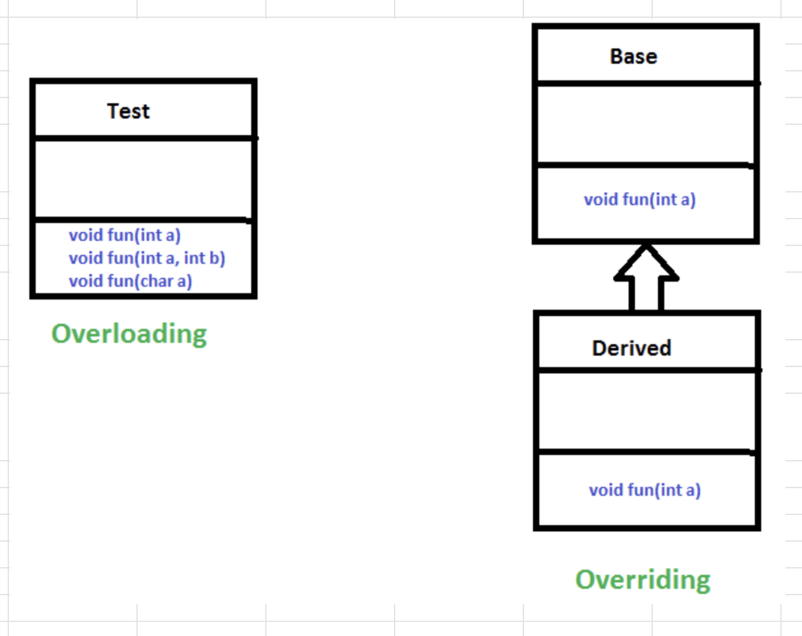

# OOP concepts

The protected modifier specifies that the member can only be accessed within its own package (as with package-private) and, in addition, by a subclass of its class in another package. The following table shows the access to members permitted by each modifier.

https://docs.oracle.com/javase/tutorial/java/javaOO/accesscontrol.html#:~:text=The%20protected%20modifier%20specifies%20that,members%20permitted%20by%20each%20modifier.

**ploymorphism**

https://www.geeksforgeeks.org/polymorphism-in-java/

Is overriding and overloading both polymorphism? yes

The JavaScript comments are meaningful way to deliver message.
It is used to add information about the code, warnings or suggestions so that
end user can easily interpret the code.

https://www.javatpoint.com/javascript-comment

**JavaScript Polymorphism**

The polymorphism is a core concept of an object-oriented paradigm that provides a way
to perform a single action in different forms. It provides an ability to call the same method
on different JavaScript objects.

**What is polymorphism in JavaScript with example?**

In an OOP context, “polymorphism” almost always means just one thing: the overriding
of inherited methods to facilitate calling the same method on different objects
(so, for example, the chapter on OOP in Eloquent JavaScript).26 Jun 2017

https://developer.mozilla.org/en-US/docs/Learn/JavaScript/Objects/Object-oriented_JS

## Bookmarks

### oop links best

- [Learn How To Program In C# Part 10 - Object Oriented Programming Basics - YouTube](https://www.youtube.com/watch?v=0K2EsvAz5Pg)

- [Object-oriented programming in C#](http://zetcode.com/lang/csharp/oopi/)

- [Student Studies Corner](https://www.youtube.com/channel/UCIYHS0QDjb1K0imTCMbTb7A/playlists)

## Bookmarks

- [C# - Encapsulation](https://www.tutorialspoint.com/csharp/csharp_encapsulation.htm)

- [OOP Lectures - Google Drive](https://drive.google.com/drive/folders/0Byaoc_4eLubFLW1OcVJtWEl2b0E)
