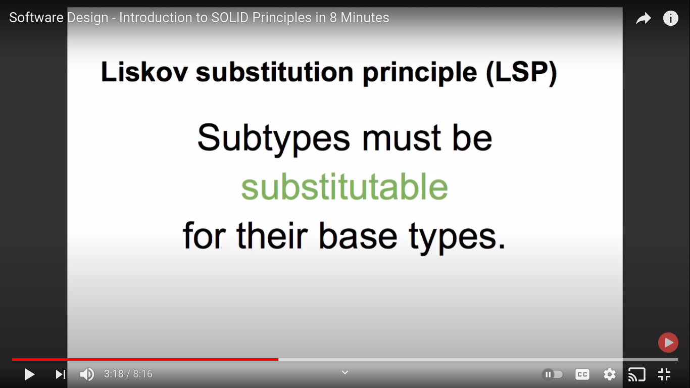
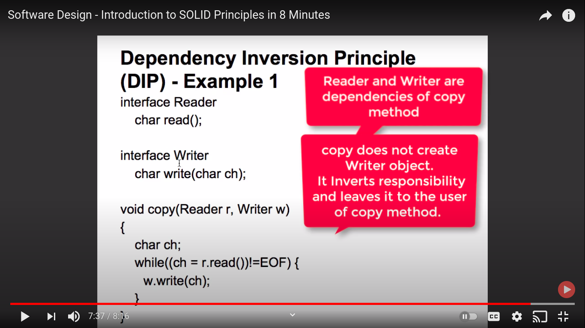

# Solid Principles

## SOLID: The First 5 Principles of Object Oriented Design

It's a mnemonic acronym for the following five design principles:

1. Single Responsibility Principle. (A class which do one thing)
2. Open/Closed Principle. (open for extension and close for modification)
3. Liskov Substitution Principle. (subclass can be substitute/replacable to its parent class)
   This means that every subclass or derived class should be substitutable for their base or parent class.
4. Interface Segregation Principle. ()
5. Dependency Inversion.

single responsibility principles (when you achieve SRP you would see that the amount of possibility of reuse would increase)

e.g

its is resp of downloading

```java
public class task{
public void downloadFile(String location)
public void parseTheFile(File file)
public void persistTheData(Data data)
}
```

is that meeting the single resp principal or you will able to use this kind of code in any where else the answer is No

This below class follows SRP

```java
public class task{
public void downloadFile(String location)
}
```

These are classes with multiple responsibilities
SRS is all about having classes which do one thing

2.Open close principle

https://www.digitalocean.com/community/conceptual_articles/s-o-l-i-d-the-first-five-principles-of-object-oriented-design







Reference :

https://www.youtube.com/watch?v=yxf2spbpTSw&ab_channel=in28minutesCloud%2CDevOpsandMicroservices
https://www.qfles.com/interview-question/solid-principles-interview-questions
