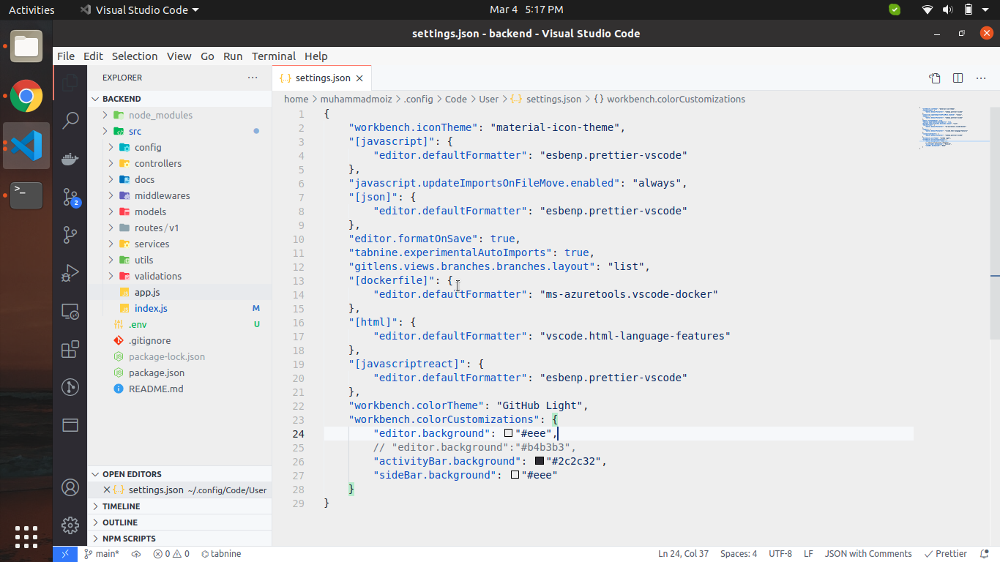

# Vscode Cheatsheet

### Useful Commands for increase productivity:

1. Side menu open and close with ctrl+b command
2. Terminal open with ctrl + ` command
3. Close one current tab with ctrl+w command
4. Close all opened tab with ctrl+k+w (just tap the ctrl button and then first click on k and then w by pressing ctrl button also)
5. Format code ctrl+shift+i
6. Toggle line comment select all test you want to comment and press CTRL+/
7. Toggle block comment select all test you want to comment and press CTRL+SHIFT+A

**Markdown and Visual Studio Code**

**Markdown preview**

VS Code supports Markdown files out of the box. You just start writing Markdown text, save the file with the .md extension and then you can toggle the visualization of the editor between the code and the preview of the Markdown file; obviously, you can also open an existing Markdown file and start working with it. To switch between views, press Ctrl+Shift+V in the editor. You can view the preview side-by-side (Ctrl+K V) with the file you are editing and see changes reflected in real-time as you edit.

**Snippets for Markdown**

There are several built-in Markdown snippets included in VS Code - press Ctrl+Space (Trigger Suggest) and you get a context specific list of suggestions.

Ref:
https://stackoverflow.com/questions/9331281/how-can-i-test-what-my-readme-md-file-will-look-like-before-committing-to-github
https://code.visualstudio.com/docs/languages/markdown

**Manually install vscode extension through command line**

**Install from a VSIX**

You can manually install a VS Code extension packaged in a .vsix file. Using the Install from VSIX command in the Extensions view command drop-down, or the Extensions: Install from VSIX command in the Command Palette, point to the .vsix file.
You can also install using the VS Code --install-extension command-line switch providing the path to the .vsix file.
`code --install-extension myextension.vsix`
E.g
`code --install-extension ms-azuretools.vscode-docker-1.9.1.vsix`

I have manually download and install docker extension by using above command

### Customizing VScode theme etc:

You can do changes in setting.json file for do any kind of customization :

E.g below I have changed background color or editor

**Shortcut for go to definition (F12)**

Click on any component in code and press F12 for go to definition of component OR
Alternate is CTRL + right click

**Emmet in vscode**

https://code.visualstudio.com/docs/editor/emmet

**Integrated Terminal**

`CTRL+ d` To delete / close vscode terminal using command line
**CTRL+shift+`** to open new terminal in vscode

Reference :
https://code.visualstudio.com/docs/editor/integrated-terminal

**Shortcut key to delete a line in vscode**

`CTRL + SHIFT + K`

https://superuser.com/questions/194004/delete-a-line-in-visual-studio-without-copying-it
