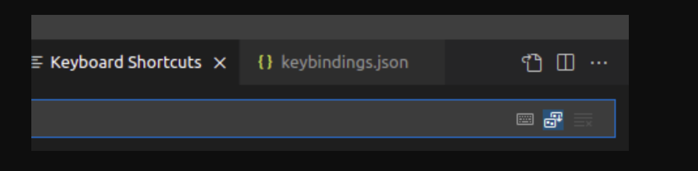

# VSCODE

### How to take beautified code snapshot

use snappify free tool

https://snappify.com/

### Extensions:

**best theme for markdown files in vscode**

In vscode you have hundreds !
It's totally up to your personal preference, but I would recommend using Atom one light or One Dark Pro for markdown editing. I personally prefer using light theme for writing, and dark theme for coding.08-Jul-2019

**Atom One Light Theme**

https://marketplace.visualstudio.com/items?itemName=akamud.vscode-theme-onelight

**One Dark Pro**

https://marketplace.visualstudio.com/items?itemName=zhuangtongfa.Material-theme

## vscode theme for work at night

```bash showLineNumbers
Night Owl
```

https://medium.com/@haxzie/curated-list-of-best-vscode-dark-themes-855337f77e19

**How we can use git compare of PR in vscode ?**

**GitLab VS Code Extension**

https://marketplace.visualstudio.com/items?itemName=GitLab.gitlab-workflow
https://about.gitlab.com/blog/2021/01/25/mr-reviews-with-vs-code/

Why old commits are showing in new MR on gitlab
seems like issue with gitlab see this thread https://gitlab.com/gitlab-org/gitlab-foss/-/issues/15140 btw I'm reading this as well
ok but can you please make following steps:
stash your changes
checkout to dev (pull latest)
driver branch from dev and apply your stash
commit and push the changes
now it will be show the relevant changes

becasue this branch was created from feature-mobile-load branch not develop so gitlab has issue its showing merged commits again creating new branch from develop again and making new MR
Or just make new branch from target branch add your changes using cherry pick or stash and make new MR.

**Github Pull request**

https://marketplace.visualstudio.com/items?itemName=GitHub.vscode-pull-request-github
https://www.youtube.com/watch?v=OUZj2_cpKXg&ab_channel=JonGallant
https://code.visualstudio.com/blogs/2018/09/10/introducing-github-pullrequests
https://github.blog/2019-01-07-create-pull-requests-in-vscode/#:~:text=To%20create%20pull%20requests%20in,ve%20opened%20your%20pull%20request.

**vscode-styled-components**

https://marketplace.visualstudio.com/items?itemName=mf.vscode-styled-components

**VS Code tips — Automatically commit git changes without staging**

https://www.youtube.com/watch?v=1F48hKFNlg8&ab_channel=Code2020
https://github.com/Microsoft/vscode/issues/26185

**VS Code tips — Automatically update import paths when moving files in JavaScript and TypeScript**

https://www.youtube.com/watch?v=8oCBk9BWjHQ&ab_channel=Code2020

**VS Code tips — Rename on import paths for JavaScript and TypeScript**

https://www.youtube.com/watch?v=opLjYX2gJ3M&ab_channel=WebDevSimplified

**What is the shortcut in Visual Studio Code for console.log**

CTRL +SHIFT + P in vscode
search open keyboard shortcut JSON
paste this below code and save
Done

```js showLineNumbers

{
"key": "ctrl+shift+l",
"command": "editor.action.insertSnippet",
"when": "editorTextFocus",
"args": {
"snippet": "console.log('${TM_SELECTED_TEXT}$1')$2;"
}
}
```

https://stackoverflow.com/questions/40177331/what-is-the-shortcut-in-visual-studio-code-for-console-log

### Prettier

#### how to increase line width in prettier

add this line in .prettierrc: by default its 80

```json showLineNumbers
{
  "printWidth": 140
}
```

https://prettier.io/docs/en/options.html

**React native stylesheet formatter prettier**

Format Code Style with Prettier in React Native (recommended)

https://blog.reactnativecoach.com/format-code-style-with-prettier-in-react-native-1e10e6b7169f

https://github.com/typicode/husky

https://github.com/IronTony/react-native-redux-toolkit-starter-app/blob/master/package.json

**no-unused-vars in vscode how ot remove all**

https://eslint.org/docs/rules/no-unused-vars

https://github.com/microsoft/vscode/issues/105234

**VS Code is removing unused vars even when settings tell it not to do so #105234 (you have to enable this the reverse of this solution )**

https://github.com/microsoft/vscode/issues/105234

**How to grayed out unused styles in stylesheet react native?**

vscode extensions for highlight unused styles

```js showLineNumbers
// .eslintrc
module.exports = {
  root: true,
  extends: [
    /* ... */
  ],
  rules: {
    /* ... */
  },
  settings: {
    "react-native/style-sheet-object-names": ["StyleSheet"],
  },
  plugins: [
    /* ... */
  ],
};
```

https://blog.logrocket.com/using-prettier-eslint-automate-formatting-fixing-javascript/

https://stackoverflow.com/questions/58648902/how-to-get-eslint-fix-to-also-run-prettier-write

**How to accept all incoming changes in one file using git ?**

Manage Git conflicts in VSCode
Alternatively, you can select files in the sidebar, right-click and select Accept All Incoming or Accept All Current based on your specific scenario.26-Jun-2021

https://linuxpip.org/git-accept-all-incoming-changes/#:~:text=Manage%20Git%20conflicts%20in%20VSCode,-Visual%20Studio%20Code&text=Alternatively%2C%20you%20can%20select%20files,based%20on%20your%20specific%20scenario.

**How do I duplicate a line or selection within Visual Studio Code?**

shortcut key for duplicate line in vscode

You can find keyboard shortcuts from

> `File > Preferences > Keyboard Shortcuts`

Default Keyboard Shortcuts are, And editing the `keybindings.json`


click on this icon

```jsx showLineNumbers title="keybindings.js"
// Place your key bindings in this file to override the defaults
[
  {
    key: "ctrl+i",
    command: "editor.action.copyLinesDownAction",
    when: "editorTextFocus",
  },
];
```

**for mac**

```bash showLineNumbers
//keybindings.json

// Place your key bindings in this file to override the defaults
[
  {
    "key": "cmd+shift+i",
    "command": "editor.action.insertSnippet",
    "when": "editorTextFocus",
    "args": {
      "snippet": "console.log('${TM_SELECTED_TEXT}$1')$2;"
    }
  },
  {
    "key": "cmd+i",
    "command": "editor.action.copyLinesDownAction"
  }
]


```

https://stackoverflow.com/questions/30203752/how-do-i-duplicate-a-line-or-selection-within-visual-studio-code

**What is the shortcut in Visual Studio Code for console.log**

`short key for console.log(‘’) in vscode`

```jsx showLineNumbers
// Place your key bindings in this file to override the defaults
[
  {
    key: "ctrl+i",
    command: "editor.action.copyLinesDownAction",
    when: "editorTextFocus",
  },
  {
    key: "ctrl+shift+l",
    command: "editor.action.insertSnippet",
    when: "editorTextFocus",
    args: {
      snippet: "console.log('${TM_SELECTED_TEXT}$1')$2;",
    },
  },
];
```

https://stackoverflow.com/questions/40177331/what-is-the-shortcut-in-visual-studio-code-for-console-log

### How to delete duplicate rows or lines in a visual Studio Code?

vscode remove duplicate lines extension

select all text in files from which you want to remove duplicate lines

```bash showLineNumbers
$ CTRL + A
$ CTRL+SHIFT+P
search delete duplicate lines
hit Enter
```

In the builtin Delete Duplicate Lines feature
This feature is available as inbuilt vs code.

Select Views Menu + Command palette or use the following shortcut commands

Windows: hotkeys: Ctrl + Shift + P
Mac: shortcuts: ⌘ + Shift +P
It opens the command palette and types delete in the search box and selects the Delete Duplicate Lines option

<!--  -->

https://www.w3schools.io/editor/vscode-duplicate-line/

### Source Control in VSCode is not refreshed automatically

vscode not auto reloading changes in source control

Solution:

CTRL+ SHIFT+P open User Settings Json and add this line in the end and save file and reload vscode

```json showLineNumbers
  "git.autorefresh": true
```

https://stackoverflow.com/questions/71181697/source-control-in-vscode-is-not-refreshed-automatically

**VS Code tips — Automatically update import paths when moving files in JavaScript and TypeScript**

https://www.youtube.com/watch?v=8oCBk9BWjHQ&ab_channel=Code2020

**VS Code tips — Rename on import paths for JavaScript and TypeScript**

https://www.youtube.com/watch?v=opLjYX2gJ3M&ab_channel=WebDevSimplified

**What is the shortcut in Visual Studio Code for console.log**

CTRL +SHIFT + P in vscode
search open keyboard shortcut JSON
paste this below code and save

Done

```json showLineNumbers
{
  "key": "ctrl+shift+l",
  "command": "editor.action.insertSnippet",
  "when": "editorTextFocus",
  "args": {
    "snippet": "console.log('${TM_SELECTED_TEXT}$1')$2;"
  }
}
```

https://stackoverflow.com/questions/40177331/what-is-the-shortcut-in-visual-studio-code-for-console-log

**how to grayed out unused styles in stylesheet react native**

vscode extensions for highlight unused styles

```jsx showLineNumbers
// .eslintrc
module.exports = {
  root: true,
  extends: [
    /* ... */
  ],
  rules: {
    /* ... */
  },
  settings: {
    "react-native/style-sheet-object-names": ["StyleSheet"],
  },
  plugins: [
    /* ... */
  ],
};
```

https://blog.logrocket.com/using-prettier-eslint-automate-formatting-fixing-javascript/
https://stackoverflow.com/questions/58648902/how-to-get-eslint-fix-to-also-run-prettier-write

**.Prettierc**

Please install Prettier extension in your vs code and set is as default formatter.
@Zohaib Akhtar @Zubair Mehboob
In order to make apply same configuration in all contributors pc
Add this .prettierc file in repo

```json showLineNumbers
{
  "printWidth": 100,
  "singleQuote": true,
  "arrowParens": "always",
  "trailingComma": "all"
}
```

Or

```jsx showLineNumbers
module.exports = {
  bracketSpacing: false,
  jsxBracketSameLine: true,
  singleQuote: true,
  trailingComma: "all",
  arrowParens: "avoid",
};
```

Open setting and search format and select format onsave and format on paste its recommended

https://stackoverflow.com/questions/50975264/prettier-settings-for-vscode

### Vscode : Visual studio code

how to remove unused code in visual studio code
#how to remove unused imports in vscode


https://marketplace.visualstudio.com/items?itemName=kuscamara.remove-unused-imports
https://stackoverflow.com/questions/46722701/is-there-a-way-to-remove-unused-imports-and-declarations-from-angular-2 https://stackoverflow.com/questions/46722701/is-there-a-way-to-remove-unused-imports-and-declarations-from-angular-2

**no-unused-vars in vscode how to remove all**

https://eslint.org/docs/rules/no-unused-vars

**VS Code is removing unused vars even when settings tell it not to do so #105234 (you have to enable this the reverse of this solution )**

https://github.com/microsoft/vscode/issues/105234

`CTRL+P `
Type keybing.json ENTER

```json showLineNumbers
[
  {
    "key": "ctrl+i",
    "command": "editor.action.duplicateSelection"
  },
  {
    "key": "ctrl+shift+l",
    "command": "editor.action.insertSnippet",
    "when": "editorTextFocus",
    "args": {
      "snippet": "console.log('${TM_SELECTED_TEXT}$1')$2;"
    }
  },
  {
    "key": "Ctrl+d Ctrl+k",
    "command": "editor.action.removeDuplicateLines"
  }
]
```

TO check if shortcut key already exist

`CTRL+SHIFT+P`

Type: Open keyboard shortcuts Enter
Select this line


**How to rename multiple files in vscode (visual studio code)?**

Changing all files' extensions in a folder with one command
how to change extension of all files in a folder at once using vscode
I wonder, if there is way to rename multiple files in visual studio code? I have tried to use find and replace, no luck.

Sol


https://stackoverflow.com/questions/44223988/how-to-rename-multiple-files-in-vscode-visual-studio-code#:~:text=Go%20to%20the%20Expl

### Extensions:

how we can use git compare of PR in vscode ?

** GitLab VS Code Extension**

https://marketplace.visualstudio.com/items?itemName=GitLab.gitlab-workflow
https://about.gitlab.com/blog/2021/01/25/mr-reviews-with-vs-code/

why old commits are showing in new MR on gitlab
seems like issue with gitlab see this thread https://gitlab.com/gitlab-org/gitlab-foss/-/issues/15140 btw I'm reading this as well
ok but can you please make following steps:
stash your changes
checkout to dev (pull latest)
driver branch from dev and apply your stash
commit and push the changes
now it will be show the relevant changes

becasue this branch was created from feature-mobile-load branch not develop so gitlab has issue its showing merged commits again creating new branch from develop again and making new MR
Or just make new branch from target branch add your changes using cherry pick or stash and make new MR.

**Github Pull request**

https://marketplace.visualstudio.com/items?itemName=GitHub.vscode-pull-request-github
https://www.youtube.com/watch?v=OUZj2_cpKXg&ab_channel=JonGallant
https://code.visualstudio.com/blogs/2018/09/10/introducing-github-pullrequests
https://github.blog/2019-01-07-create-pull-requests-in-vscode/#:~:text=To%20create%20pull%20requests%20in,ve%20opened%20your%20pull%20request.

**vscode-styled-components**

https://marketplace.visualstudio.com/items?itemName=mf.vscode-styled-components

**VS Code tips — Automatically commit git changes without staging**

https://www.youtube.com/watch?v=1F48hKFNlg8&ab_channel=Code2020
https://github.com/Microsoft/vscode/issues/26185

#### Package json

**How to call one command from another in package.json?**

how to run another command in another command in package.json

Use npm run inside the script. E.g.

```jsx showLineNumbers
"scripts": {
  "a1": "first command",
  "a2": "second command",
  "a3": "third command && npm run a1 && npm run a2",
}
```

https://stackoverflow.com/questions/42978355/how-to-call-one-command-from-another-in-package-json

## Vscode Learning

### Theme

1. vscode theme selection (kentcdodds)
   https://twitter.com/kentcdodds/status/1316551573980377089/photo/1 nightowl

2. all dev enviornment of kentcdodds vscode
   https://kentcdodds.com/uses/ https://github.com/kentcdodds/ama/issues/406

3. ctrl + f2 for select all text at one time with same text key

"On Ubuntu:

`Ctrl + F2` will select all occurrences immediately.

`Ctrl + D` will select occurrences one by one." I have searched : vs code ctrl d select all

"On mac"

Select all occurrences of selected word in VSCode

shortcut for select all ctrl d in vscode

Select All Occurrences of Find Match editor.action.selectHighlights.

```bash showLineNumbers
Ctrl+Shift+L

Cmd+Shift+L or Cmd+Ctrl+G on Mac
```

https://stackoverflow.com/questions/46539714/select-all-occurrences-of-selected-word-in-vscode

### Technical hacks

1. detach terminal for fast development and easy goto defination

   https://stackoverflow.com/questions/59665958/vscode-open-terminals-in-a-separate-window#:~:text=1%20Answer&text=You%20can't%20detach%20the,terminal%20pane%20in%20that%20window.

## Vscode Shortkeys

Shortcut keys in vscode

1. CTRL + \ to split screen in vscode
2. CTRL+ I to duplicate current line need to be custom set in vscode ketbinding.js
3. CTRL+SHIFT+K to delete current line of code
4. CTRL+SHIFT+ L shortkey for console.log() need to be custom set in vscode ketbinding.js

**Error fixes**

Reload with extensions enabled #52760

https://github.com/Microsoft/vscode/issues/52760

sample file

```json showLineNumbers
[
  {
    "key": "ctrl+i",
    "command": "editor.action.duplicateSelection"
  },
  {
    "key": "ctrl+shift+l",
    "command": "editor.action.insertSnippet",
    "when": "editorTextFocus",
    "args": {
      "snippet": "console.log('${TM_SELECTED_TEXT}$1')$2;"
    }
  }
]
```

## Vscode

**how to add custom keyboard shortcut into vscode**

**OR how to duplicate line in vscode**

open keybindings.js

open keybinding.js by clicking on the first icon show at right side

add this object in array



// Place your key bindings in this file to override the defaults OR this id CTRL+SHIFT+I is
occupied

```json showLineNumbers
[
  {
    "key": "ctrl+shift+i",
    "command": "editor.action.duplicateSelection"
  }
]
```

https://stackoverflow.com/questions/30203752/how-do-i-duplicate-a-line-or-selection-within-visual-studio-code#:~:text=moveLinesDownAction%20are%20the%20ones%20to,and%20Ctrl%20%2B%20Up%20on%20Linux.

https://stackoverflow.com/questions/33791097/how-can-i-change-keyboard-shortcut-bindings-in-visual-studio-code

**how to log all data in console log of vscode
Or Showing all output in the console VS code**

https://stackoverflow.com/questions/63013673/showing-all-output-in-the-console-vs-code

**how to open vscode terminal on right side**

https://stackoverflow.com/questions/43877697/it-is-possible-in-vscode-to-put-the-terminal-on-the-right/54768672

**Visual Studio Code Tab Key does not insert a tab**


https://stackoverflow.com/questions/35519538/visual-studio-code-tab-key-does-not-insert-a-tab

**What is the shortcut in Visual Studio Code for console.log OR shortcut for console.log in vscode productivity**

https://stackoverflow.com/questions/40177331/what-is-the-shortcut-in-visual-studio-code-for-console-log

https://stackoverflow.com/questions/40177331/what-is-the-shortcut-in-visual-studio-code-for-console-log#:~:text=Pressing%20CTRL%20%2B%20SHIFT%20%2B%20L%20will,put%20inside%20the%20log%20statement.

**Auto Import of React Components in Visual Studio Code [closed]**

https://stackoverflow.com/questions/60637561/auto-import-of-react-components-in-visual-studio-code

**type commit in source control (commit bar ) in sidebar and press CTRL+ENTER and press enter to directly push to github productivity**

## vscode themes

**Vscode Short keys**

- open setting menu CTRL+ ,
- format code CTRL+ SHIFT+ I
- open close side menu CTRL +B

**good i have tried**

- Monokai 4
- Material icon theme(Dark Mode) (2)
- I love the default one. ,dark theme 3

**medium**

- Night Owl , Night owl along with some extensions & Operator mono font - killer combination,Night Owl non italic 7

**not good i have tried**

- Nord
- Shadee Darkest
- Shades of Purple
- Monarch
- Tokyo night 2
- Material dark theme,
- One Dark Pro – Monokai Darker
- Overnight
- not found
- Hydra + Fira Code Font

## Bookmarks

### VScode

### Intellisense not working issue resolved

- [microsoft/vscode](https://github.com/microsoft/vscode/issues/71751)

- [TypeScript Compiling with Visual Studio Code](https://code.visualstudio.com/docs/typescript/typescript-compiling#_using-newer-typescript-versions)

- [Debugging React Like a Champ with VSCode – Hacker Noon](https://hackernoon.com/debugging-react-like-a-champ-with-vscode-66281760037)
