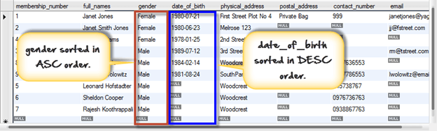

# Learning MySql

**Sql Important links**

https://www.guru99.com/introduction-to-database-sql.html
https://www.codecademy.com/articles/sql-commands

**Mysql queries**

```sql showLineNumbers
When IF NOT EXISTS is used database is created only if given name does not conflict with an existing database's name. Without the use of IF NOT EXISTS MySQL throws an error.
CREATE DATABASEIF NOT EXISTS movies;

You can see list of existing databases by running following SQL command.
SHOW DATABASES

Tables can be created using CREATE TABLE statement and it actually has the following syntax.

CREATE TABLE [IF NOT EXISTS] `TableName` (`fieldname` dataType [optional parameters]) ENGINE = storage Engine;

HERE
"CREATE TABLE" is the one responsible for the creation of the table in the database.
"[IF NOT EXISTS]" is optional and only create the table if no matching table name is found.
"`fieldName`" is the name of the field and "data Type" defines the nature of the data to be stored in the field.
"[optional parameters]" additional information about a field such as " AUTO_INCREMENT" , NOT NULL etc
```

**Best practices**

Use upper case letters for SQL keywords i.e. "DROP SCHEMA IF EXISTS `MyFlixDB`;"
End all your SQL commands using semi colons.

Avoid using spaces in schema, table and field names. Use underscores instead to separate schema, table or field names.

**SQL SELECT statement syntax**

It is the most frequently used SQL command and has the following general syntax

```sql showLineNumbers
SELECT [DISTINCT|ALL ] { _ | [fieldExpression [AS newName]} FROM tableName [alias] [WHERE condition][group by fieldname(s)] [HAVING condition] ORDER BY fieldName(s)
HERE
SELECT is the SQL keyword that lets the database know that you want to retrieve data.
[DISTINCT | ALL] are optional keywords that can be used to fine tune the results returned from the SQL SELECT statement. If nothing is specified then ALL is assumed as the default.
{_| [fieldExpression [AS newName]} at least one part must be specified, "\*" selected all the fields from the specified table name, fieldExpression performs some computations on the specified fields such as adding numbers or putting together two string fields into one.
FROM tableName is mandatory and must contain at least one table, multiple tables must be separated using commas or joined using the JOIN keyword.
WHERE condition is optional, it can be used to specify criteria in the result set returned from the query.
GROUP BY is used to put together records that have the same field values.
HAVING condition is used to specify criteria when working using the GROUP BY keyword.
ORDER BY is used to specify the sort order of the result set.
```

Let's say we are only interested in getting only the full_names, gender, physical_address and email fields only. The following script would help us to achieve this.

```sql showLineNumbers
SELECT `full_names`,`gender`,`physical_address`, `email` FROM `members`;

SELECT Concat(`title`, ' (', `director`, ')') , `year_released` FROM `movies`;
HERE
```

The Concat () MySQL function is used join the columns values together.
The line "Concat (`title`, ' (', `director`, ')') gets the title, adds an opening bracket followed by the name of the director then adds the closing bracket.

```js showLineNumbers
Concat(`title`, ' (', `director`, ')')
year_released
Pirates of the Caribean 4 ( Rob Marshall)
2011
```

```sql showLineNumbers
SELECT `column_name|value|expression` [AS] `alias_name`;

SELECT Concat(`title`, ' (', `director`, ')') AS 'Concat', `year_released` FROM `movies`;
```

```bash showLineNumbers
We get the following result

Concat
year_released
Pirates of the Caribean 4 ( Rob Marshall)
2011
```

```sql showLineNumbers
SELECT `membership_number`,`full_names`,LEFT(`date_of_birth`,4) AS `year_of_birth` FROM members;
```

HERE

- "LEFT(`date_of_birth`,4)" the LEFT string function accepts the date of birth as the parameter and only returns 4 characters from the left.
- "AS `year_of_birth`" is the column alias name that will be returned in our results. Note the AS keyword is optional, you can leave it out and the query will still work.
  Executing the above query in MySQL workbench against the myflixdb gives us the results shown below.

```bash showLineNumbers
  membership_number
  full_names
  year_of_birth
  1

Janet Jones
1980
2

Janet Smith Jones
1980
```

**Expressions can also be used in the select statement .**

Example "SELECT quantity + price FROM Sales"
The SQL SELECT command can also have other optional parameters such as WHERE, GROUP BY, HAVING, ORDER BY. They will be discussed later.

```sql showLineNumbers

SELECT _ FROM tableName WHERE condition;
SELECT _ FROM `members` WHERE `membership_number` = 1;
WHERE clause combined with -AND OR LOGICAL Operator
SELECT _ FROM `movies` WHERE `category_id` = 2 AND `year_released` = 2008;
SELECT _ FROM `movies` WHERE `category_id` = 1 OR `category_id` = 2;
```

**WHERE clause combined with - IN Keyword**

The WHERE clause when used together with the IN keyword only affects the rows whose values matches the list of values provided in the IN keyword. IN helps reduces number of OR clauses you may have to use
The following query gives rows where membership_number is either 1 , 2 or 3

```sql showLineNumbers
SELECT \* FROM `members` WHERE `membership_number` IN (1,2,3);
```

```bash showLineNumbers
following results.
membership_number
full_names
gender
date_of_birth
physical_address
postal_address
contct_number
email
1
Janet Jones
Female
21-07-1980
First Street Plot No 4
Private Bag
0759 253 542
janetjones@yagoo.cm
2
Janet Smith Jones
Female
23-06-1980
Melrose 123
NULL
NULL
jj@fstreet.com
3
Robert Phil
Male
12-07-1989
3rd Street 34
NULL
12345
rm@tstreet.com
```

**WHERE clause combined with - NOT IN Keyword**

The WHERE clause when used together with the NOT IN keyword DOES NOT affects the rows whose values matches the list of values provided in the NOT IN keyword.
The following query gives rows where membership_number is NOT 1 , 2 or 3

```sql showLineNumbers
SELECT _ FROM `members` WHERE `membership_number` NOT IN (1,2,3);
WHERE clause combined with - COMPARISON OPERATORS
= Equal To
SELECT _ FROM `members` WHERE `gender` = 'Female';

> Greater than
> SELECT _ FROM `payments` WHERE `amount_paid` > 2000;
> < > Not Equal To
> The following script gets all the movies whose category id is not 1.
> SELECT _ FROM `movies` WHERE `category_id`<> 1;
```

**Brain Teaser**

Let's suppose that we want to get a list of rented movies that have not been returned on time 25/06/2012. We can use the WHERE clause together with the less than comparison operator and AND logical operator to achieve that.

```sql showLineNumbers

SELECT \* FROM `movierentals` WHERE `return_date` < '2012-06-25' AND movie_returned = 0;

MySQL query INSERT INTO Table with Examples

INSERT INTO `table_name`(column_1,column_2,...) VALUES (value_1,value_2,...);

INSERT INTO `members` (`full_names`,`date_of_birth`,`gender`,`physical_address`,`contact_number`) VALUES ('Leslie Winkle','1984-02-14','Male','Woodcrest', '0987636553');

All of the above queries specified the columns and mapped them to values in the insert statement.If we are supplying values for ALL the columns in the table, then we can omit the columns from the insert query.

Example:-
INSERT INTO `members` VALUES (9,'Howard Wolowitz','Male','1981-08-24','SouthPark','P.O. Box 4563', '0987786553', 'lwolowitz[at]email.me');

Inserting into a Table from another Table
The INSERT command can also be used to insert data into a table from another table. The basic syntax is as shown below.

INSERT INTO table_1 SELECT \* FROM table_2;

INSERT INTO `categories_archive` SELECT \* FROM `categories`;
```

Executing the above script inserts all the rows from the categories table into the categories archive table. Note the table structures will have to be the same for the script to work. A more robust script is one that maps the column names in the insert table to the ones in the table containing the data.

The query shown below demonstrates its usage.

```sql showLineNumbers
INSERT INTO `categories_archive`(category_id,category_name,remarks) SELECT category_id,category_name,remarks FROM `categories`;

```

**Example of MySQL Delete Query**

```sql showLineNumbers

DELETE FROM `movies` WHERE `movie_id` = 18;

DELETE FROM `movies` WHERE `movie_id` IN (20,21);0
```

Executing the above script deletes movies with IDs 20 and 21 from our movies table.

**Example of MySQL Update Query**

```sql showLineNumbers

UPDATE `table_name` SET `column_name` = `new_value' [WHERE condition];

UPDATE `members` SET `full_names` = 'Janet Smith Jones', `physical_address` = 'Melrose 123' WHERE `membership_number` = 2;
```

**ORDER BY in MySQL: DESC & ASC**

Sorting Results : Sorting is simply re-arranging our query results in a specified way.

Sort the result alphabetically by name:

```sql showLineNumbers

SELECT _ FROM customers ORDER BY name
SELECT _ FROM customers ORDER BY name DESC

```

Order by clause

```sql showLineNumbers

SELECT statement... [WHERE condition | GROUP BY `field_name(s)` HAVING condition] ORDER BY `field_name(s)` [ASC | DESC];

"SELECT statement..." is the regular select query
" | " represents alternatives
"[WHERE condition | GROUP BY `field_name(s)` HAVING condition" is the optional condition used to filter the query result sets.
"ORDER BY" performs the query result set sorting
"[ASC | DESC]" is the keyword used to sort result sets in either ascending or descending order. Note ASC is used as the default.
```

```sql showLineNumbers
SELECT \* FROM members ORDER BY date_of_birth DESC;
```

**Let's now look at an example that does the sorting using two columns; the first one is sorted in ascending order by default while the second column is sorted in descending order.**

```sql showLineNumbers

SELECT \* FROM `members` ORDER BY `gender`,`date_of_birth` DESC;
```



**What is the Group by Clause?**

`The GROUP BY clause is a SQL command that is used to group rows that have the same values.`

GROUP BY Syntax

```sql showLineNumbers
SELECT statements... GROUP BY column_name1[,column_name2,...] [HAVING condition];

SELECT `category_id`,`year_released` FROM `movies` GROUP BY `category_id`,`year_released`;
```

The GROUP BY clause operates on both the category id and year released to identify unique rows in our above example.

If the category id is the same but the year released is different, then a row is treated as a unique one .If the category id and the year released is the same for more than one row, then it's considered a duplicate and only one row is shown.

**Grouping and aggregate functions**

Suppose we want total number of males and females in our database. We can use the following script shown below to do that.

```sql showLineNumbers

SELECT `gender`,COUNT(`membership_number`) FROM `members` GROUP BY `gender`;

```

Executing the above script in MySQL workbench against the myflixdb gives us the following results.

```bash showLineNumbers
gender
COUNT('membership_number')
Female
3
Male
5
```

**Restricting query results using the HAVING clause**

It's not always that we will want to perform groupings on all the data in a given table. There will be times when we will want to restrict our results to a certain given criteria. In such cases , we can use the HAVING clause

```sql showLineNumbers

SELECT \* FROM `movies` GROUP BY `category_id`,`year_released` HAVING `category_id` = 8;
```

```bash showLineNumbers
movie_id
title
director
year_released
category_id
9
Honey mooners
John Schultz
2005
8
5
Daddy's Little Girls
NULL
2007
8
```

**Summary**

The GROUP BY Clause is used to group rows with same values .

The GROUP BY Clause is used together with the SQL SELECT statement.

The SELECT statement used in the GROUP BY clause can only be used contain column names, aggregate functions, constants and expressions.

The HAVING clause is used to restrict the results returned by the GROUP BY clause.

**Wildcard Characters**

You can also select the records that starts, includes, or ends with a given letter or phrase.
Use the '%' wildcard to represent zero, one or multiple characters

```sql showLineNumbers
"SELECT \* FROM customers WHERE address LIKE 'S%'"
```

**Escaping Query Values**

```sql showLineNumbers

var adr = 'Mountain 21';
var sql = 'SELECT \* FROM customers WHERE address = ?';
con.query(sql, [adr], function (err, result) {
if (err) throw err;
console.log(result);
});

C:\Users\My Name>node demo_db_where_placeholder.js
[
{ id: 4, name: 'Hannah', address: 'Mountain 21'}
]

```

**Multiple placeholders:**

```sql showLineNumbers

var name = 'Amy';
var adr = 'Mountain 21';
var sql = 'SELECT \* FROM customers WHERE name = ? OR address = ?';
con.query(sql, [name, adr], function (err, result) {
if (err) throw err;
console.log(result);
});

[
{ id: 3, name: 'Amy', address: 'Apple st 652'}
{ id: 4, name: 'Hannah', address: 'Mountain 21'}
]
```

**Node.js MySQL Drop Table**

```sql showLineNumbers

DROP TABLE customers
DROP TABLE IF EXISTS customers
```

**Limit the Result**

```sql showLineNumbers

Select the 5 first records in the "customers" table:
SELECT \* FROM customers LIMIT 5
```

**Start From Another Position**

If you want to return five records, starting from the third record, you can use the "OFFSET" keyword:

```sql showLineNumbers
SELECT \* FROM customers LIMIT 5 OFFSET 2
```

Shorter Syntax

```sql showLineNumbers

Start from position 3, and return the next 5 records:
SELECT \* FROM customers LIMIT 2, 5
asd

[result:
{ id: 3, name: 'Amy', address: 'Apple st 652'},
{ id: 4, name: 'Hannah', address: 'Mountain 21'},
{ id: 5, name: 'Michael', address: 'Valley 345'},
{ id: 6, name: 'Sandy', address: 'Ocean blvd 2'},
{ id: 7, name: 'Betty', address: 'Green Grass 1'}
]

```

**Join Two or More Tables**

Join Two or More Tables
You can combine rows from two or more tables, based on a related column between them, by using a JOIN statement.

Consider you have a "users" table and a "products" table:

users

```json showLineNumbers
[
{ id: 1, name: 'John', favorite_product: 154},
{ id: 2, name: 'Peter', favorite_product: 154},
{ id: 3, name: 'Amy', favorite_product: 155},
{ id: 4, name: 'Hannah', favorite_product:},
{ id: 5, name: 'Michael', favorite_product:}
]
products
[
{ id: 154, name: 'Chocolate Heaven' },
{ id: 155, name: 'Tasty Lemons' },
{ id: 156, name: 'Vanilla Dreams' }
]
```

These two tables can be combined by using users' favorite_product field and products' id field.

```sql showLineNumbers

SELECT users.name AS user, products.name AS favorite FROM users JOIN products ON users.favorite_product = products.id

[
{ user: 'John', favorite: 'Chocolate Heaven' },
{ user: 'Peter', favorite: 'Chocolate Heaven' },
{ user: 'Amy', favorite: 'Tasty Lemons' }
]
```

### Learning MySql at nextgeni

Today Learning topics 9 March

1. how to generate sql script with data in workbench
2. trigger in sql
3. SQL Functions
4. full text search mysql
5. find_in_set mysql
6. indexes in sql
7. searching in sql
8. security in mysql database
9. how to prevent sql injection node js
10. node.js sql server best practices
11. events in mysql
12. MySQL storage engines

**Connect nodejs with mysql local database using mysql-server locally installed in computer**

Steps

https://medium.com/technoetics/installing-and-setting-up-mysql-with-nodejs-in-ubuntu-75e0c0a693ba

Commands :

```sql showLineNumbers

Check mysql-server status

> service mysql status

Check Mysql process id

> ps uxa | grep mysqld

Check my sql version

> mysql --version

To Start mysql server

> sudo service mysql start

```

#### SQL Keynotes

**Minor difference between where and having :**

Having ki query hm waha lagate hain jahan hamain at the time of write query koi value match karani hoti hy by using alias name

`Having` use for matching values (condition )with alias name
`Where` use when we use table’s columns name to match condition

**BETWEEN operator**

The BETWEEN operator is used in the WHERE clause to select a value within a range of values. We often use the BETWEEN operator in the WHERE clause of the SELECT, UPDATE and DELETE statements.

**Joins**

Summary

- JOINS allow us to combine data from more than one table into a single result set.
- JOINS have better performance compared to sub queries
- INNER JOINS only return rows that meet the given criteria.
- OUTER JOINS can also return rows where no matches have been found. The unmatched rows are returned with the NULL keyword.
- The major JOIN types include Inner, Left Outer, Right Outer, Cross JOINS etc.
- The frequently used clause in JOIN operations is "ON". "USING" clause requires that matching columns be of the same name.
- JOINS can also be used in other clauses such as GROUP BY, WHERE, SUB QUERIES,
  AGGREGATE FUNCTIONS etc.

**Apart from using ON and USING with JOINs you can use many other MySQL clauses like GROUP BY, WHERE and even functions like SUM, AVG, etc.**

```sql showLineNumbers

ALTER TABLE `movies` CHANGE `id` `movie_id` INT( 11 ) NOT NULL AUTO_INCREMENT;
```

**When you use count don't forget to use group by in that query**

"ON" and "USING" clauses
In above JOIN query examples, we have used ON clause to match the records between table.

USING clause can also be used for the same purpose. The difference with USING is it needs to have identical names for matched columns in both tables.

**SQL Queries**

```sql showLineNumbers

-- select DISTINCT COMPANY*ID,COMPANY_NAME,COMPANY_CITY from company where COMPANY_ID in (1,18,2,4) OR COMPANY_NAME in ('Order all','foodies.')
-- select * from company where COMPANY*ID between 1 and 3
-- select * from company where COMPANY*NAME like 'o%'
-- select * from company order by COMPANY*NAME
-- select SUM(COMPANY_ID) from company group by COMPANY_ID
-- select count(company_id) from company where COMPANY_CITY='karachi'
-- select company_id from company where COMPANY_CITY='boston';
-- UPDATE `TABLE` SET `FIELD`= TRIM(FIELD);
-- update company set company_city=REPLACE(company_city,' ','') where company_id='19'
-- select * from company where COMPANY_CITY='newyork';

-- select count(company_id),company_city from company group by COMPANY_CITY having count(company_id)>1

-- create table myTable(id int primary key not null)
-- drop table myTable

-- description about table
-- desc table_name
-- alter table company drop if exists COMPANY_CITY
-- select \* from company

-- alter table company drop COMPANY_CITY
-- truncate student
-- alter table student rename to newstudent

-- update company set COMPANY_NAME="compnameasdsad" where COMPANY_ID='1'

-- delete from company where COMPANY_ID='2'

```

#### SQL - Syntax

SQL is followed by a unique set of rules and guidelines called Syntax. This tutorial gives you a quick start with SQL by listing all the basic SQL Syntax.

All the SQL statements start with any of the keywords like SELECT, INSERT, UPDATE, DELETE, ALTER, DROP, CREATE, USE, SHOW and all the statements end with a semicolon (;).

The most important point to be noted here is that SQL is case insensitive, which means SELECT and select have same meaning in SQL statements. Whereas, MySQL makes difference in table names. So, if you are working with MySQL, then you need to give table names as they exist in the database.

**Various Syntax in SQL**

All the examples given in this tutorial have been tested with a MySQL server.

SQL SELECT Statement

```sql showLineNumbers
SELECT column1, column2....columnN
FROM table_name;


SQL DISTINCT Clause

SELECT DISTINCT column1, column2....columnN
FROM table_name;

SQL WHERE Clause
SELECT column1, column2....columnN
FROM table_name
WHERE CONDITION;

SQL AND/OR Clause
SELECT column1, column2....columnN
FROM table_name
WHERE CONDITION-1 {AND|OR} CONDITION-2;

SQL IN Clause
SELECT column1, column2....columnN
FROM table_name
WHERE column_name IN (val-1, val-2,...val-N);

SQL BETWEEN Clause
SELECT column1, column2....columnN
FROM table_name
WHERE column_name BETWEEN val-1 AND val-2;

SQL LIKE Clause
SELECT column1, column2....columnN
FROM table_name
WHERE column_name LIKE { PATTERN };

SQL ORDER BY Clause
SELECT column1, column2....columnN
FROM table_name
WHERE CONDITION
ORDER BY column_name {ASC|DESC};

SQL GROUP BY Clause
SELECT SUM(column_name)
FROM table_name
WHERE CONDITION
GROUP BY column_name;

SQL COUNT Clause
SELECT COUNT(column_name)
FROM table_name
WHERE CONDITION;

SQL HAVING Clause
SELECT SUM(column_name)
FROM table_name
WHERE CONDITION
GROUP BY column_name
HAVING (arithmetic function condition);

SQL CREATE TABLE Statement
CREATE TABLE table_name(
column1 datatype,
column2 datatype,
column3 datatype,
.....
columnN datatype,
PRIMARY KEY( one or more columns )
);

SQL DROP TABLE Statement
DROP TABLE table_name;

SQL CREATE INDEX Statement
CREATE UNIQUE INDEX index_name
ON table_name ( column1, column2,...columnN);

SQL DROP INDEX Statement
ALTER TABLE table_name
DROP INDEX index_name;

SQL DESC Statement
DESC table_name;

SQL TRUNCATE TABLE Statement
TRUNCATE TABLE table_name;

SQL ALTER TABLE Statement
ALTER TABLE table_name {ADD|DROP|MODIFY} column_name {data_ype};

SQL ALTER TABLE Statement (Rename)
ALTER TABLE table_name RENAME TO new_table_name;

E.g of alter table and modify existing column in database
https://stackoverflow.com/questions/5035836/how-to-add-auto-increment-to-an-existing-column

To change the name of column in table here i have change column name from “name” to “title”

ALTER TABLE `TESTDB`.`testTable`
CHANGE COLUMN `name` `title` VARCHAR(30) NULL DEFAULT NULL ;

SQL INSERT INTO Statement
INSERT INTO table_name( column1, column2....columnN)
VALUES ( value1, value2....valueN);

SQL UPDATE Statement
UPDATE table_name
SET column1 = value1, column2 = value2....columnN=valueN
[ WHERE CONDITION ];

SQL DELETE Statement
DELETE FROM table_name
WHERE {CONDITION};

SQL CREATE DATABASE Statement
CREATE DATABASE database_name;

SQL DROP DATABASE Statement
DROP DATABASE database_name;

SQL USE Statement
USE database_name;

SQL COMMIT Statement
COMMIT;

SQL ROLLBACK Statement
ROLLBACK;

SQL STORED Procedures

DELIMITER //

CREATE PROCEDURE GetAllDaysOrder()
BEGIN
SELECT \* FROM company;
END //

DELIMITER ;

OR with parameter

DELIMITER //

CREATE PROCEDURE procedure_name(parameter_list)
BEGIN
statements;
END //

DELIMITER ;

```

#### Executing a stored procedure

To execute a stored procedure, you use the CALL statement:

1. CALL stored_procedure_name(argument_list);

E.g

```sql showLineNumbers

-- DELIMITER //
--
-- CREATE PROCEDURE GetCompanyByID(id int)
-- BEGIN
-- SELECT \* FROM company where COMPANY_ID=id;
-- END //
--
-- DELIMITER ;

execute:

CALL GetCompanyByID(8)
```

**insertId in node mysql :**

I try to get id of user (auto increment id field) when insert data to user table. Here is ,my code:

result.insertId will give inserted id. Use it like this:
connection.query(sql, (err, result) => { if(err) { } else { let inserted_id = result.insertId; } });
ref: https://stackoverflow.com/questions/53271171/get-inserted-id-node-js-mysql

**Does SELECT \* really take more time than selecting only the needed columns?**

Dont user every where \* because it is not recommended

Select by col name only if you need some columns only is recommended

Yes it will when you have to search from more than thousand of records/row you can feel delay in response time

https://stackoverflow.com/questions/22385706/does-select-really-take-more-time-than-selecting-only-the-needed-columns
