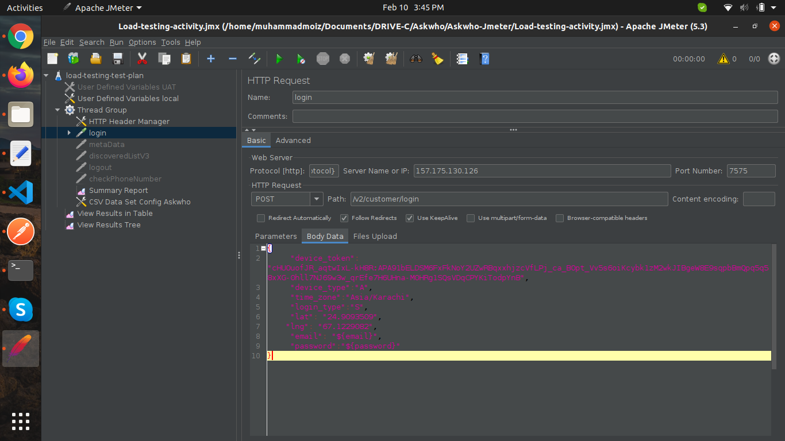

# Nodejs Load Testing

**Using Jmeter:**



```jsx showLineNumbers
import data from csv in nodejs login API
```

https://www.youtube.com/watch?v=aEJNc3TW-g8&ab_channel=JMeterTutorial

Tools used for load testing in nodejs.

- Jmeter
- NewRelic

- Jmeter:

- [users.csv](./Using-Jmeter/users.csv)
- [Load-testing-activity.jmx](./Using-Jmeter/Load-testing-activity.jmx)
