# Learn microservices in nodejs

**monolithic server**

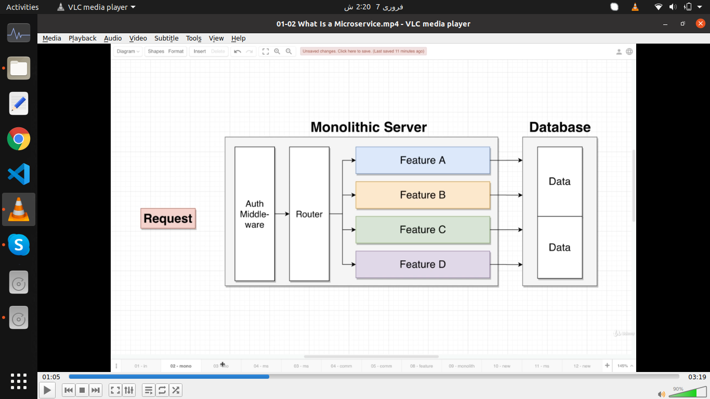

Conventional way for building servers

In monolithic server we have all our code needed to implement our application inside of one single codebase and we deploy that code base as one discrete units

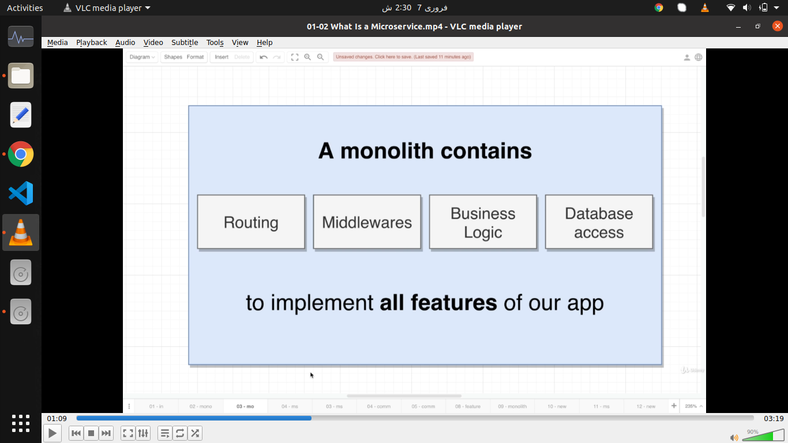

**Where as micro services ?**

A single microservice contains all of the routing all the middlewares, all the business login and database access required to implement one feature of our application that is the big difference

So a monolithic has all the code needed to implement every feature of our application
A microservice has the coded needed to implement just one feature

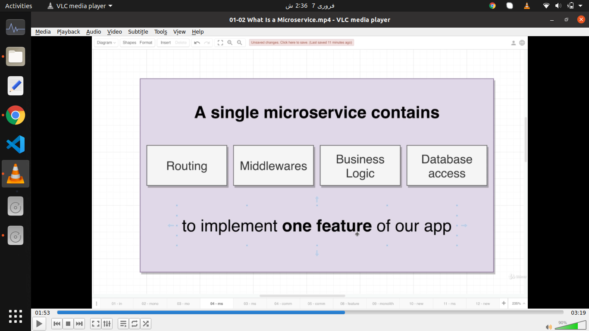

### Microservice architecture

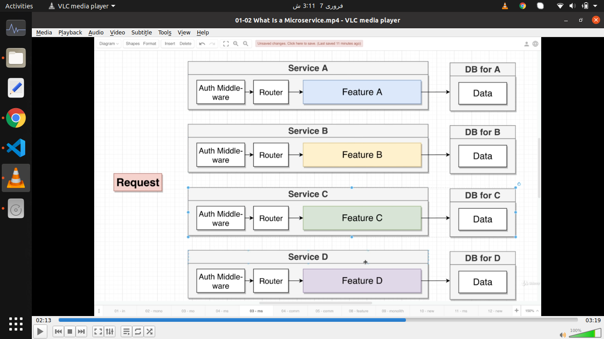

Each of these services are entirely self contained

A microservice has all things which includes separate database as well
Nice thing about this approach is that if for some reason if every other feature or every other service inside of our application crashes a portion of our app is still going to work just fine

A service A is 100% stand alone and doesn’t necessarily require for any other service to work correctly

Big problem.

**Data management between services .**

Example.

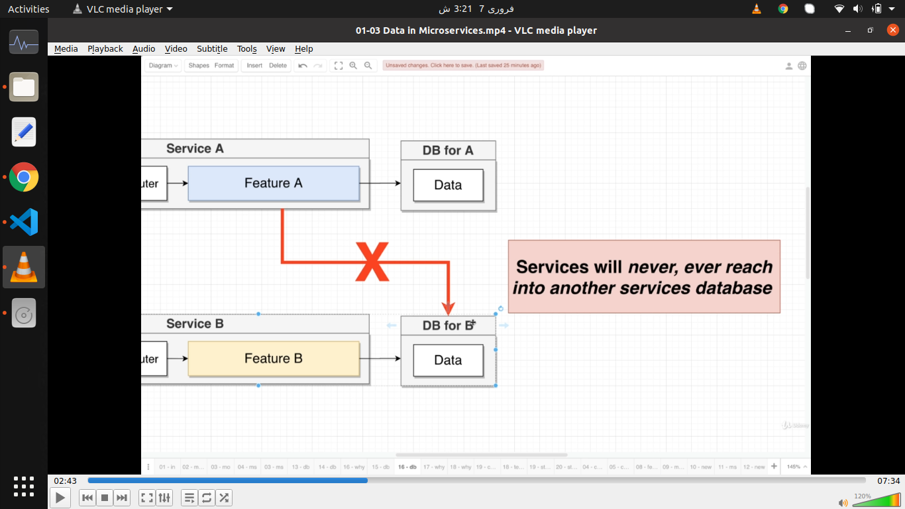

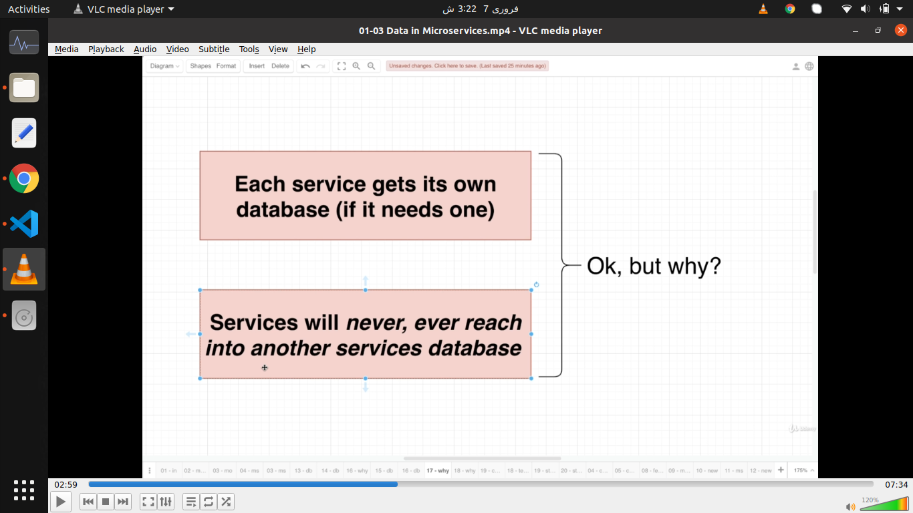

**Database per service (one database on service only architecture)**

E.g

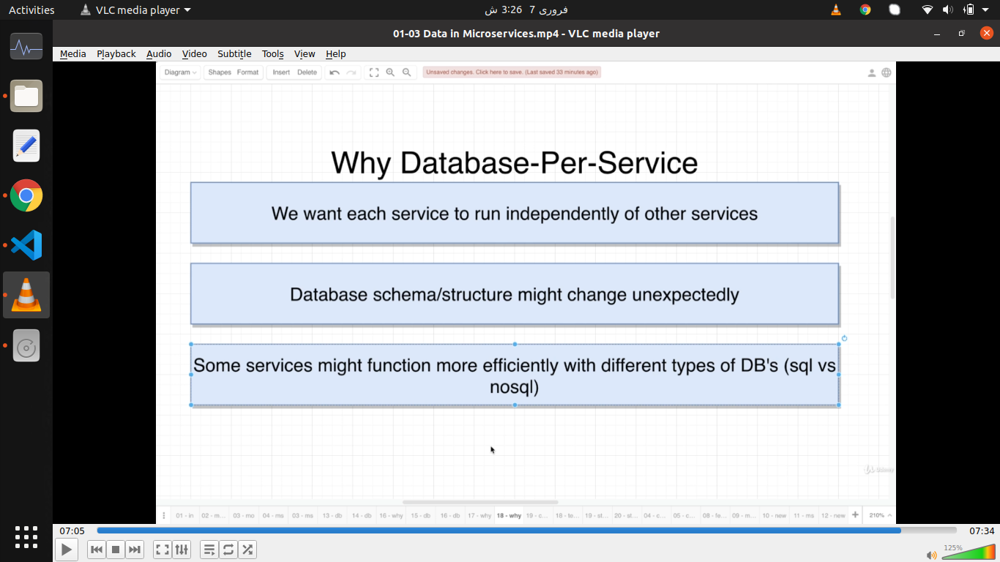

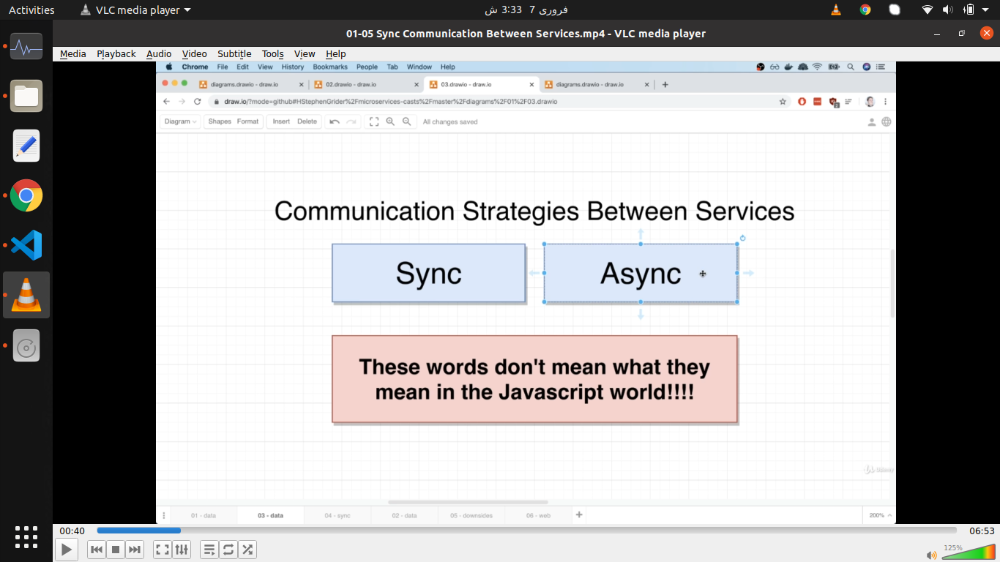

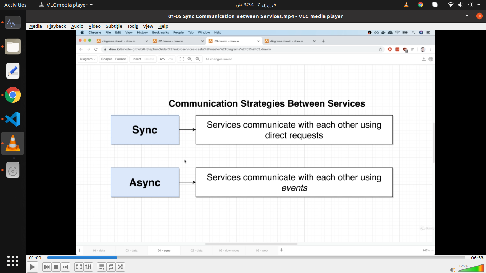

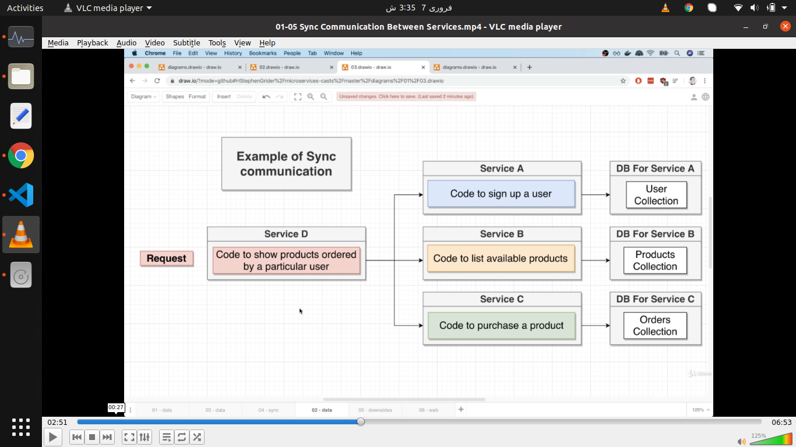

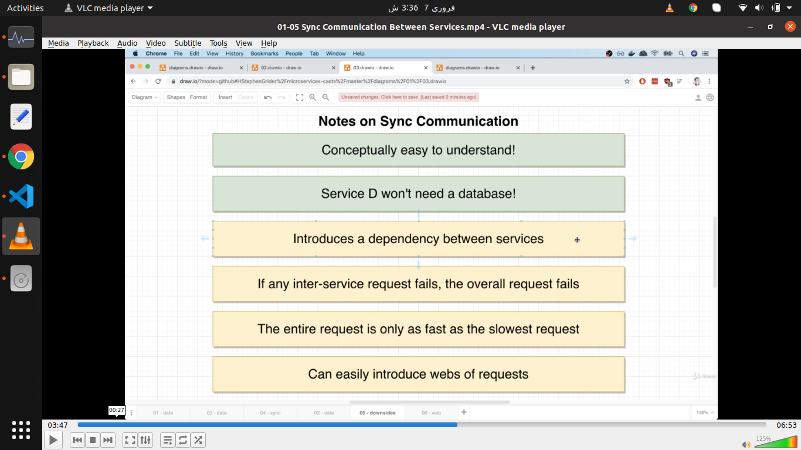

Point 5 e.g

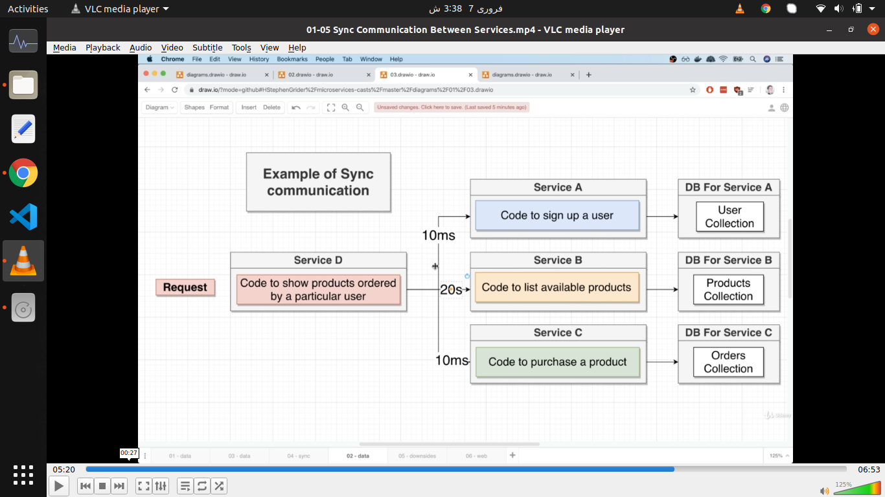

Point 6 eg

Web of dependencies

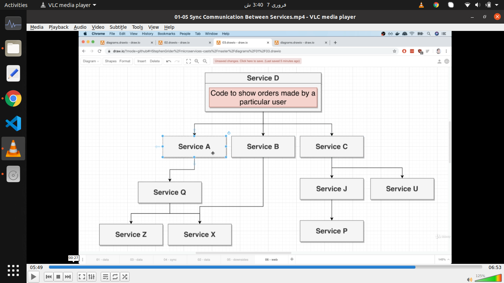

**Async communication: (not recommended)**

E.g

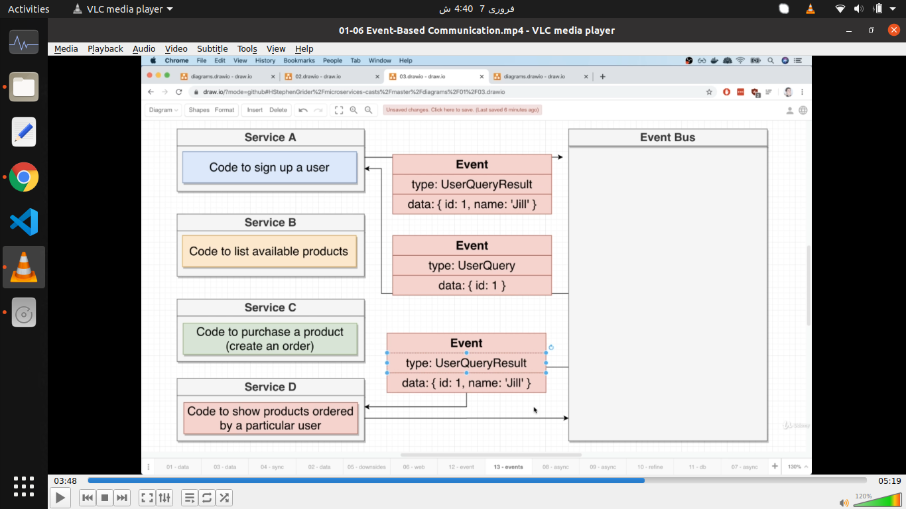

Not best solution because all these issues coming in sync communication persist in Event bus method we got an other solution which we will often and cover in next lecture

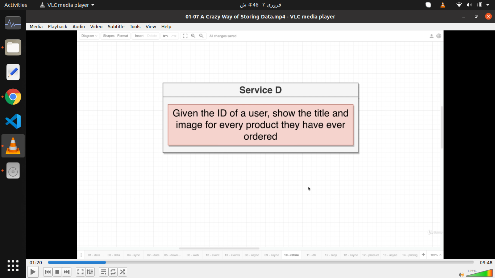

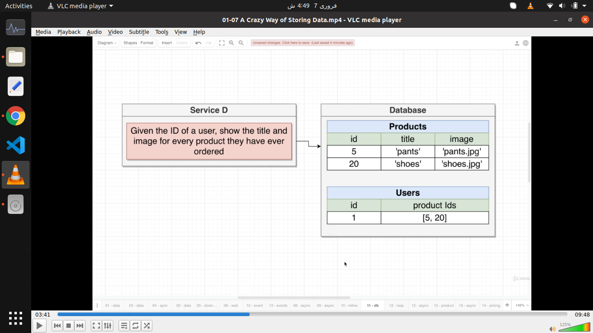

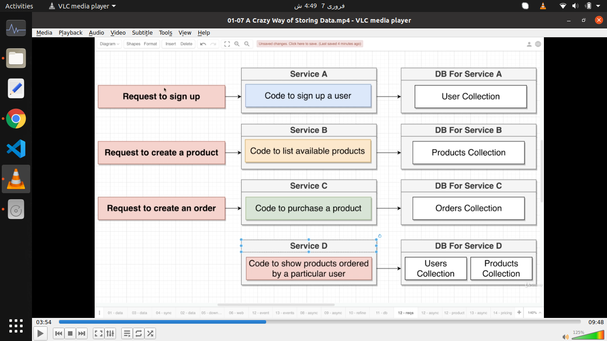
