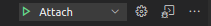

# Nodejs Debugging guide

## Debugging in Node JS:

By this guide you can debug node js applications with node and nodemon .

Steps.

1. Check folder name .vscode in root directory
2. Create file named as launch.json in .vscode folder
3. paster this code in this file Launch.json

```json showLineNumbers
{
  "version": "0.2.0",
  "configurations": [
    {
      "type": "node",
      "request": "attach",
      "name": "Attach",
      "port": 9229,
      "restart": true, // restart means whenever you dont changes in your code it will automatically restart the debugger as nodemon did it means you don't have to disconnect and connect to debugger again and again when you are doing changes in your code
      "sourceMaps": true,
      "protocol": "inspector"
    }
  ]
}
```

ref : https://drive.google.com/drive/folders/1GvUOzTYP5Nz89PrO9YRRGC-l5BotpXpU

This file will debug with nodemon

4. Save file
5. Open terminal in vscode not external terminal but open the vscode terminal using ctrl+tab command
6. run this command
7. nodemon --inspect=0.0.0.0 app.js (if you are using nodemon)
   OR
   node --inspect=0.0.0.0 app.js (when using node)
8. Then from menu bar click on Run > start debugging or just press f5 for start a debugger
9. Select Attach configuration from select configuration dropdown in debugging mode

   1. Click on debug  icon from side menu and
   2. select Attach  process from dropdown

      Using with node --inspect=0.0.0.0 app.js (when using node)

      

      Or

      nodemon --inspect=0.0.0.0 app.js (if you are using nodemon)

      

   3. Check footer bar should be orange
   4. And breakpoints should now be red (means active)

10. Press F10 for moving to next step
11. One thing is important is to press one key at a time like if you start moving next step with F10 key then stick to it and don’t use other move to next step key in this round like F11 or F5 you can use F11 and F5 in next API call this is best practice and to avoid issues in jumping to next step.

**For Fast debugging : (press only f5 for jump to next breakpoints only)**

If you want to stop process only when you apply breakpoints then
You can press f5 after run debugger
F5 key will goto only breakpoint to breakpoints that is also for fast debugging (recommended approach)

**Tips and tricks for debugging :**

1. If debugging not working then server and close vscode and open again
2. Run this command if you see these errors:
3. killall -9 node
   Error: bind EADDRINUSE null:7575
   Or
   Starting inspector on 0.0.0.0:9232 failed: address already in use
4. Enter breakpoints on code that you want to debug
5. You can restart debugger by restart sign on debugger plate
   
   This sign 
6. You can stop and reopen debugger using this sign

### NodeJS Debugging in Docker

Ref : https://www.youtube.com/watch?v=ktvgr9VZ4dc&ab_channel=ThatDevOpsGuy
