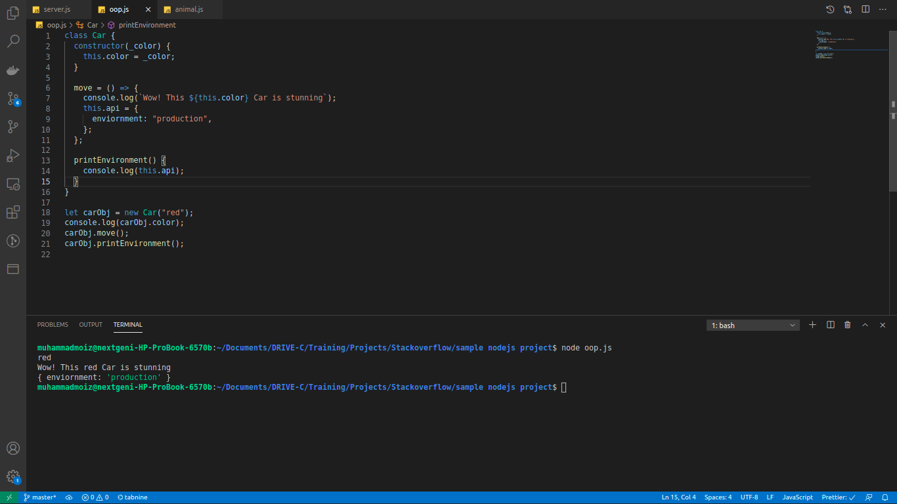
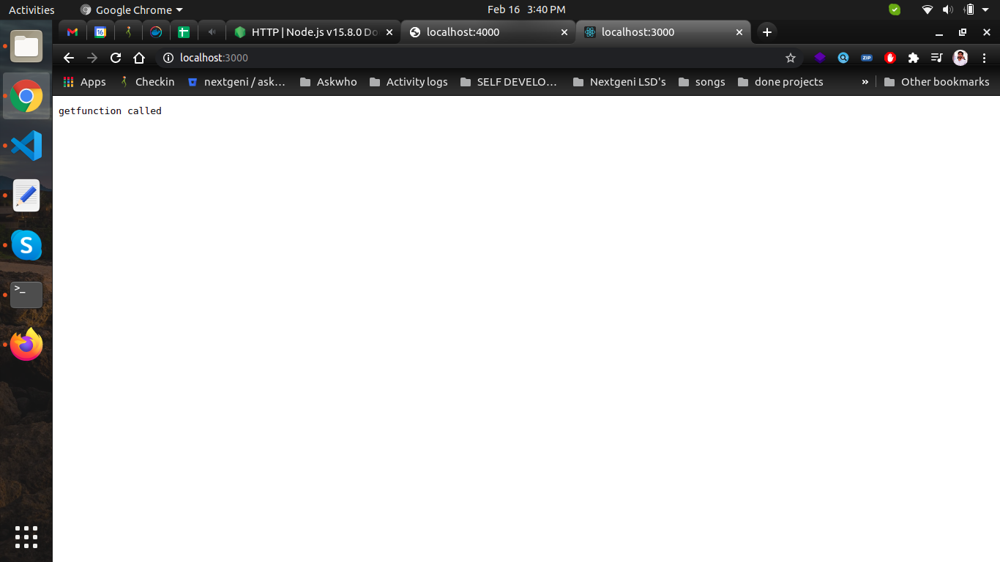
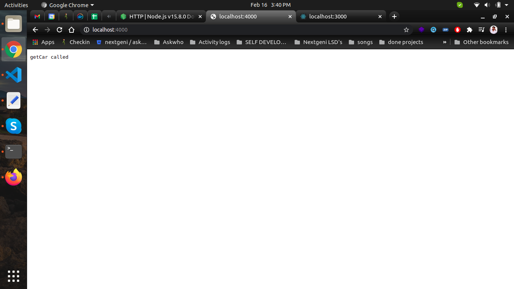
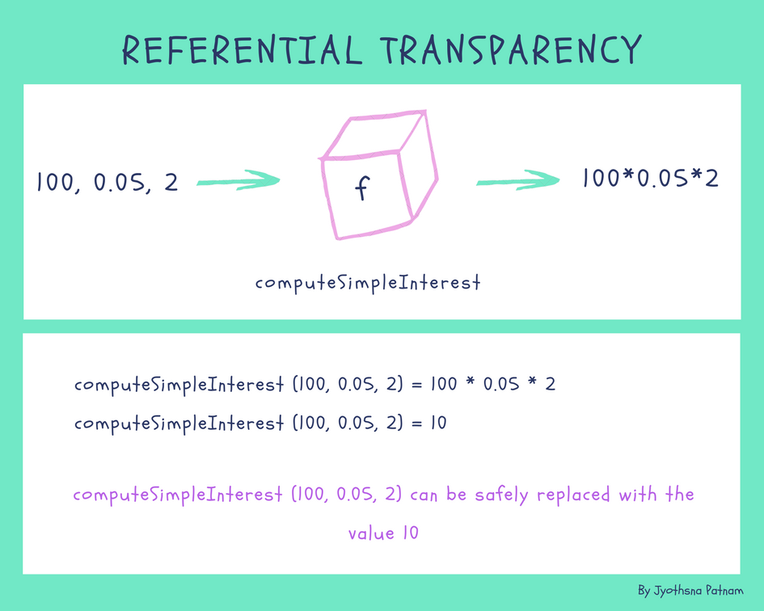

# interview q/a

docs https://docs.google.com/document/d/1buMa2i8YaC7jqaSUbDp4Gx1OXCMFDRwcRa21w4wtXis/edit#heading=h.cnbhrln7oo28

1. what is a monolith server
2. what does mean by async and sync in javascript https://youtu.be/h0ZUpPiV1ac?t=569
3. A higher order function which takes function as an argument
4. "handlebars is a template engine like Jade.
   Vash.
   EJS.
   Mustache.
   Dust.js.
   Nunjucks.
   Handlebars.
   atpl"
5. ES6 features
6. OOP programming in nodejs
7. how to allow cors in nodejs server using express and http module and cors module
8. what is refrential transparency https://www.google.com/search?q=referential+transparency&oq=refrential+tra&aqs=chrome.1.69i57j0i10l7.5812j0j1&sourceid=chrome&ie=UTF-8
9. What is difference between REST API and RESTful API?
10. Why bluebird? https://www.guru99.com/bluebird-promises.html to convert function that return callback into promisefy function
11. sendgrid We send over 90 billion non-spam emails a month for over 80,000 paying customers including technology leaders like AirBnB, Spotify, and Uber.
12. What is Node.js? What is it used for?
13. Q2. What is Event-driven programming?
14. Q3. What is Event loop in Node.js work? And How does it work?
15. Q4. What is REPL in Node.js?
16. Q5. What is the purpose of module.exports in Node.js?
17. Q6. What is the difference between Asynchronous and Non-blocking?
18. Q7. What is Tracing in Node.js?
19. Q8. How will you debug an application in Node.js?
20. Q9. Difference between setImmediate() vs setTimeout()
21. Q10. What is process.nextTick()
22. vent loop continues.
23. Q11. What is package.json? What is it used for?
24. Q12. What is libuv?
25. libuv is a multi-platform support library with a focus on asynchronous I/O. It was primarily developed for use by Node.js, but it’s also used by Luvit, Julia, pyuv, and others.
26. When the node.js project began in 2009 as a JavaScript environment decoupled from the browser, it is using Google’s V8 and Marc Lehmann’s libev, node.js combined a model of I/O – evented – with a language that was well suited to the style of programming; due to the way it had been shaped by browsers. As node.js grew in popularity, it was important to make it work on Windows, but libev ran only on Unix. libuv was an abstraction around libev or IOCP depending on the platform, providing users an API based on libev. In the node-v0.9.0 version of libuv libev was removed.
27. Some of the features of libuv are:
28. Full-featured event loop backed by epoll, kqueue, IOCP, event ports.
29. Asynchronous TCP and UDP sockets
30. Asynchronous file and file system operations
31. Child processes
32. File system events
33. Q13. What are some of the most popular modules of Node.js?
34. There are many most popular, most starred or most downloaded modules in Node.js. Some of them are:
35. express
36. async
37. browserify
38. socket.io
39. bower
40. gulp
41. grunt
42. Q14. What is EventEmitter in Node.js?
43. All objects that emit events are instances of the EventEmitter class. These objects expose an eventEmitter.on() function that allows one or more functions to be attached to named events emitted by the object.
44. When the EventEmitter object emits an event, all of the functions attached to that specific event are called synchronously.
45. Generator function \*Add(){} https://www.guru99.com/node-js-generators-compare-callbacks.html

## jobs posts

1. Sudofy
   3 July 2020 ·
   Are you a NodeJS backend developer?
   You know how to deal with Node, Express and Mongo?
   We are looking for you to join our awesome team!
   Experience:
   1+ Year
   Location:
   Karachi
   Requirements:

   - Strong Nodejs and Javascript understanding.
   - Understanding of Promises, async/await, ECMAScript 6.
   - Real-time communication - Socket-io, MQTT.
   - Database modelling.
   - Agile/Scrum.
   - MongoDB, Mongoose, ORM
   - AWS (Lamda, Elastic Beanstalk etc).
     Send your updated resume to hr@sudofy.com with the position title "BACKEND20" in the subject.

## learning goals

1. socket programming in nodejs
2. linkedin course for nodejs https://www.linkedin.com/learning/learning-rest-apis

## Nodejs interview questions

**How to check if Node.js supports ES6 language feature**

**ECMAScript 2015 (ES6) and beyond**

- All shipping features, which V8 considers stable, are turned on by default on Node.js and do NOT require any kind of runtime flag.

https://nodejs.org/en/docs/es6/

https://node.green/

https://bytearcher.com/articles/how-to-check-if-node-implements-es6-language-feature/

**Q.OOP in nodejs?**

Example



Ref https://www.freecodecamp.org/news/how-javascript-implements-oop/#:~:text=JavaScript%20is%20not%20a%20class,object%20oriented%20programming%20(OOP).&text=A%20prototype%2Dbased%20language%20has,properties%20for%20a%20new%20object.

**Q. Do we start multiple node servers on different ports using the same server code/ same app.js one file ?**

OR

How can we use http module with nodejs?

OR

Does the http module come from node js builtin library ?

Answer : Yes

Http is lightest module for routing and create server rather than other third party lib like express
Because it comes from built in nodejs
If your work is pretty small then you can do your work using http module

Example:

```jsx showLineNumbers
const http = require("http");

const getfunc = (req, res) => {
  res.end("getfunction called");
};

const getCar = (req, res) => {
  res.end("getCar called");
};

http.createServer(getfunc).listen(3000, () => {
  console.log("server is listening on port", 3000);
});

http.createServer(getCar).listen(4000, () => {
  console.log("server is listening on port 4000");
});
```

Result





Ref https://nodejs.org/api/http.html

**Q. How to allow cors in node js server using express and http module and cors module ?**

```jsx showLineNumbers
// Create our server
var server;
server = http.createServer(function (req, res) {
  // Set CORS headers
  res.setHeader("Access-Control-Allow-Origin", "_");
  res.setHeader("Access-Control-Request-Method", "_");
  res.setHeader("Access-Control-Allow-Methods", "OPTIONS, GET");
  res.setHeader("Access-Control-Allow-Headers", "*");
  if (req.method === "OPTIONS") {
    res.writeHead(200);
    res.end();
    return;
  }

  // ...
});
```

Ref: https://gist.github.com/balupton/3696140

**What is referential transparency ?**

Referential transparency and referential opacity are properties of parts of computer programs. An expression is called referentially transparent `if it can be replaced with its corresponding value without changing the program's behavior.`



**What is the difference between REST API and RESTful API?**

What's the `difference between a REST API` and a `RESTful` one? ... The short answer is that REST stands for Representational State Transfer. `It's (REST) an architectural pattern for creating web services`. A RESTful service is one that implements that pattern.

**Why bluebird ?**

There are many third party promise libraries available for JavaScript and even the standard library contains a promise implementation in newer versions of browsers and node/io.js. This page will explore why one might use bluebird promises over other third party or the standard library implementations. For reasons to use promises in general, see the Why Promises? Article.

### NODEJS OFFICIAL DOCUMENTATION :

**Ecmascript module, commonjs module**

Summary. ESM is the best module format thanks to its simple syntax, async nature, and tree-shakeability. CJS is synchronous and good for the back end. AMD is asynchronous and good
for front end.

**CJS**

CJS is short for CommonJS. Here is what it looks like:

```jsx showLineNumbers
//importing
const doSomething = require("./doSomething.js");

//exporting
module.exports = function doSomething(n) {
  // do something
};
```

**AMD**

AMD stands for Asynchronous Module Definition. Here is a sample code:

```jsx showLineNumbers
define(["dep1", "dep2"], function (dep1, dep2) {
  //Define the module value by returning a value.
  return function () {};
});
```

or

```jsx showLineNumbers
// "simplified CommonJS wrapping" https://requirejs.org/docs/whyamd.html
define(function (require) {
  var dep1 = require("dep1"),
    dep2 = require("dep2");
  return function () {};
});
```

**UMD**

UMD stands for Universal Module Definition. Here is what it may look like (source):

```jsx showLineNumbers
(function (root, factory) {
if (typeof define === "function" && define.amd) {
define(["jquery", "underscore"], factory);
} else if (typeof exports === "object") {
module.exports = factory(require("jquery"), require("underscore"));
} else {
root.Requester = factory(root.$, root._);
    }
}(this, function ($, \_) {
// this is where I defined my module implementation

    var Requester = { // ... };

    return Requester;

}));
```

**ESM**

ESM stands for ES Modules. It is Javascript's proposal to implement a standard module system. I am sure many of you have seen this:

```jsx showLineNumbers
import React from "react";
```

Other sightings in the wild:

```jsx showLineNumbers
import {foo, bar} from './myLib';

...

export default function() {
// your Function
};
export const function1() {...};
export const function2() {...};

```

Works in many modern browsers

It has the best of both worlds: CJS-like simple syntax and AMD's async

Tree-shakeable, due to ES6's static module structure

ESM allows bundlers like Rollup to remove unnecessary code, allowing sites to ship less codes to get faster load.

Can be called in HTML, just do:

```jsx showLineNumbers
<script type="module">import {func1} from 'my-lib'; func1();</script>
```

This may not work 100% in all browsers yet (source).

**Summary**

`ESM` is the best module format thanks to its simple syntax, async nature, and tree-shakeability.
`UMD` works everywhere and usually used as a fallback in case ESM does not work
`CJS` is synchronous and good for the back end.
`AMD` is asynchronous and good for the front end.

https://dev.to/iggredible/what-the-heck-are-cjs-amd-umd-and-esm-ikm#:~:text=Summary,nature%2C%20and%20tree%2Dshakeability.&text=CJS%20is%20synchronous%20and%20good,and%20good%20for%20front%20end.

**REPL in node js**

The Node. js Read-Eval-Print-Loop (REPL) is an interactive shell that processes Node. js expressions. The shell reads JavaScript code the user enters, evaluates the result of interpreting the line of code, prints the result to the user, and loops until the user signals to quit.

**What is profiling in node js ?**

CPU Profiling and Heap Snapshot tools are used to profile the execution performance and memory usage of your Node. ... js applications. These tools are available at the push of a button from the N|Solid Console.

https://nodejs.org/en/docs/guides/simple-profiling/

**What's a flame graph useful for?**

Flame graphs are a way of visualizing CPU time spent in functions. They can help you pin down where you spend too much time doing synchronous operations.

**Don't Block the Event Loop (or the Worker Pool)**

https://nodejs.org/en/docs/guides/dont-block-the-event-loop/#don-t-block-the-event-loop-or-the-worker-pool

**The Node.js Event Loop, Timers, and process.nextTick()**

https://nodejs.org/en/docs/guides/event-loop-timers-and-nexttick/

**Venture Dive interview test**

`They will give you program of get highest number with its frequency from an array`

Given an arr=[1,2,3,2,2,5,6,2]

Output : 2:4 (highest number is 2 with frequency of 4)

```jsx showLineNumbers

let arr = [4, 4, 4, 4, 2, 2, 3, 3, 4, 5, 6, 2, 2];
let freqObject = {};

for (let i = 0; i < arr.length; i++) {
if (freqObject[arr[i]]) {
freqObject[arr[i]] += 1;
} else {
freqObject[arr[i]] = 1;
}
}
console.log({ freqObject });

//now find max number with frequency

//output
{ freqObject: { '2': 4, '3': 2, '4': 5, '5': 1, '6': 1 } }
```
