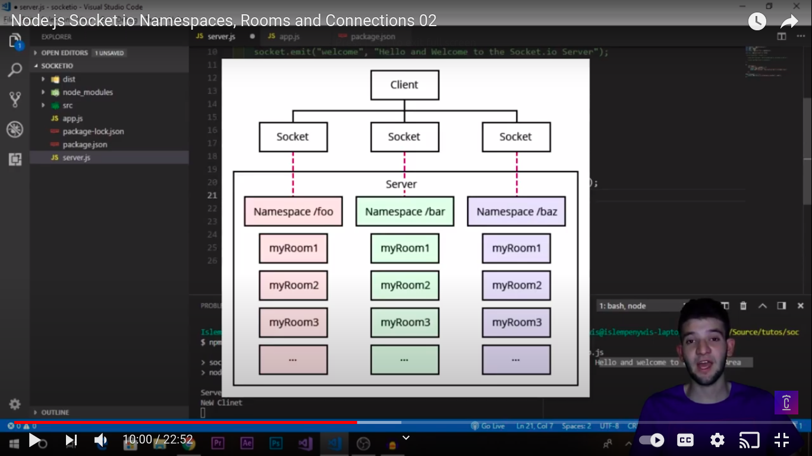

# Socket learning in nodejs

**What is Socket.io ?**

Socket is a library for creating (client/server) structure where a lot of clients can use web sockets to connect to a server and being able to exchange real time data (Event-like) for ex: Chat Messages, APIs, Databases.

With a couple of lines of code you can create a Chat application between multiple users and start using right out of the box where the library simplifies it the most.

You will be dealing with an Event driven system where you emit and listen for events both on the client and server.

**How WebSockets Works?**

It is composed of two main factors (Server & client) The server is the main piece of puzzle and where all the magic happens (it would have a database to store)
Ref https://youtu.be/soerr09FYCw

**Features**

Here are the features provided by Socket.IO over plain WebSockets:

1. reliability (fallback to HTTP long-polling in case the WebSocket connection cannot be established)
2. automatic reconnection
3. packet buffering
4. acknowledgments
5. broadcasting to all clients or to a subset of clients (what we call “Room”)
6. multiplexing (what we call “Namespace”)

https://socket.io/docs/v4

**Socket.io-client**

https://www.npmjs.com/package/socket.io-client

**Cors issue in sockets**

Simple Server-Side Fix

Note: DO NOT USE "socket io" package... use "socket.io" instead. "socketio" is out of date. Some users seem to be using the wrong package.

socket.io v3

docs: https://socket.io/docs/v3/handling-cors/

cors options: https://www.npmjs.com/package/cors

```jsx showLineNumbers
const io = require("socket.io")(server, {
  cors: {
    origin: "*",
  },
});
```


On server we use socket.io package
On client we use socket.io-client package

Serve emit an event and client receive event and logs msg wherever they want to do
Both server and client can emit event and other one listen

**Rooms and Namespaces in Sockets :**

Namespaces in sockets

They are like routes in node js
Routes to connect with socket like /games

E.g

```jsx showLineNumbers
io
.of("/games")
.on("connection",(socket)=>{
console.log('New client");
socket.emit("welcome","Hello and welcome to the Game Area")
});
```


