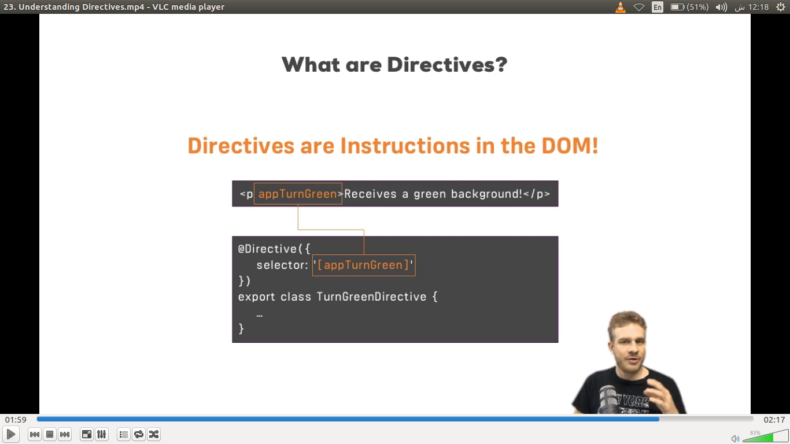
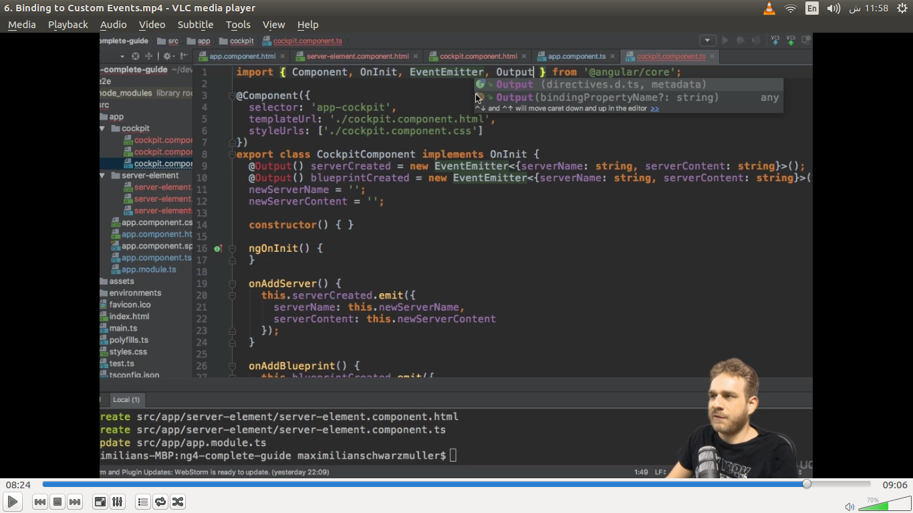
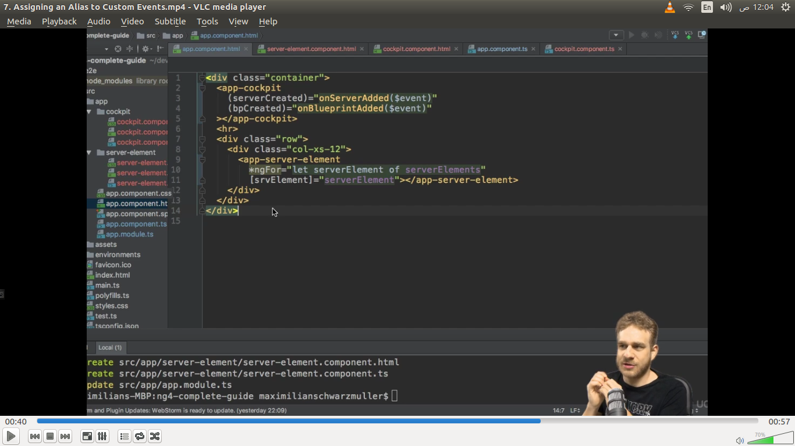

# ­Angular concepts

­Angular concepts

**angular concepts link** : https://github.com/sudheerj/angular-interview-questions

**KEYNOTE:**

- in angular html file we can execute typescript or javascript code between the quotation marks e.g : “ function() ”
- we can use ternary operator in typescript file­
- variable value access using double curly braces called string interpolation

### Directives

directives are instruction in the DOM

components are kind of instructions in the DOM by using selector in @Component decorator of comp we tell the dom that with the selector name show this comp template and business logic in the dom

components are kind of directives called directives with a template there are also kind of directives called directives with out a template

we can build custom directives

the seletor of directive can be attribute , element name or by class name like in comp



### ngIf : (structural directive)

added and remove elements from the DOM according to condition rather then just hide element. Means it element is not there by this directive

e.g

```html showLineNumbers
<p * ngif="”booleanProperty”">
  Server was created, server name is {{servername}}
</p>
```

`*` here means it is structural directive

structural directives (changing the DOM) means that is will change the structure of DOM by adding and remove element from DOM.

### Else in ngIf : (through ng-template)

e.g

```html showLineNumbers
<p * ngif="”booleanProperty;" else noServer”>
  Server was created, server name is {{servername}}
</p>

<ng-template #noServer>
  <p>no server was created</p>
</ng-template>
```

: here #noServer is a local reference or a marker to this element that show in else pa rt
`<ng-template>` is a component by angular used to mark places in the DOM by this we mark a certain template in the DOM which we want to show conditionally

**OR**

we can show else part by just add ! In ngif
e.g : `<p \* ngif=”!booleanProperty”>Server was created, server name is {{servername}} </p>`

**KEYNOTE:**

structural direction add or remove the elements from the DOM<br/>
and attribute directive only change the elements they were placed on .

### ngStyle: (Attribute directive allow us to dynamically change css style)

ngstyle use to dynamically style elements (it take an object in attribute binding rather then just string as in ngIf)

e.g `<p [ngStyle]=”{backgroundColor : getColor()}” >some text></p>`

here `ngSytle` use in as a property binding and we call getColor function to dynamically get color according to conditions

### ngClass: (Attribute directive allow us to dynamically change css class)

ngClass use to dynamically add class to element like below it also take an object with key value pair<br/>

key is class name and value is condition base true or false
https://docs.google.com/document/d/1Yb28IaCFmIBbGzM1ZBARQWkR1Wq40f4TeYzvsXgrK9c/edit

`<p [ngClass]=”{online: serverStatus=== ‘online’}”`

### ngFor: (structural because start with \* star allow us to loop through array list of content):

e.g: `<app-server \*ngFor=”let server of servers”></app-server>`

this will render app-server comp servers.lenght times

here we dont pass content to aur comp through selector name but loop throught again static content of length time of array

we can extract index in `*ngFor` like this

```jsx showLineNumbers
<div *ngFor=”let item of array; let i=index”
[ngStyle]=”{backgroundColor:i<=4 ?’ blue’ : transparent }” >{{item}}
</div>
```

### command to generate components

- ng generate component component-name OR ng g c comp-name
- ng generate component comp-name –spec false OR ng g c comp-name –spec false
- ng g c recipes/recipes-list –spec false

here g= generate , c= component and –spec false is use to not generate .spec file which I don’t need right now which is use for testing purpose

resipes/recipes-list is the path of recipes-list component that will be generated by this command (create inside recipes folder)

### DEBUGGING TOOL AND TIPS:

1. Reading the error messages in console
2. using `source maps` to easily debug your code by adding breakpoints

### SOURCEMAPS

remember typescipt is not run on the browser only javascript run by the main.bundle file which is bundled and build form of all the typescript and also js code into one main js file.

So we can access our pure js or typescript file using source maps in browser to debug code at run time source maps are little addition cli adds to out bundles which allow our browser to translate javascript code to typescript or to simply map the js code to our typescript files in development only these sourcemaps will be remove (striped out) for production ofcourse.this is a great feature so now we can add break points and debug code at run time on browser

your typescript file are placed in sources tab then localhost folder in react usually

but in angular it is placed in webpack:// => . (webpack then .(dot) folder)

source maps are the

3. install `angular augury` as chrome extension for degug angular code in browser

### type defination object in typescript

element : {type:string, name : string , content:string}

assigning a value here it is not type defination here we have right side to the equal sign not colon sign e.g below

element = {type:”name”, name:”recipe” , content:”list of recipes”}

**Custom property binding: (how to pass data from a component down to another component which is implement below (pass data from parent into child))**

here we make custom propery name as element which is use to bind with parent app component to get and bind list elements value in child comp to access array item in child

here we use `@input()` decorator paranthasis in front of it to make available this element property available to app.component.ts to bind element property by default we cant access property outside the class in parent component


if you want to use some other propery name to bind in outside comp you can pass that name in @input(‘any name’) and use this name in outside comp to bind property now element property is no longer available but this input anyname property can be bind to this component through outside comp

make sure you import input from @angular/core

here we user `@input()` decorator because here we receive some input from outer comp not sending data to outside thats why


### Custom event binding ( pass data from child to parent) (Component communication)

here we user `@output` decorator imported from @angular/core because here we want to output some data to outside comp





just like @input( ‘some property name ’)if you want to use some other event name to bind in outside comp you can pass that name in `@output`(‘any event name’) and use this name in outside comp to bind event through outside comp

e.g




### View Encapsulation in Angular:

view encapsulation means that in angular one style sheet style sheet is no longer available in outside component either the other is the child of that component that style is used only that component in which it imported for use not in child

this is behaviour by angular which prefere encapsulation in these forms

while we have seen that in html file if we apply an style in parent component let say root component that that style is applied to all child component except that we overright that style in child component by its style can be inline style

but in angular every component has its own custom style there is no style inheritance in moving down component so thats the bloody concept “It encapsulate your styles”

you can change the view encapsulation behaviour in angular by adding these property in @component decorator

```jsx showLineNumbers
@Component({
encapsulation:ViewEncapsulation.None //by default is emulated
})
```

None means this component will receive parent style behavioue in its component also

besides None you also use .Native and native uses the “Shadow DOM Technology”.this should gives you the same result as emulated but it is supported by some modern browser and give you the same result as before in emulated (encapsualtion in view) which is for most cases we use by default emulated behaviour

Angular not achieve this view encapsultaion feature by magically rather then what it do that It assign a unique attribute or property to all element of one component and different unique of other components all elements and so on like ngContent-ejo-0 apply all element in one comp and ngContent-ejo-1 for other and so on and it matches this propery with the style of that component and only apply that style on element that have that same attribute that assign by angular for component


It kind of emulate the **`“shadow DOM”`**

**Shadow Dom** : the shadow dom is a technology not supported by all browsers where each element has its kind of own yeah shadow dom behind it where you than could assign styles to each element but as this technology is not supported by all browsers this is how angular emulated and that is the default behaviour of view encapsulation in angular

### USING LOCAL REFERENCE IN TEMPLATES: (templates means html code)

if we dont want to use two -way data binding for pass data from child to parent then we can use local reference in templates.

Local reference can be add in any element of html
you add by #nameofyourchoice e.g serverName

you can use that ref every where in template (in html file) of that component not in .ts file

using local ref we can pass all the property of that element in any where and access its value like inputElement.value ==test for example

e.g


­

USING LOCAL REFERENCE IN TEMPLATES and also access in our typescript using ViewChild(‘decorator name or element or ‘local ref name’) decorator

@viewChild() use to get access to element from our dom (from our template) using place a local reference in element of that template using # sign import viewChild form angular/core store in any name of property of type ElementRed which is also imported from angular /core


**`<ng-content></ng-content>` special directive use to render child of element in template:**

this serve as a hook that you serve in your component which use to show the content tha wrap between opening and closing tag name of that component
this simply emulates the {this.children} property as we use to show child in js
e.g:


### Life Cycle Hooks :


**1.ngOnChanges:**

executed multiple times its executed right at the start when the new component is created but there after its also always called whenever one of our bound input properties changes and with that I mean properties decorated with `@Input()` so when ever these properties receive new values.

Receive an arugments , a changes argument which is of type simpleChanges, simpleChanges also need to be import from @angular/core

It is called after constructor and before ngOn Init

argument changes is an object which has properties (which are bound to

@Input(‘srvElement’) propname : { type:String ,name: string } ’)) types of simlesChanges bind to @Input()

and then angular simly gives us some information whats the

current value of that property ,

firstChange :true //true if it initalize and previous value is undefined at initialize

previousValue: **\_value or undefined\_\_** (undefined on first time on initailize because we didn’t change this before)

**2.ngOnInit:**

this method get executed whens the component has been initialized this doesn’t mean that we can see it it has not been added to the Dom yet but angular finish the basic initiaization our properties can now be accessed and initialize for example so the object was created you could say .

NgOninit will run after the constructor

**3.ngDoCheck:**

executed multiple times actually this method will be executed a lot because this will run whenever change detection runs now change Detection is simply is the system by which angular determines whenever something changed on the template of a component or inside of a component let just say so whenever it needs to change something in the template so whenever some property value change from one to two let say and that property is output in the template where of course angular need to re render that part of the template and ngDoCheck is a hook executed on every check angular makes now important on every check so not just if something change a lot of times ngDoCheck will run because you click some button which doesn’t change any thing but still its an event and on events angular has to check if something change because how else would it know you don’t tell it right so it has to check on certain triggering events like you click some where or a timer fired or an observable was resolved and on these ocations it will check your code an ngDoCheck will be executed now was this might some very in efficient angular does this in a very efficient way so change detection angular works pretty great and doesn’t cost a lot of performance ngDoCheck is a great method to use if you want to do something on every change detection cycle like may be manually inform angular about some change it would not be able to detect otherwise will that Is a very advance use case .

By simply we can say that it will called on every change occur (every means every change)
called whenever angular checks for any changes and there are couple of trigger which trigger this method an event was called by clicking or promise gave us back some data so a lot of triggers for ngDoCheck that is not something where you run amazing powerfull code because that will cost high level of performance

and it can be a great tool if you do need to change somethinf manually because angular didn’t pick it up or something like that .

**4.ngAfterContentInit:**

this is called whenever the content which is projected via ngContent has been initalized so not the view of the component itself but instead you could say the view of the parent component specially part which will get added to our component through ngContent .

Called after doCheck and it is called only once it doesn’t get initalize again it only run when the content or view is first time render or initialize or new created

**5.ngAfterContentChecked :**

is executed whenever change detection checked this content were projected into our component

it will called after 2 hooks first is

it is called ngAfterContentInit and secondly after ngDoCheck (because ngDoCheck run multiple times so it also run multiple times)

**6.ngAfterViewInit:**

ngAfterViewInit is then reached once the view of our own component has been finished initializing so once our view has been renderd you could say

It will run afterContectCheck first time when view initialized. For e.g se picture below

**7.ngAfterViewChecked :**

the same ngAfterViewChecked with that is called whenever our view has been checked so once we are sure that well either all changes which had to be done were displayed in the view or no changes were detected by angular .

It will runs multiple time after ngContentChecked hook .

All above life cycle cover this picture below


**8 ngOnDestory :**

called once the comp is about to be destroyed
and here is the great place to do some clean up work because this is called right before the object itself will be destroyed by angular

called when ever element remove from the dom


destroy was called because we removes that componet from the array


It is a good practice to implement the hooks name in implements defination in class name declaration (write the name of life cycle hook in front of implements which you use it in the comp )

you can implement a method alone without declare it in implements before classname but it is a good practice though and also imports all these interfaces (lifecyclehooks) from @angular/core to use them

e .g below


as we can see the max write all the hooks in run sequence in code also it is also a best practice that write that hook on the top which run first in your component

difference between onInit and afterViewInit

after onInit we dont access the content of view element

but after ngAfterViewInit give us access to or value of content that is render or view on the dom

e.g

se oninit and after view init hook code


as we can see that `Text Content` value is null after onInit hook but then
when ngAfterView init the value is test server so that is the difference

afterViewInit gives you the access to the template elements you can access and used their value
but before this hooks has been reached you can’ t do that you can’t checked the value of some elements in your dom because it hasn’t been rendered yet


**#contentChild()**


content child use to access element using local reference as we see in @viewChild above but the difference between viewChild and contentChild is that viewChild use to access elements which are now present in the same html file for that component and on the other hand contentChild use to access those elements using local reference which are define in between (construct or selector name) of that component (define in another html of component and between the name of current comp means child of that componet )

see example above in which as you can see that we have to access #contentParagraph local reference of paragraph that define in between our `<app-server-element>` component but we dont accessed in `<app-server-element>` component using @viewChild because it is not part of the view its part of the content (another components html file )so it can be accessed using @contentChild

**so that is something I just wanted to add @contentChild( ) to get access to content which is stored in another component but then passed on via ngContent**


just like with viewChild ref we can’t access the value or anything in contentChild before we reached ngAfterContentInit() hook see e.g below

just see the value of( Text content of paragraph) console


here we can see that in ngOnInit its empty but there after ngContentInit the content has its value (“just a test”) so now it was initialized
