# Javascript Learning/ interview questions

Press CTRL+end for jump to last line

**Prerequisites#**

To work with React Native, you will need to have an understanding of JavaScript fundamentals. If you’re new to JavaScript or need a refresher, you can dive in or brush up at Mozilla Developer Network.

Ref : https://reactnative.dev/docs/getting-started

https://1loc.dev/

**Introduction**

RxJS is a library for composing asynchronous and event-based programs by using observable sequences. It provides one core type, the Observable, satellite types (Observer, Schedulers, Subjects) and operators inspired by Array#extras (map, filter, reduce, every, etc) to allow handling asynchronous events as collections.

This library is use to implement listeners observables in javascript and subscribe to event that is not built in available in javascript

Simple def :https://youtu.be/7sJZi0grFR4?t=651

How can I use await in for loop or wait for iteration after specific time or condition or api response

**FOR AWAIT loop:**

You can use generator function for this because for loop is sync

Or you can use for await loop this is also using generator function on background I guess.

https://developer.mozilla.org/en-US/docs/Web/JavaScript/Reference/Statements/for-await...of

What is closure ?

In javascript you can access outside functions variables inside inner/child function that is not possible in other language but in JS it is possible thats why this concept is callled closures

E.g

This is most simple example of closures

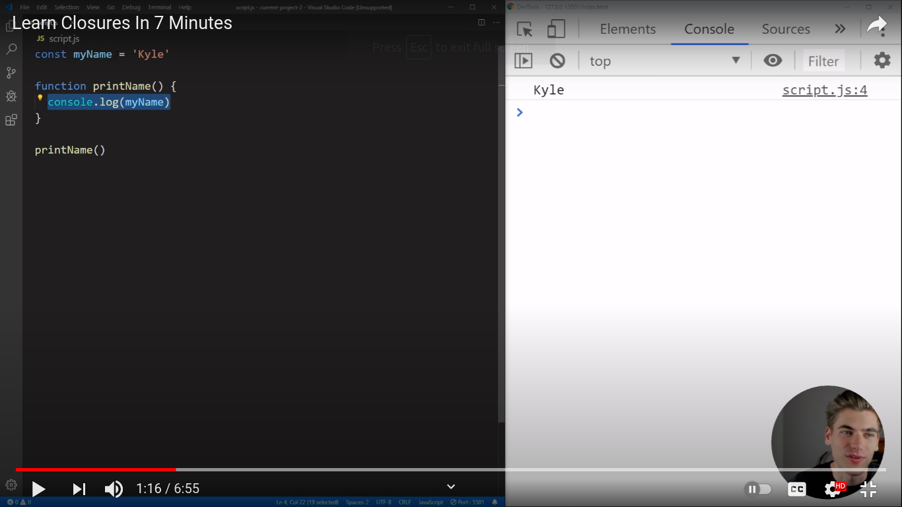

Here myName is a global var and it is available inside child function
A function that is getting access of parent functions or scope variable is called closures

Because in JS everything that is inside has access to its outside parent components

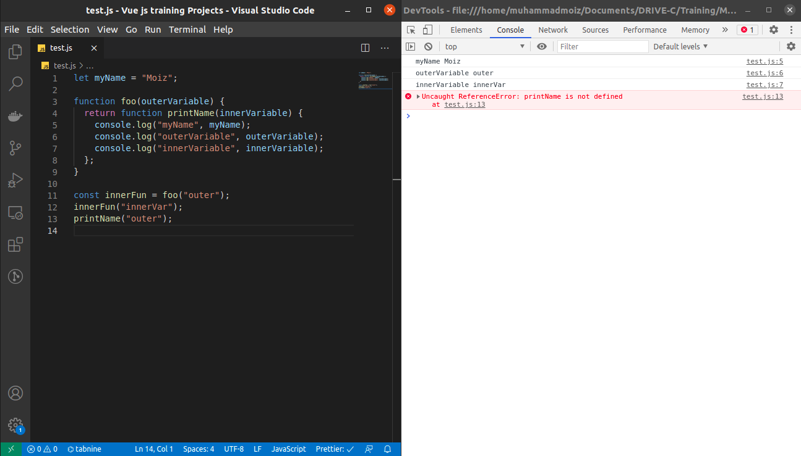

Or another example:

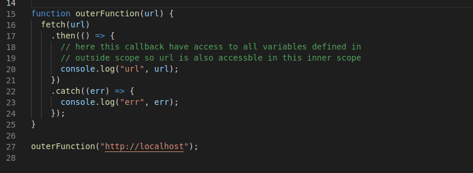

summary/conclusion
All you need to know about closures is that when you have a function that is defined inside of another function like this that inner function has access to the variables and scope of the outer function even if the outer function finished executing and those variables are no longer accessible outside that function.

**W3school definition:**

A closure is a function having access to the parent scope, even after the parent function has closed.
Ref : https://www.w3schools.com/js/js_function_closures.asp

Another aspect of closures is that we can create private variables that cannot access from outside scope by any other functions or variables

**Developer mozilla definition:**

A closure is the combination of a function bundled together (enclosed) with references to its surrounding state (the lexical environment). In other words, a closure gives you access to an outer function’s scope from an inner function. In JavaScript, closures are created every time a function is created, at function creation time.

**Lexical scoping**

Closure

Consider the following code example:

```jsx showLineNumbers
function makeFunc() {
  var name = "Mozilla";
  function displayName() {
    alert(name);
  }
  return displayName;
}

var myFunc = makeFunc();
myFunc();
```

Ref: https://developer.mozilla.org/en-US/docs/Web/JavaScript/Closures

**how to check variable is integer in JS ?**

```jsx showLineNumbers
"Number.isInteger('1')
false
Number.isInteger(1)
true"
```

**What is the side effect concept in JS, react,redux etc?**

Or

What are side effect in javascript/react/redux etc

**Side Effect : (state change / modify global variable ):**

General definition

A side effect is any application state change that is observable outside the called function other than its return value. Side effects include: Modifying any external variable or object property (e.g., a global variable, or a variable in the parent function scope chain) Logging to the console.

Or

"Side Effect'' is not a react-specific term. It is a general concept about behaviours of functions. A function is said to have side effects if it tries to modify anything outside its body. For example, if it modifies a global variable, then it is a side effect.
https://www.google.com/search?q=side-effects+in+react&oq=side-effects+in+&aqs=chrome.0.0l2j69i57j0i22i30l5.3543j0j1&sourceid=chrome&ie=UTF-8

**What is hoisting ?**

Hoisting is a JavaScript mechanism where variables and function declarations are moved to the top of their scope before code execution. Inevitably, this means that no matter where functions and variables are declared, they are moved to the top of their scope regardless of whether their scope is global or local

Var support hoisting before es6 feature

But let and const doesn’t support hoisting es6 feature

You can declare let and var alone without initialization like this

```jsx showLineNumbers
Let a ;
Var a;
```

`But you have to both declare and initialize const at the same time otherwise it's through error`

```bash showLineNumbers
Like this
Wrong:
Const a;
Result :
const c
```

`VM6313:1 Uncaught SyntaxError: Missing initializer in const declaration`

```bash showLineNumbers
Right
Const c=”random string”;
Or
Const c=null;
This is also acceptable because null is a value which itself nothing in it. Like an empty value.
```

What is the difference between these 2 functions ?

This :

```jsx showLineNumbers
function A() {
  console.log("I'm in foo function");
}
```

And this :

```jsx showLineNumbers
let B = () => {
  console.log("B is called");
};
```

The difference between A and B is the A support hoisting in javascript

B doesn’t support hoisting because B is a variable of type function but variable declare with value
undefined if its initialize with var and error of not declare when initialize with let or const

E.g

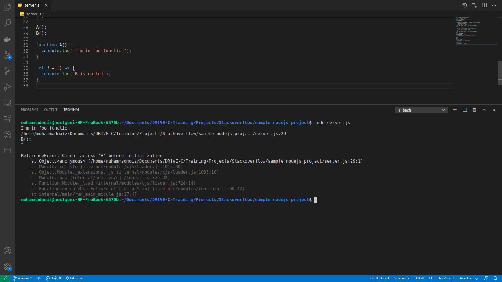

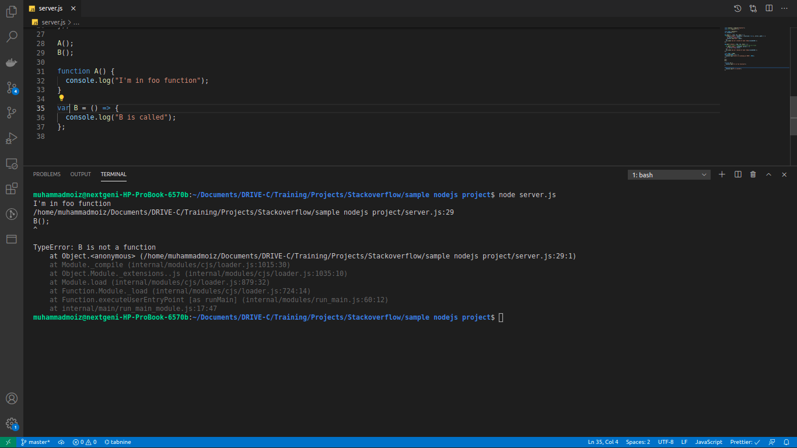

**Q array.reduce method in javascript?**

Ans: reduce methods is an array method use to run a function in all items of array and that function take 2 params (startVarValue,arrayItem)

E.g

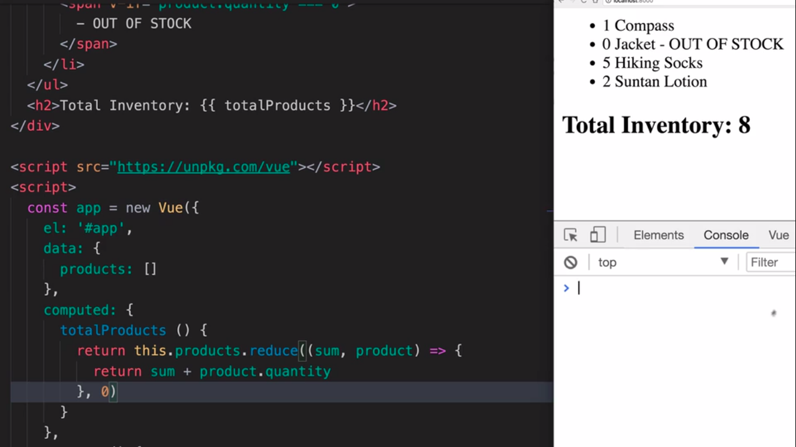

Or

```jsx showLineNumbers
let products = [
  { name: "shoes", quantity: 10 },
  { name: "cloths", quantity: 45 },
  { name: "watch", quantity: 34 },
];

products.reduce((initialVal, product) => {
  return initialVal + product.quantity;
}, 0);

output: 89;
```

**Garbage collector in Javascript:**

There’s a background process in the JavaScript engine that is called [garbage collector](<https://en.wikipedia.org/wiki/Garbage_collection_(computer_science)>). It monitors all objects and removes those that have become unreachable.

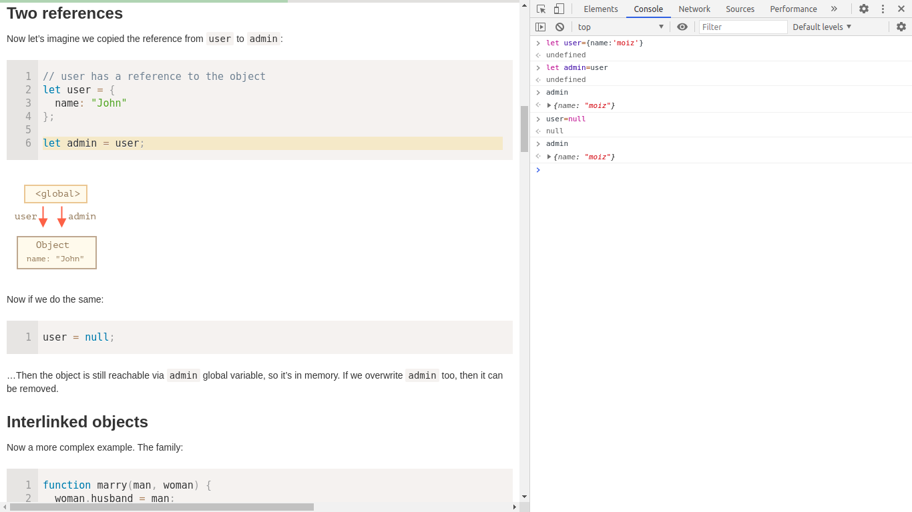

Ref: https://javascript.info/garbage-collection

**POST increment:**

counter+=1 is same as counter=counter + 1
E.g

```jsx showLineNumbers
let count = 0;
(function increment() {
  return (count += 1);
})();
1;
```

// Same as

```jsx showLineNumbers
count = 0;
(function increment() {
  return (count = count + 1);
})();
1;
```

The difference between the two lies in their return values. The prefix increment returns the value of a variable after it has been incremented. On the other hand, the more commonly used postfix increment returns the value of a variable before it has been incremented.20-Oct-2018

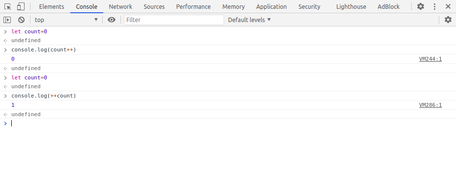

**Object.preventExtensions() :**

You can convert mutable object into immutable by using this method

```jsx showLineNumbers
// I am John Doe from Vancouver, Canada. Latitude(49.2827), Longitude(-123.1207)

Object.preventExtensions();
// This method prevents the addition of new properties to our existing object. preventExtensions() is an irreversible operation. We can never add extra properties to the object again.

Object.isExtensible(myTesla); // true
Object.preventExtensions(myTesla);
Object.isExtensible(myTesla); // false
myTesla.color = "blue";
console.log(myTesla.color); // undefined
```

**1.Object.preventExtensions()**

This method prevents the addition of new properties to our existing object. preventExtensions() is an irreversible operation. We can never add extra properties to the object again.

OR

Object.preventExtensions() (by this we can’t add new properties to object but we can change the value of existing properties of object that was defined before)
e.g

```jsx showLineNumbers
Object.isExtensible(myTesla); // true
Object.preventExtensions(myTesla);
Object.isExtensible(myTesla); // false
myTesla.color = "blue";
console.log(myTesla.color); // undefined
```

**Object.seal()**

It prevents additions or deletion of properties. seal() also prevents the modification of property descriptors.

E.g

```jsx showLineNumbers
Object.isSealed(myTesla); // false
Object.seal(myTesla);
Object.isSealed(myTesla); // true

myTesla.color = "blue";
console.log(myTesla.color); // undefined

delete myTesla.batteryLife; // false
console.log(myTesla.batteryLife); // 300

Object.defineProperty(myTesla, "batteryLife"); // TypeError: Cannot redefine property: batteryLife
```

**Object.freeze()**

It does the same that Object.seal() plus it makes the properties non-writable.

E.g

```jsx showLineNumbers
Object.isFrozen(myTesla); // false
Object.freeze(myTesla);
Object.isFrozen(myTesla); // true

myTesla.color = "blue";
console.log(myTesla.color); // undefined

delete myTesla.batteryLife;
console.log(myTesla.batteryLife); // 300

Object.defineProperty(myTesla, "batteryLife"); // TypeError: Cannot redefine property: batteryLife
myTesla.batteryLife = 400;

console.log(myTesla.batteryLife); // 300
```

**What is currying in JavaScript?**

"Currying is a technique of evaluating a function with multiple arguments, into a sequence of functions with a single argument.
In other words, when a function, instead of taking all arguments at one time, takes the first one and return a new function
that takes the second one and returns a new function which takes the third"

```jsx showLineNumbers
//No currying
function volume(w, h, l) {
return w _ h _ l;
}

volume(4, 6, 3); // 72

//Currying
function volume(w) {
return function(h) {
return function(l) {
return w _ h_ l;
}
}
}

volume(4)(6)(3); // 72
```

**how to use conditional statements in switch cases?**

solution : (pass true in switch parameter)

```jsx showLineNumbers
let age = 30;
switch (true) {
  case age > 20:
    console.log("You are young");
    break;
}
```

**Dictionaries in javascript :**

```jsx showLineNumbers
var dict = []; // create an empty array

dict.push({
  key: "keyName",
  value: "the value",
});
// repeat this last part as needed to add more key/value pairs
```

OR

```jsx showLineNumbers
// Dictionaries are placed in braces, and values are seperated with a comma
let myDictionary = {
  "value 1": "string",
  "value 2": 2,
  "value 3": ["array value 1", "array value 2"],
};

// Access the dictionary using its keys
var value1 = myDictionary["value1"]; // Type: String
var value2 = myDictionary["value2"]; // Type: Int
```

they are just HASHMAPs (a collection of key value pairs like an object we can directly access element by key name easily because key is index in dictionaries) where as in array we have to pass specific index let say array[1] which is not human understandable or predictable we don't know what is in at specific index

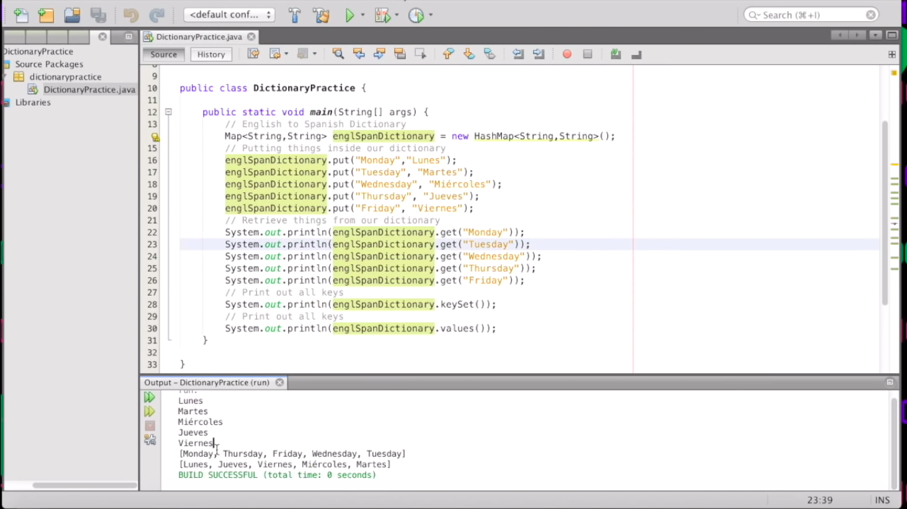

Ref
https://pietschsoft.com/post/2015/09/05/javascript-basics-how-to-create-a-dictionary-with-keyvalue-pairs
https://www.hackerrank.com/challenges/30-dictionaries-and-maps/tutorial

NOTE:
In dictionaries `no guaranteed ordering` (Ascending or descending)

**what are primitive and non primitive types ?**

**Non-Primitive Data Types**

Primitive types are predefined (already defined) in Java. Non-primitive types are created by the programmer and is not defined by Java (except for String ). Non-primitive types can be used to call methods to perform certain operations, while primitive types cannot

https://www.w3schools.com/java/java_data_types.asp#:~:text=Non%2DPrimitive%20Data%20Types,-Non%2Dprimitive%20data&text=Primitive%20types%20are%20predefined%20(already,operations%2C%20while%20primitive%20types%20cannot.

```jsx showLineNumbers
/\* Primitive data types are those data types which are used by programmers when creating variables in their program.
For example :-

- boolean
- char
- byte
- short
- int
- long
- float
- double
Non-Primitive data types:
- String
- array
- enum
- class
- etc
\*/
```

**Is the object primitive or non primitive ?**

In the Java programming language, **non-primitive data types are simply called "objects"** because they are created, rather than predefined. While an object may contain any type of data, the information referenced by the object may still be stored as a primitive data type.

https://www.google.com/search?q=object+is+primitive+or+non+primitive&oq=object+is+primitive+or+non+primitive&aqs=chrome..69i57j33i22i29i30l8.14132j1j1&sourceid=chrome&ie=UTF-8

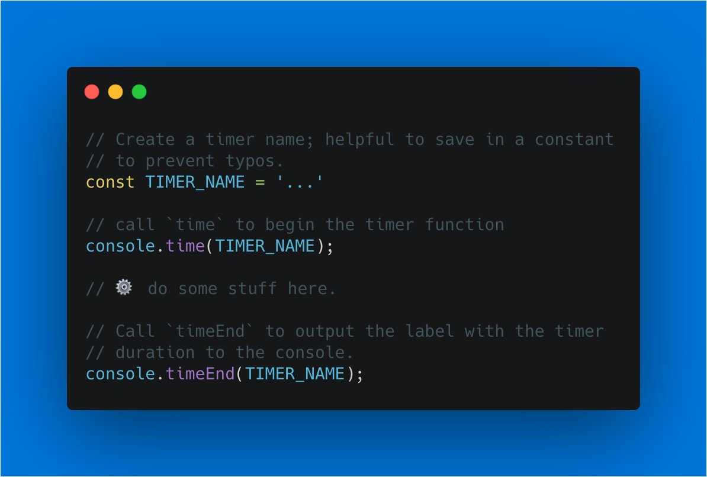

Test :

```jsx showLineNumbers
console.time('moiz')
console.timeEnd('moiz')
moiz: 2144.529052734375 ms
```

**What is a pure function in JavaScript?**

Pure Functions:

A pure function is a function which: Given the same input, will always return the same output. Produces no side effects.

**4 Ways to Remove Character from String in JavaScript :**

1. Using substring() method
2. With substr() method
3. Using slice() method
4. Using replace() method

https://www.tracedynamics.com/javascript-remove-character-from-string/

```jsx showLineNumbers
var text = "A | normal | text |";

var final = text
  .split("")
  .filter(function (c) {
    return c != "|";
  })
  .join("");

console.log(final);
// A normal text
```

https://stackoverflow.com/questions/42554744/javascript-remove-all-in-a-string

**Answering Tricky JS Interview Questions :**

**Explain event delegation :**

`“Js event listeners fire not only on a single DOM element but on all its descendents”`

The idea is that if we have a lot of elements handled in a similar way, then instead of assigning a handler to each of them – we put a single handler on their common ancestor.

https://javascript.info/event-delegation

**Event Bubbling :**

`“Inverse of event delegation. Also known as propagation, events on an element will “bubble up”` and also fire on all parents.

The bubbling principle is simple.

**When an event happens on an element, it first runs the handlers on it, then on its parent, then all the way up on other ancestors.**

Let’s say we have 3 nested elements FORM > DIV > P with a handler on each of them:

```jsx showLineNumbers
<style>
  body * {
    margin: 10px;
    border: 1px solid blue;
  }
</style>

<form onclick="alert('form')">FORM
  <div onclick="alert('div')">DIV
    <p onclick="alert('p')">P</p>
  </div>
</form>

```

A click on the inner `<p>` first runs onclick:

1. On that `<p>`.
2. Then on the outer `<div>`.
3. Then on the outer `<form>`.
4. And so on upwards till the document object.

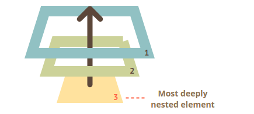

**Type checking of data types using typeof :**

typeof null

"object"

```jsx showLineNumbers
let foo = "moiz";
foo[1] = "x";
console.log(foo);
("moiz");
// This won’t change because strings are immutable
```

**What are prototypes in javascript ?**

`JavaScript Object Prototypes`

All JavaScript objects inherit properties and methods from a prototype.

Example

```html
<!DOCTYPE html>
<html>
  <body>
    <h2>JavaScript Objects</h2>

    <p id="demo"></p>

    <script>
      function Person(first, last, age, eye) {
        this.firstName = first;
        this.lastName = last;
        this.age = age;
        this.eyeColor = eye;
      }

      Person.prototype.nationality = "English";

      var myFather = new Person("John", "Doe", 50, "blue");
      document.getElementById("demo").innerHTML =
        "The nationality of my father is " + myFather.nationality;
    </script>
  </body>
</html>
```

Result

**JavaScript Objects**

The nationality of my father is English

The JavaScript `prototype` property also allows you to add new methods to objects constructors:

```html
<!DOCTYPE html>
<html>
  <body>
    <h2>JavaScript Objects</h2>

    <p id="demo"></p>

    <script>
      function Person(first, last, age, eye) {
        this.firstName = first;
        this.lastName = last;
        this.age = age;
        this.eyeColor = eye;
      }

      Person.prototype.name = function () {
        return this.firstName + " " + this.lastName;
      };

      var myFather = new Person("John", "Doe", 50, "blue");
      document.getElementById("demo").innerHTML =
        "My father is " + myFather.name();
    </script>
  </body>
</html>
```

**JavaScript Objects**

My father is John Doe

https://www.w3schools.com/js/js_object_prototypes.asp

**Buffer in nodejs :**

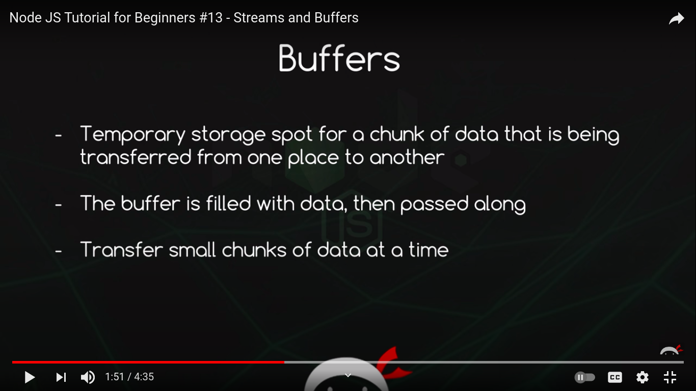

https://www.youtube.com/watch?v=GlybFFMXXmQ&ab_channel=TheNetNinja

So, basically you're asking what is the difference between these two (where p is a promise created from some previous code):

```js showLineNumbers
return p.then(...).catch(...);
and
return p.catch(...).then(...);
```

https://stackoverflow.com/questions/42013104/placement-of-catch-before-and-after-then

# Javascript Learning tech and fixes

How to read a local text file?
Ask Question

```html
<!DOCTYPE html>
<html lang="en">
  <head>
    <meta charset="UTF-8" />
    <meta http-equiv="X-UA-Compatible" content="IE=edge" />
    <meta name="viewport" content="width=device-width, initial-scale=1.0" />
    <title>Document</title>
  </head>

  <body>
    <h1>Reading pdf resume</h1>
  </body>

  <script>
    function readTextFile(file) {
      var rawFile = new XMLHttpRequest();
      rawFile.open("GET", file, false);
      rawFile.onreadystatechange = function () {
        if (rawFile.readyState === 4) {
          if (rawFile.status === 200 || rawFile.status == 0) {
            var allText = rawFile.responseText;
            alert(allText);
          }
        }
      };
      rawFile.send(null);
    }
    readTextFile("http://127.0.0.1:8080//sample.txt");

    // 2nd way
    // fetch('file:///home/muhammadmoiz/Documents/read-local-file/sample.txt')
    //     .then(response => response.text())
    //     .then(text => console.log(text))
    // outputs the content of the text file
  </script>
</html>
```

Run server by command http-server on localhost

https://stackoverflow.com/questions/14446447/how-to-read-a-local-text-file

https://www.youtube.com/watch?v=OWxVjS3yD1c&ab_channel=C%C3%B3digoconJuan

**How to run html file on localhost?**

Ask Question

https://stackoverflow.com/questions/38497334/how-to-run-html-file-on-localhost

https://developer.mozilla.org/en-US/docs/Web/JavaScript/Reference/Statements/function*

https://dev.to/developertharun/4-ways-to-use-generator-functions-in-javascript-examples-advantages-2ohd

- namespaces in css
- iterators in js
- generator fun in js
- css vs css in js difference

**JS iterators**

https://codeburst.io/a-simple-guide-to-es6-iterators-in-javascript-with-examples-189d052c3d8e

https://www.youtube.com/watch?v=2oU-DfdWM0c&ab_channel=dcode

**generator**

https://www.pluralsight.com/guides/using-asyncawait-with-generator-functions

https://codeburst.io/understanding-generators-in-es6-javascript-with-examples-6728834016d5

**concepts**

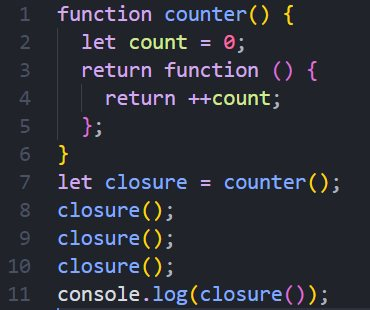
