# PWA Learning

**What is PWA technology?**

`PWA` stands for progressive web app. This is an app built from the web technologies we all know and love, like HTML, CSS, and JavaScript, but with a feel and functionality that rivals an actual native app. ... Plus, you can offer all the features of native apps, like push notifications, offline support, and much more.06-May-2020

Benefits of PWA :

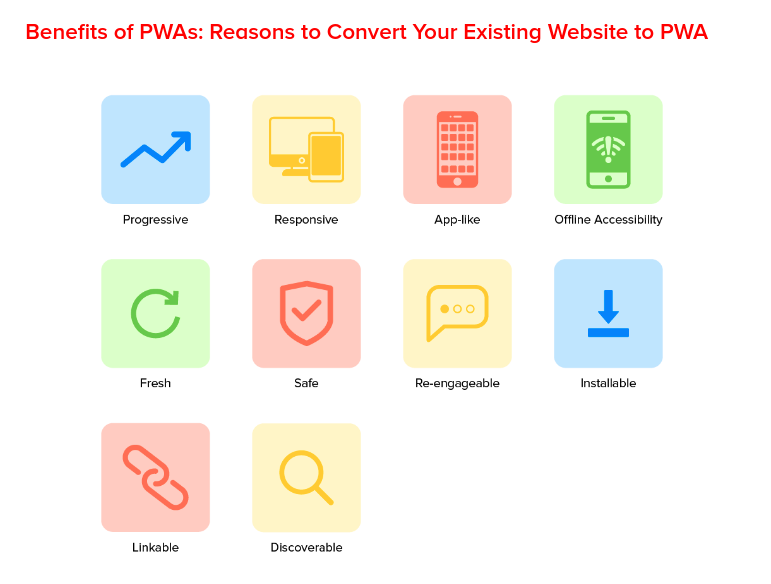

**Progressive Web Apps**

Websites that took all the right vitamins

https://web.dev/progressive-web-apps/


https://developers.google.com/web/tools/workbox/

Using Workbox to manage your caches - Progressive Web App Training

https://www.youtube.com/watch?v=QHm6-xu4F_I&ab_channel=GoogleChromeDevelopers

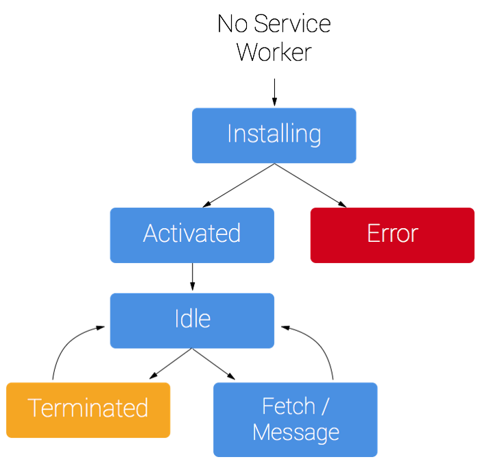

**Service worker life cycle:**

https://developers.google.com/web/fundamentals/primers/service-workers/lifecycle

**A Guide on How to Convert a Website to Progressive Web App (PWA)**

https://appinventiv.com/blog/migrating-your-website-to-progressive-web-app/

**Convert any website into a PWA in just 3 simple steps:**

https://dev.to/developertharun/convert-any-website-into-a-pwa-in-just-3-simple-steps-35pp

**Will PWA replace native apps ?**

PWAs can do most things native apps can and many native apps could easily be replaced by a PWA. ... Android has significantly better support for PWAs and is developing rapidly, while support on iOS is limited and inconsistent.

**Here are 9 of the best examples of companies using PWAs.**

1. Twitter. Twitter is taking advantage of PWA technology for its Twitter Lite platform. ...
2. Uber. ...
3. Instagram. ...
4. Smashing Magazine. ...
5. Financial Times. ...
6. Forbes. ...
7. Lancôme. ...
8. Pinterest.

References :

https://www.linkedin.com/pulse/planning-growth-launch-first-remove-blind-spot-from-your-ikram/

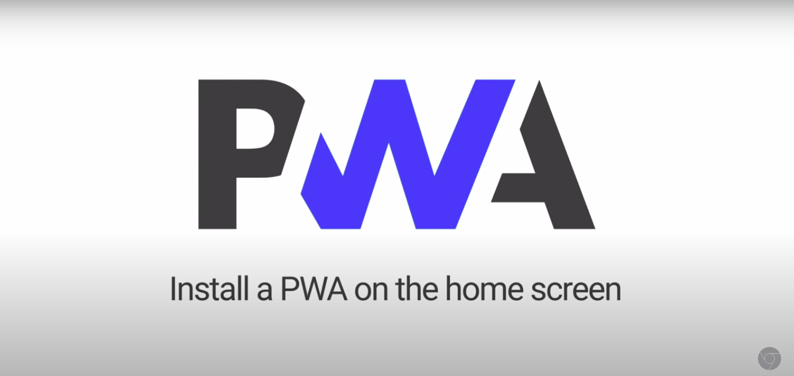

- Since the PWA began on the web your customers could create a bookmark in the browser.

- In the past year 80% of PWA users intentionally moved apps to the home screen its incredibly useful

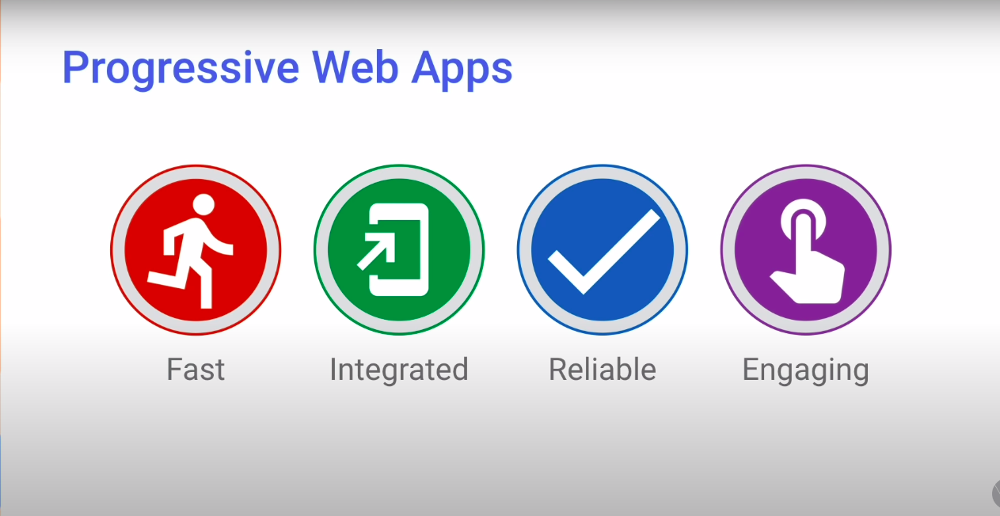

**How to add a home screen icon ?**

```bash showLineNumbers
Android : Manifest file
IOS : <meta> tags (manifest under development)
Mozilla : Manifest file
MS Edge : Manifest file
```

**Web App Manifest:**

In index.html

```html
<head>
  <link rel="manifest" href="/expense-tracker-app/manifest.json" />
</head>
```

How manifest.json looks like :

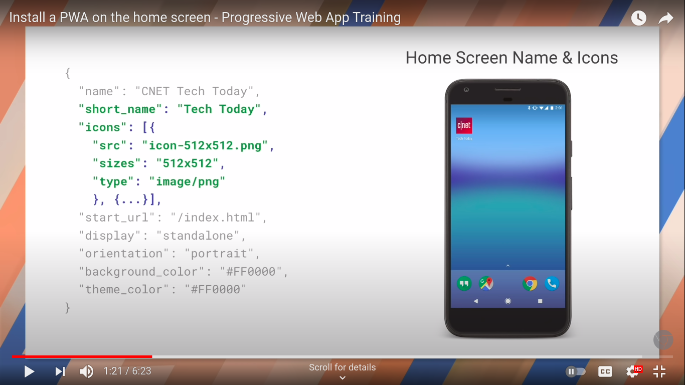

Here :

- Name : is full name (the full name and icon will also be used for the splash screen)
- Short_name : to appear under the icon
- Icons: set of icons at different sizes for different screens
- Background-color: you should set background color for splash screen
- Start_url : starting url of the app
- Display: you can also control whether you show the URL bar or launching full screen mode
- Orientation : screen orientation portrait / landscape
- Theme-color : you can change the color of your app in task switcher / this usually matched your background color.

But be careful :

When you go full screen you lose access to safari’s back button so you will need to provide navigation inside your app.
As of mid 2018 apple was developing manifest file support
Know it might be you can use one standard across all browsers

Let's ask your customer whether they want to install icon

The install prompt

You can trigger sample install prompt like this :

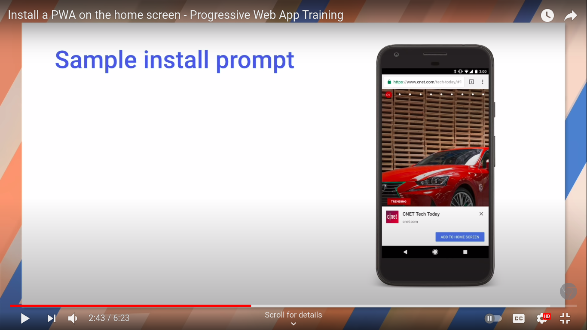

**Requirements :**

You app has to meet 2 requirements

1. Web App Manifest : ( It needs to have manifest.json file with 192by192 icon size to fit the screen)
2. Offline support :( It needs to work offline)

**Installing the app :**
Technique work on all versions :

1. Listen for the “beforeinstallprompt” event
2. Notify the user that your app can be installed
   Chrome needs to see a user gesture at this point
   Finally :
3. Show the prompt by calling prompt()

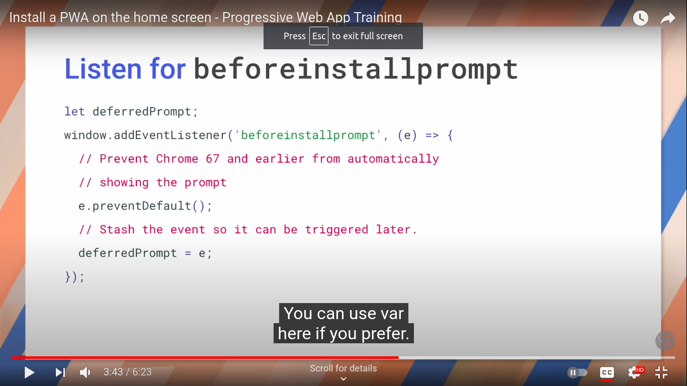

Add a btn link and icon to begin the installation process :
Don't show a full page and there's additional or other elements that may be annoying or distracting.

In some cases you may want to wait before showing a prompt to the users so you don't distract them from what they are doing.
E,g if the user is in checkout flow or creating their account let them complete that before offering the prompt.

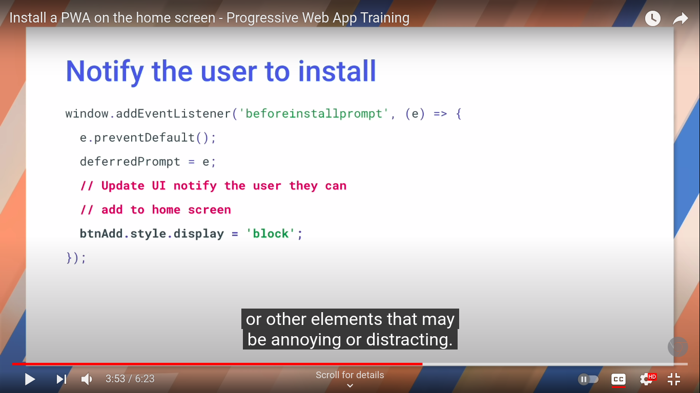

When you get a clicktostartinstallation call prompt on the saved event.
This must happen inside the user event handler.
It will show the modal dialog asking user to add your app to the home screen

Then wait for the promising user choice property.
It will complete once the user accepts or cancels the dialog you should then clear the saved event.

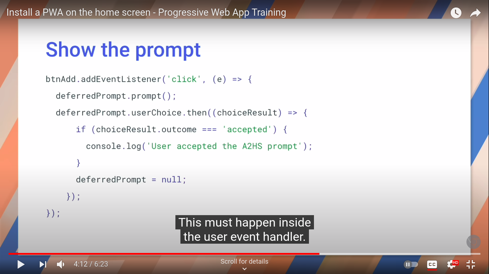

**Speaking of analytics :**

You can listen to the app installed event to detect that your PWA has been added to the home screen

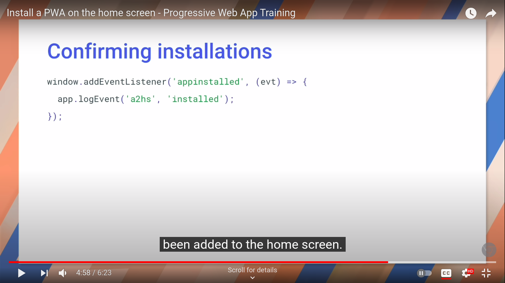

Once you add this code :

Let's test this with `Lighthouse` :

**Lighthouse PWA Analysis Tool :**

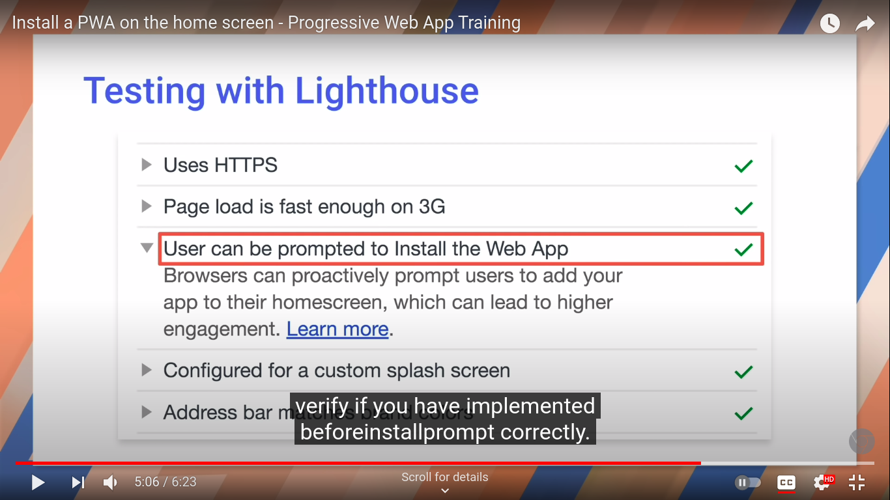

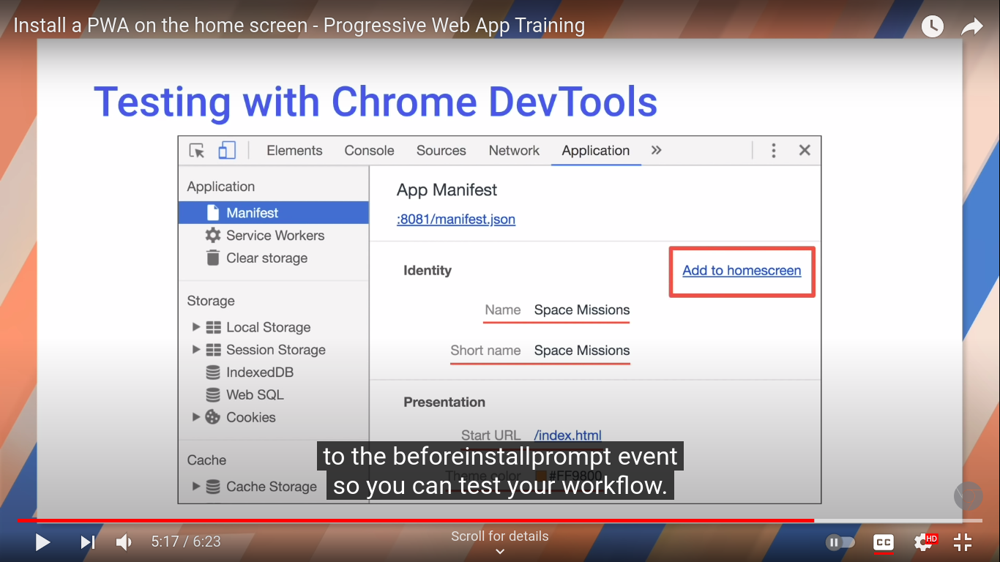

Clicking Add to home screen will turn to the beforeinstallprompt event so you can test your workflow

Note ; if the PWA criteria aren’t meet
Chrome will through an exception in the console instead of firing the event.

There are 2 more things you may want to add

1. Change the CSS if launched full screen
2. The other is to detect the full screen launch in code

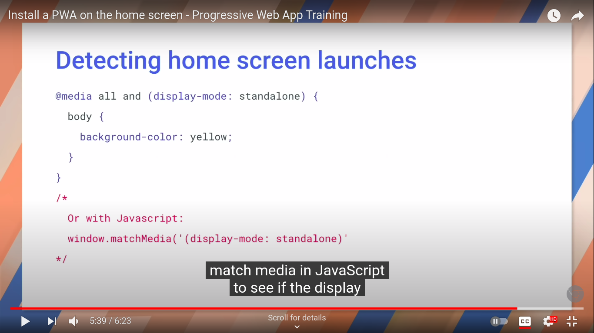

You can use media queries to see if the display mode is set to standalone
Or

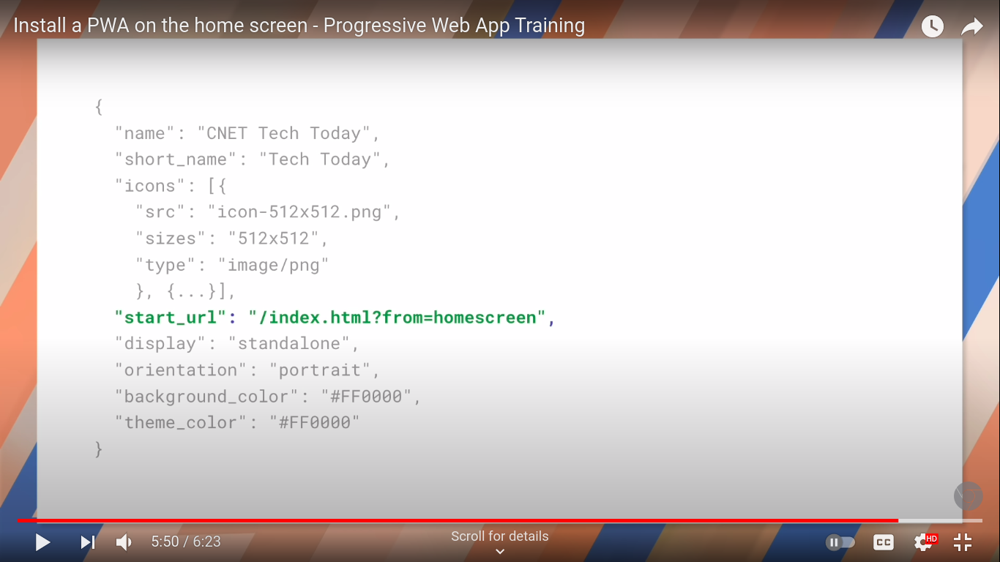

You can do this in your manifest file
By adding a query parameter to your start URL.

This makes it easy to use analytics to see how many people are installing your PWA.

References :

https://www.youtube.com/watch?v=LWRdBywm4Zo&ab_channel=GoogleChromeDevelopers
https://developers.google.com/web/ilt/pwa/lighthouse-pwa-analysis-tool
https://developers.google.com/web/tools/lighthouse
https://chrome.google.com/webstore/detail/lighthouse/blipmdconlkpinefehnmjammfjpmpbjk/related?utm_source=chrome-ntp-icon
https://developers.google.com/web/tools/lighthouse#devtools
https://realfavicongenerator.net/

**Lighthouse dev tool for debugging:**

Install this extension from google chrome and open site and open dev console by pressing F12 and goto lighthouse tab and click on generate report.

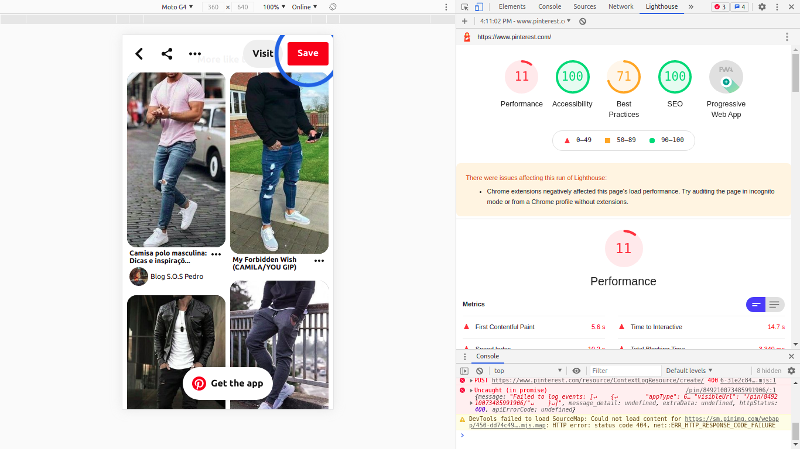

**Running Lighthouse from the command line :**

If you want to run Lighthouse from the command line (for example, to integrate it with a build process) it is available as a Node module.

`npm install -g lighthouse`

This installs the tool globally. You can then run Lighthouse from the command line (where https://airhorner.com/ is your app):

`lighthouse https://airhorner.com/`

You can check Lighthouse flags and options with the following command:

`lighthouse --help`

This command line will generate html file with all the test logs
E.g Airhorner.com_2021-02-23_16-19-12.report.html

Response of `https://airhorner.com/ generated using command file`

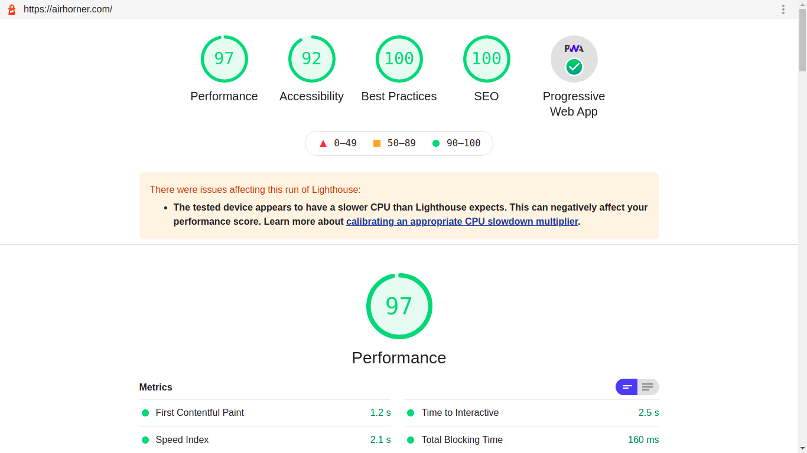

https://developers.google.com/web/ilt/pwa/lighthouse-pwa-analysis-tool#running_lighthouse_from_the_command_line

Safari IOS doesn’t support automatic pop for add to home screen icon
We have to manually create popup and give user direction for educate user that by click on this icon you can add this app to `home screen.`

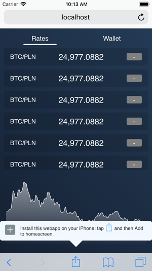

https://stackoverflow.com/questions/51160348/pwa-how-to-programmatically-trigger-add-to-homescreen-on-ios-safari
https://developer.apple.com/library/archive/documentation/AppleApplications/Reference/SafariWebContent/ConfiguringWebApplications/ConfiguringWebApplications.html
https://www.netguru.com/codestories/pwa-ios

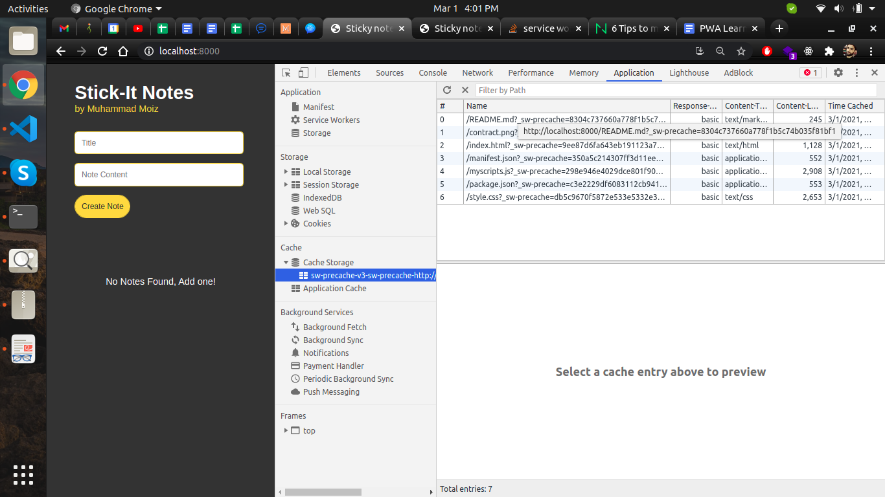

**Debugging PWA APP: (use light house)**

The first step for Add to Home Screen (A2HS) automatic pop-up testing is using the lighthouse audit tools.

You need to run the PWA audit and correct warnings there until you see
--- "User can be prompted to install the Web App"
The lighthouse audit tools are available as a tab in the Chrome dev tools or as a Chrome extension.

The extension usually has the more current features.
Once you see that message you can test the automatic pop-up message on Chrome Desktop and Android (Chrome & Edge)

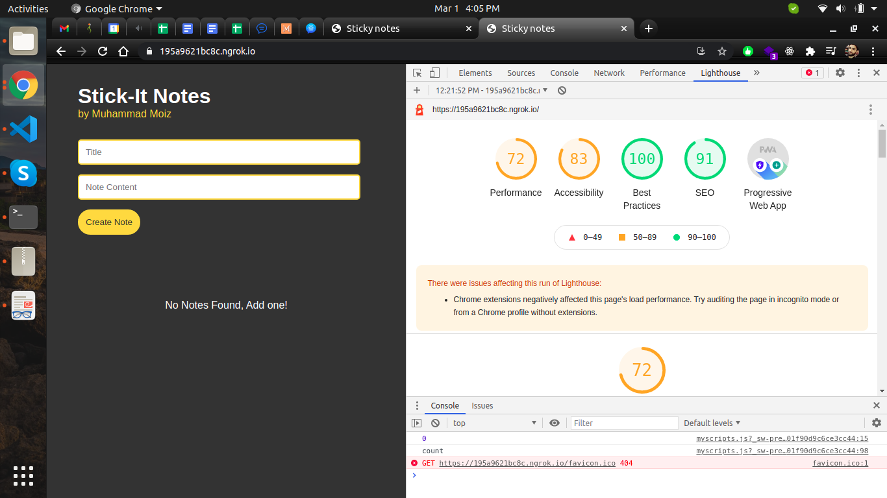

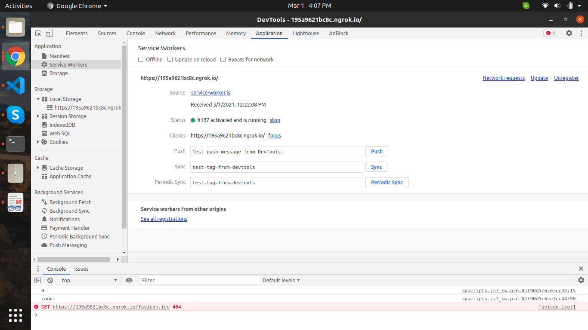

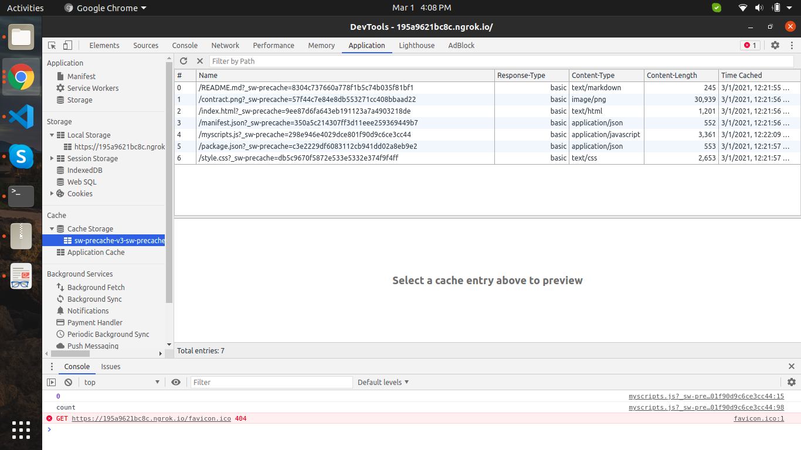

Ref :
PWA concepts: https://www.youtube.com/watch?v=4XT23X0Fjfk&list=PL4cUxeGkcC9gTxqJBcDmoi5Q2pzDusSL7&ab_channel=TheNetNinja

**PWA application source code :**

https://github.com/abdulmoizshaikh/sticky-notes
Demo : https://abdulmoizshaikh.github.io/sticky-notes/

NOTE:

1. PWA add to homescreen automatic popup app will not work in incognito mode
2. PWA add to homescreen automatic popup Not working if app already installed in device
3. PWA add to homescreen automatic popup not work in IOS browser safari we have to create manual popup
4. You can clear site setting cached data in order to show add to home screen popup automatically on mobile and browser etc

**How to build a PWA from scratch with HTML, CSS, and JavaScript**

https://www.freecodecamp.org/news/build-a-pwa-from-scratch-with-html-css-and-javascript/
Result : https://devcoffee-pwa.netlify.app/#
Github repo : https://github.com/abdulmoizshaikh/PWA-workbox

**Workbox-cli commands**

```bash showLineNumbers
npm install workbox-cli --global
```

workbox wizard
workbox generateSW workbox-config.js

Sample app:
https://github.com/abdulmoizshaikh/PWA-workbox
https://developers.google.com/web/tools/workbox/modules/workbox-cli

**Debugging :**

**PWA Website is running on only one browser even I have close my local server**

If you open server at port 8080 and close the opened server of any web app
If you hit same url in browser and it wont gone and shows every time you open with same url and port then it is because as a service worker you need to clear site data in order to close PWA app from browser.

**Uploading PWA app to play store**

Convert web app to Android app using


References:
https://youtu.be/Ppzjg6uzWt8
https://appmaker.xyz/pwa-to-apk/verification/uRlLDRjhUS3X9DS5CvnH
https://appmaker.xyz/pwa-to-apk/download/uRlLDRjhUS3X9DS5CvnH
https://stackoverflow.com/questions/49328396/how-to-create-progressive-web-app-apk-any-type-of-file-that-can-be-distributed-i
https://www.davrous.com/2020/02/07/publishing-your-pwa-in-the-play-store-in-a-couple-of-minutes-using-pwa-builder/
