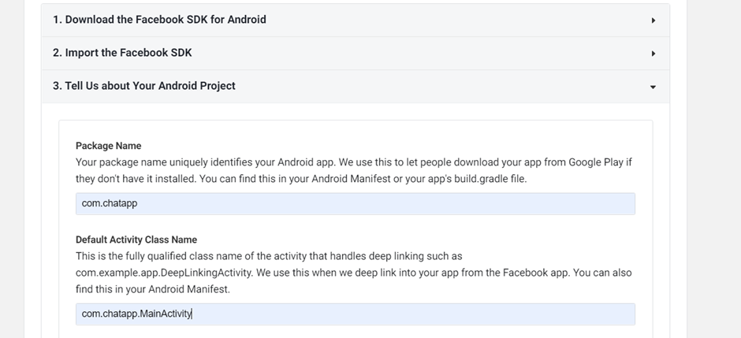
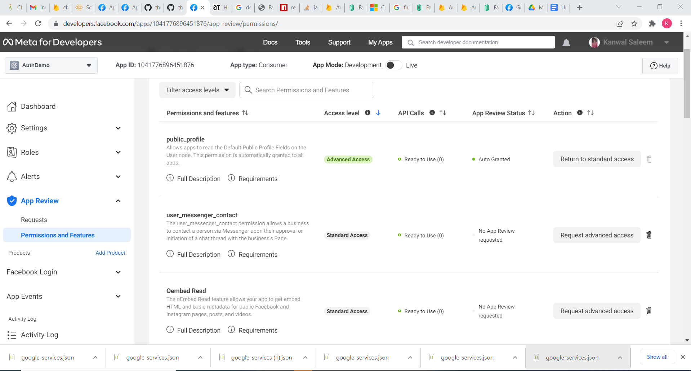

# React Native fbAuth in Firebase

**React Native Facebook Authentication in Firebase:**

Add firebase configuration in your project before following these steps.
Step1: Install the library

React-native-fbsdk-next
https://github.com/thebergamo/react-native-fbsdk-next

Step2: Create the app on facebook developer

https://developers.facebook.com/docs/android/getting-started/

during creation og app follow these steps:

- Implement just step 4
- Add this in strings.xml
  ```jsx showLineNumbers
  <string name="facebook_app_id">facebook_app_id</string>
  <string name="facebook_client_token">facebook_client_token</string>
  ```

In this way:


- Add meta data inside application tag and check the android permission should be added(by default added) in AndroidManifest.xml file:

```jsx showLineNumbers
 <meta-data android:name="com.facebook.sdk.ApplicationId" android:value="@string/facebook_app_id"/>
    <meta-data android:name="com.facebook.sdk.ClientToken" android:value="@string/facebook_client_token"/>
```

- Add your app name



- Adding keyhash (create SHA1 and then convert it into keyhash)from this link: http://tomeko.net/online_tools/hex_to_base64.php

How to generate hash key:

https://aboutreact.com/getting-key-hash-for-facebook-console/

- Set advanced access enable to public_profile in facebook developer app



**Step3: Adding facebook configuration in firebase**

- Enable facebook authentication in firebase
- Adding appId and secret in firebase and firebase will give the OAuth redirect URI


- Add this url to fb developer account. To complete the set up, you should add the OAuth redirect URI to your Facebook app configuration. Copy the OAuth redirect URI and head to the Facebook Developer console by going to Facebook Login/settings.


**Step4: Adding facebook login ini the project**

- Updated googleservice file add to project

- Fb login with firebase code:


Related Links:

1. https://rnfirebase.io/auth/social-auth
2. https://developers.facebook.com/docs/android/getting-started/#add-app_id
3. https://github.com/thebergamo/react-native-fbsdk-next
4. https://firebase.google.com/docs/auth/web/facebook-login
5. https://mehrankhandev.medium.com/integrating-fbsdk-facebook-login-in-react-native-7b7600ce74a7
6. https://firebase.google.com/docs/auth/android/facebook-login
7. https://www.section.io/engineering-education/react-native-firebase-facebook-authentication/
