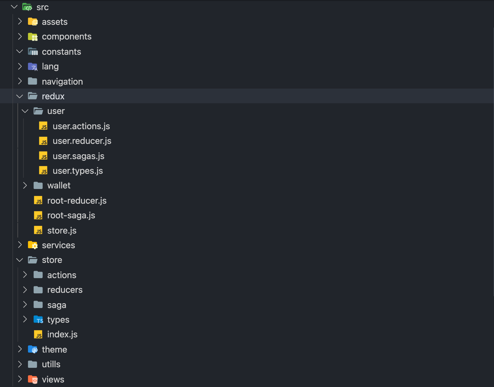
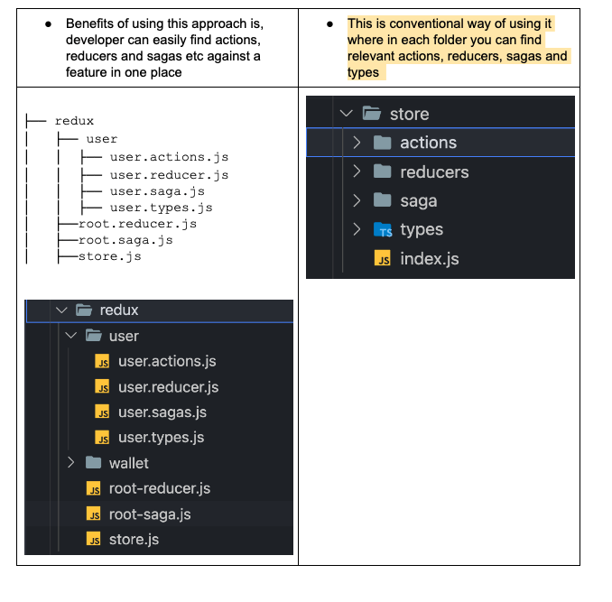

# Hisaab App Code Architecture / Structure



As seen in the referenced screenshot above, At the very first I created a base folder “src” which will store all the necessary folders or files in it for the project.

### assets/

This folder will store all the assets that we are using in react-native. You can add static files like fonts and images to it. Also, you can add more assets like videos in this folder according to your project requirements.

```bash showLineNumbers
├── src
│ ├── assets
│ │ ├── fonts
│ │ ├── images
```

### components/

In the components folder, you can create multiple component files that are used to wrap the application components and determine their overall layout. Goal is to develop reusable UI components.

### screens/

Just as the name implies, you can put all screen-based components inside screens, such as Splash Screen, Home Screen, and the view-based files, etc.

### lang (i18n)

This holds translation files for different languages in which you’re using your application.

### navigation/

Your project base navigation goes here. You can create a stack navigator in it and export it to your application.

### services/

The service folder contains logic, related to external API communications and reusable functions which could be used across the application.

### utils/

All the utils/helpers files go here that store reusable methods and logic like validations, progress bar, date pickers, and according to your app requirements.

### constants/

This directory contains all static URLs, APIs endpoints etc which we can use across the application

### theme/

This directory contains styling component i-e font, colors, and metrics etc which will be across the application.

```bash showLineNumbers
├── theme
│   ├── font.js
│   ├── colors.js
│   ├── metrics.js
```

### Store (Redux)

Following are two different approaches we can use either one of them


