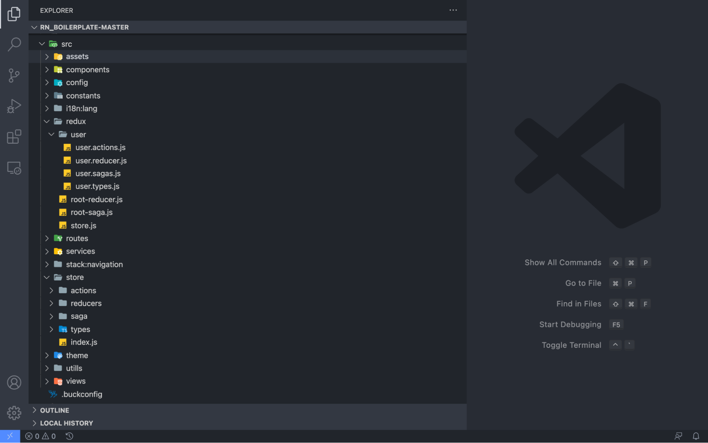
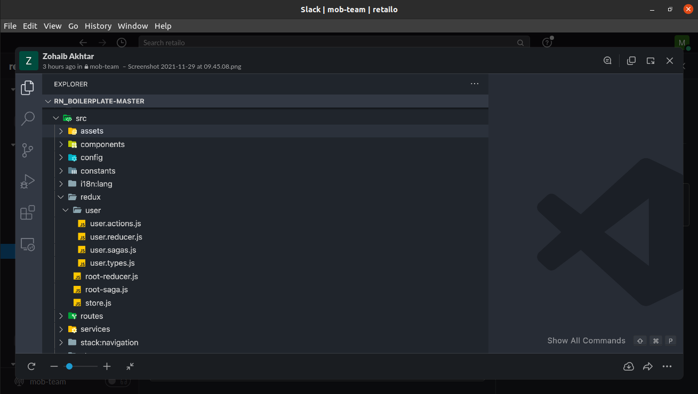
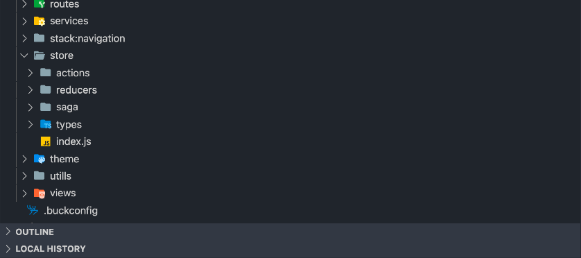
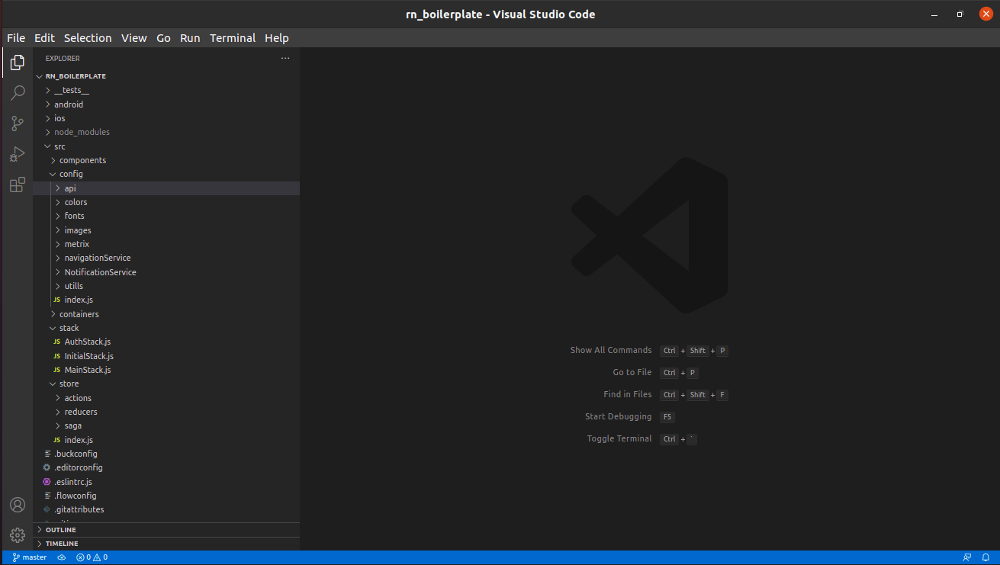

# React Native project Architecture / Structure

1. **`MRC structure`** (model routes controller) (architecture for backend)
2. **`modular approach`** (for those features which are dependent on each other)



Zohaib approach for redux setup (See below picture for reference:) recommended for large applications.
In this approach we will make specific folder for each feature in redux folder which contain its types.js, actions.js, reducer.js and if any middleware like saga then yes saga.js also
By this modular approach development will be save because we can frequently move from actions to reducers and saga because its all in one folder



On the other hand if we go towards this below approach



This is not suitable for large application because all actions files like user.actions.js, login.actions.js etc are in same folder which will be messy when our application grows and its hard to debug the code to fix error if happened in future.

Another approach zubair mahboob worked on is that



```bash showLineNumbers
react-project
├── api
├── components
├── i18n
├── modules
├── pages
├── stores
├── tests
├── utils
├── index.js
├── main.js
└── style.css
```

https://dev.to/larswaechter/how-i-structure-my-react-projects-jii
