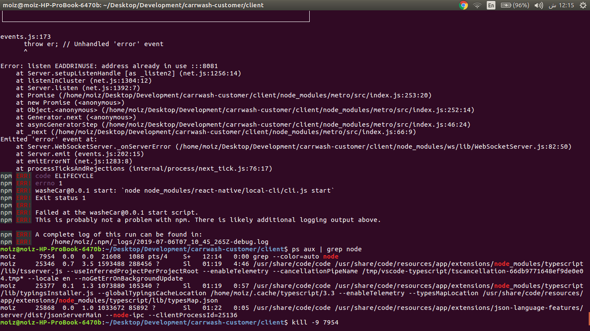
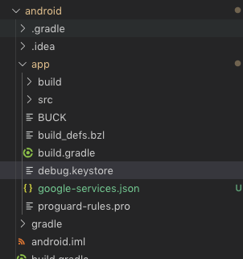

# React Native Bug Fixes:

<div class="error">
</div>

!> **Warning: Failed prop type : The prop 'onRequestClose' is marked as required in modal but its value is undefined #16**

```bash showLineNumbers
npm init docusaurus@latest my-website classic
```

```jsx showLineNumbers
onRequestClose={()=>{}}.
```

https://github.com/hiddentao/react-native-modal-filter-picker/issues/16

!> **Not listing the files using rn fetch blob in react native [Error: Attempt to get length of null array] #631
[Error: Attempt to get length of null array] rn fetch blob**

Answer

Android 10 introduce a new storage paradigm called scoped storage. Due to this is not working.

```jsx showLineNumbers
<application android:requestLegacyExternalStorage="true" ... > ... </application>

```

in AndroidManifest.xml. This is a temporary solution.

For me after adding this block, it started working.

https://github.com/joltup/rn-fetch-blob/issues/631

!> **Task :react-native-device-info:compileDebugJavaWithJavac FAILED #1350**
Execution failed for task ':react-native-device-info:compileDebugJavaWithJavac’.
Android Gradle plugin requires Java 11 to run. You are currently using Java 1.8. React Native

Solution

upgrade java version to 11 will fix the issue:
Yep 31 API requires jdk11

https://github.com/react-native-device-info/react-native-device-info/issues/1350

!> **How to solve: The minCompileSdk (31) specified in a dependency's AAR metadata**

The minCompileSdk (31) specified in a dependency's AAR metadata (META-INF/com/android/build/gradle/aar-metadata.properties) is greater than this module's compileSdkVersion (android-30)

Solution:

Use Android SDK version 31 in your project. Find compileSdkVersion 30 in your app\build.gradle file, and change it to compileSdkVersion 31.

https://stackoverflow.com/questions/70511000/how-to-solve-the-mincompilesdk-31-specified-in-a-dependencys-aar-metadata/72003553

https://stackoverflow.com/questions/69034879/how-can-i-resolve-the-error-the-mincompilesdk-31-specified-in-a-dependencys

!> **[!] CocoaPods could not find compatible versions for pod "Firebase/CoreOnly”:
CocoaPods could not find compatible versions for pod "Firebase/CoreOnly"**

Solution:

delete the Podfile.lock in the root directory, after that run pod install

https://stackoverflow.com/questions/56055142/cocoapods-could-not-find-compatible-versions-for-pod-firebase-coreonly

> ### React native error fixing in bootstrapping baker app project Hammad reference

### ANDROID STUDIO:

How To Install Android Studio on Ubuntu 20.04

https://www.itzgeek.com/post/how-to-install-android-studio-on-ubuntu-20-04/

!> **Apps targeting Android 12 and higher are required to specify an explicit value for `android: exported`
Android Studio error: "Manifest merger failed: Apps targeting Android 12"**

Solution:
add this below line will fix
android:exported=“true"

https://stackoverflow.com/questions/67412084/android-studio-error-manifest-merger-failed-apps-targeting-android-12

!> **Execution failed for task ': app:checkDebugAarMetadata'**

Solution:
Solution upgrade version of buildtoolversion and compileSdkversion from 30 to 31 fixed this issue

https://stackoverflow.com/questions/64521804/execution-failed-for-task-appcheckdebugaarmetadata

for more info on error debugging:

```bash showLineNumbers
$ react-native run-android —verbose
```

!> **An exception has occurred in the compiler (1.8.0_292). Please file a bug against the Java compiler via the Java bug reporting page (http://bugreport.java.com) after checking the Bug Database (http://bugs.java.com) for duplicates. Include your program and the following diagnostic in your report. Thank you.**

Error: Command failed: ./gradlew app:installDebug -PreactNativeDevServerPort=8081

solution

```bash showLineNumbers
chmod 755 android/gradlew
```

!> **Execution failed for task ': app:checkDebugAarMetadata’.**

dyld[14954]: Library not loaded: /usr/local/opt/pcre2/lib/libpcre2-8.0.dylib
https://stackoverflow.com/questions/54246341/git-not-in-path-for-homebrew-on-mac

zsh component: insecure directories [closed]

compaudit | xargs chmod g-w

https://stackoverflow.com/questions/13762280/zsh-compinit-insecure-directories

Problems with Git when installing Homebrew: "Error: Git is unavailable"

https://stackoverflow.com/questions/38365398/problems-with-git-when-installing-homebrew-error-git-is-unavailable

Determining the version of Java SDK on the Mac

Open a terminal and type: java -version, or javac -version.

If you have all the latest updates for Snow Leopard, you should be running JDK 1.6.0_20 at this moment (the same as Oracle's current JDK version).

https://stackoverflow.com/questions/2992566/determining-the-version-of-java-sdk-on-the-mac

!> **how to remove java from a mac using brew | how to uninstall java
Removing Java 8 JDK from Mac
how to uninstall java from a mac using terminal**

Solution:
just delete the java directory in this location

Command

```bash showLineNumbers
sudo rm -rf /Library/Java/JavaVirtualMachines/jdk<version>.jdk

OR

sudo rm -rf /Library/Java/JavaVirtualMachines/
```

https://stackoverflow.com/questions/19039752/removing-java-8-jdk-from-mac

**How to install JDK 11**

Java Development Kit
We recommend installing the OpenJDK distribution called Azul Zulu using Homebrew. Run the following commands in a Terminal after installing Homebrew:

```bash showLineNumbers
brew tap homebrew/cask-versions
brew install --cask zulu11

```

https://reactnative.dev/docs/environment-setup

!> **Configure Homebrew to not delete old versions**

Solution:

This behavior can be avoided by setting a variable export HOMEBREW_NO_INSTALL_CLEANUP=TRUE in ~/.bashrc or ~/.zshrc (or specific to your shell).

https://stackoverflow.com/questions/56206172/configure-homebrew-to-not-delete-old-versions

!> **Permission denied @ apply2files - /usr/local/lib/node_modules/expo-cli/node_modules/extglob/lib/.DS_Store?
Error: Permission denied @ apply2files - /usr/local/lib/node_modules/react-lap**

Sol:

run below command

```bash showLineNumbers
$ sudo chown -R $(whoami):admin /usr/local/* \ && sudo chmod -R g+rwx /usr/local/*
```

https://stackoverflow.com/questions/61899041/permission-denied-apply2files-usr-local-lib-node-modules-expo-cli-node-modu

!> **how to update version of react native project**

https://github.com/react-native-community/releases/blob/master/CHANGELOG.md

!> **Could not resolve project :react-native-video**

```bash showLineNumbers
Delete node_modules and run npm install fix the problem
```

!> **react-native-config example does not read variables from .env file or .env.prod #170**

Solution:

Check if any .env file needed in project
or check if react-native-config project is using in app
Just commented the line

## react-native-config example does not read variables from .env file or .env.prod #170

react-native-config not reloading changes from .env

Solution:

```bash showLineNumbers
do change in .env
and run again command and create new debug builds F
npm run android or react-native run-android
```

https://github.com/luggit/react-native-config/issues/170

!> **D8: Program type already present: com.google.android.gms.common.internal.zzb OR
Program type already present: com.google.android.gms.internal.zzfq**

Solution

D8: Program type already present: com.google.android.gms.common.internal.zzb

**Configuration with name 'compile' not found. #3242**

**Solution:**

add this in build.gradle

```js showLineNumbers
subprojects { subproject ->

​        if(project['name'] == 'react-native-reanimated'){

​            project.configurations { compile { } }

​        }

}
```

https://github.com/software-mansion/react-native-reanimated/issues/3242

Exception 'open failed: EACCES (Permission denied)' on Android
open failed: EACCES (Permission denied) on Android 29 every time (I am certain it's setup properly) - works in Android 28 #1233
oskarhertzman commented on Jan 31 •
I Recommend writing to .DocumentDirectyPath, with react-native-fs it will only require media storage permissions, which eliminates the problem, example:

https://github.com/react-native-image-picker/react-native-image-picker/issues/1233

https://stackoverflow.com/questions/8854359/exception-open-failed-eacces-permission-denied-on-android

---

## React Native Error/Bug fixes second sheet

**react-native-config not working undefined** Android. Got compiled but Config is undefined #32

Solution:

​`So, after much struggle, I've managed to make this work. Here's a summary of what I did: Link the library manually Because react native link was failing (see facebook/react-native#12216 and #80). Here the steps: settings.gradle include ':react-native-config' project(':react-native-config').projectDir = new File(rootProject.projectDir, '../node_modules/react-native-config/android') build.grade apply from: project(':react-native-config').projectDir.getPath() + "/dotenv.gradle" not sure it matters but I moved this at the top of the file right after apply plugin and under the debug { config add resValue "string", "build_config_package", "com.myappname" MainApplication.java import com.lugg.ReactNativeConfig.ReactNativeConfigPackage; and add new ReactNativeConfigPackage() Restart all Meaning restarted the emulator, react native start and react native run-android Please fix the link or add info for a manual linking for android in the readme.`

https://github.com/luggit/react-native-config/issues/32

[luggit/react-native-config#32](https://github.com/luggit/react-native-config/issues/32)

**React native secureTextEntry not working on android** Solution:

this work for me: `secureTextEntry works if you set autoCapitalize={'none'}.` [facebook/react-native#30148](https://github.com/facebook/react-native/issues/30148)

https://stackoverflow.com/questions/54684814/react-native-securetextentry-not-working-on-android

**How to disable drawer navigation swipe for one of navigator screen only?** how to disable drawer navigation react native Solution:

```jsx showLineNumbers
        options={{ swipeEnabled: false }}


    <Drawer.Navigator initialRouteName="Feed">
      <Drawer.Screen
        name="Feed"
        component={Feed}
        options={{ swipeEnabled: false }}
      />
      <Drawer.Screen
        name="Profile"
        component={Profile}
        options={{ drawerLabel: 'Profile' }}
      />
    </Drawer.Navigator>);}
```

https://stackoverflow.com/questions/55171880/how-to-disable-drawer-navigation-swipe-for-one-of-navigator-screen-only

Preparing "Install NDK (Side by side) 21.4.7075529 (revision: 21.4.7075529)". **Gradle is stuck at downloading NDK** Gradle sync failed, NDK not configured, download it with SDK manager java.lang.RuntimeException: com.android.builder.sdk.InstallFailedException: Failed to install the following SDK components: ndk;21.4.7075529 NDK (Side by side) 21.4.7075529 Failed to install the following SDK components Solution:

```bash showLineNumbers
> Just download the required NDK version from Android studio SDK manager and the issue will gone.
I have fixed this way **recommended**
```

Well, i no more need this question, so i compiled it finally because i found a way how to download NDK. There was more problems but i fixed it.

```bash showLineNumbers
Well i downloaded it using android studio finally. –
41

You can install these components using the SDK Manager:

From an open project, select Tools > Android > SDK Manager from the main menu.
Click the SDK Tools tab.
Check the box next to NDK, CMake, and LLDB
Click apply
(Using Android Studio 3.6.1)

Edit: Following above process on later versions of Android Studio still gives an NDK not installed error during the build process. This answer given by Violet Giraffe solved the issue. Once the necessary files are installed, go to File > Project Structure > SDK and select the NDK version.

See this guide for more details.
```

https://stackoverflow.com/questions/71601864/gradle-is-stuck-at-downloading-ndk

https://stackoverflow.com/questions/40943764/gradle-sync-failed-ndk-not-configured-download-it-with-sdk-manager

---

open failed: EACCES (Permission denied) rn-fetch-blob

solution recommended

ask first permission from user

```jsx showLineNumbers
useEffect(() => {
  checkPermission();
}, []);

const checkPermission = async () => {
  const granted = await PermissionsAndroid.request(
    PermissionsAndroid.PERMISSIONS.READ_EXTERNAL_STORAGE
  );
  if (granted === PermissionsAndroid.RESULTS.GRANTED) {
    var path = fs.dirs.DownloadDir + "/test.txt";
    getJWTFromExternalStorage(path);
  } else {
    Alert.alert(
      "Permission Denied!",
      "You need to give storage permission to download the file"
    );
  }
};
```

solution 2:

“open failed: EACCES (Permission denied) react native” Code Answer’s
Got the same problem in Android 10 when trying to copy a file with cp to Downloads directory.

```jsx showLineNumbers
    <application
        ...
        android:requestLegacyExternalStorage="true"
       ...

</application>

android:requestLegacyExternalStorage="true"

and
<uses-permission android:name="android.permission.READ_EXTERNAL_STORAGE" />
```

https://www.codegrepper.com/code-examples/javascript/open+failed%3A+EACCES+%28Permission+denied%29+react+native
https://github.com/joltup/rn-fetch-blob/issues/508
https://github.com/joltup/rn-fetch-blob/issues/700

how-to-access-the-file-system-in-react-native
how to create file in phone internal storage android react native
https://stackoverflow.com/questions/42394859/how-to-access-the-file-system-in-react-native

fs writefile does not overwrite in react native
I used react-native-fs now issue fixed
https://github.com/itinance/react-native-fs/issues/700

**react-native-screens:compileDebugKotlin FAILED Detected multiple Kotlin daemon sessions at build/kotlin/sessions**

```bash showLineNumbers
> Task :react-native-screens:compileDebugKotlin

> Task :react-native-screens:compileDebugKotlin FAILED
w: Detected multiple Kotlin daemon sessions at build/kotlin/sessions

Deprecated Gradle features were used in this build, making it incompatible with Gradle 8.0.

You can use '--warning-mode all' to show the individual deprecation warnings and determine if they come from your own scripts or plugins.
```

Solution:

```bash showLineNumbers
Hi,

this has happened to me before and is due to multiple versions of kotlin being used on build time.

to fix this problem you have to set a Kotlin version on your project level build grade android/build.gradle
for example:

buildscript {
    ext {
        // ...
        kotlin_version = '1.6.10' // <- add this line
    }

    dependencies {
        // ...
        classpath "org.jetbrains.kotlin:kotlin-gradle-plugin:$kotlin_version" // <- add this line
        // ...
    }
}
```

https://github.com/facebook/react-native/issues/33488

**If your build not creating/generating in react native because of Jcenter is down**

Solution:

try to turn of your internet/wifi and again make build it will work

The above fix zubair mehboob tried and it worked for him in hefazat project

or run npm install and again make build

### Production release steps (Hisaab- retailo)

prod quick deployement steps

1. update .env file (just comment the stage env code and uncomment the prod env code)
2. update prod google-service.json
3. delete the output folder of android/app folder (for update changes from new google service.json file )
4. make both prod release and bundle build with these commands and upload to we transfer and share with team to test
   PN testing is last step hopefull PN will work after the above followed steps
5. get shaleem on call and ask him that I will login on prod on my device just give me token of prod that generate in login response in logger
6. get prod token from shaleem (before stage and prod env device tokens are not same due to firebase config file google service .json files are different for both enviornments)
7. test PN from firebase console on prod project (Hisaab) and only send PN to your device only
8. when app is in foreground state a pop up should come that verify PN is working
   Or you can verify your changes in android/app/build/generated/res/google-service/release/values/values.xml# file as well just check here project name should be of production env file this below one

   `jsx<string name="project_id" translatable="false">hisaab-fa82b</string>`

### REACT NATIVE ERROR FIXING :

Warning: Failed prop type : The prop 'onRequestClose' is marked as required in modal but its value is undefined #16
Warning: Failed prop type: The prop `onRequestClose` is marked as required in `Modal`, but its value is `undefined`.

onRequestClose={()=>{}}.

https://github.com/hiddentao/react-native-modal-filter-picker/issues/16

**Not listing the files using rn fetch blob in react native [Error: Attempt to get length of null array] #631**

[Error: Attempt to get length of null array] rn fetch blob

Answer
Android 10 introduce a new storage paradigm called scoped storage. Due to this is not working.

```jsx showLineNumbers
<application android:requestLegacyExternalStorage="true" ... > ... </application>
```

in AndroidManifest.xml. This is a temporary solution.

For me after adding this block, it started working.

https://github.com/joltup/rn-fetch-blob/issues/631

**Creating a new application**

If you previously installed a global react-native-cli package, please remove it as it may cause unexpected issues.

React Native has a built-in command line interface, which you can use to generate a new project. You can access it without installing anything globally using npx, which ships with Node.js. Let's create a new React Native project called "AwesomeProject":

https://reactnative.dev/docs/environment-setup

### React native error fixing in bootstrapping baker app project Hammad reference

**ANDROID STUDIO:**

How To Install Android Studio on Ubuntu 20.04

https://www.itzgeek.com/post/how-to-install-android-studio-on-ubuntu-20-04/

**How To Install Android Studio on Ubuntu 20.04**

https://www.itzgeek.com/post/how-to-install-android-studio-on-ubuntu-20-04/

**Apps targeting Android 12 and higher are required to specify an explicit value for `android: exported`
Android Studio error: "Manifest merger failed: Apps targeting Android 12"**

Solution:

add this below line will fix
android:exported=“true"

https://stackoverflow.com/questions/67412084/android-studio-error-manifest-merger-failed-apps-targeting-android-12

**Execution failed for task ':app:checkDebugAarMetadata'**

Solution:

Solution upgrade version of buildtoolversion and compileSdkversion from 30 to 31 fixed this issue

for more info on error debugging:

```jsx showLineNumbers
$ react-native run-android —verbose
```

https://stackoverflow.com/questions/64521804/execution-failed-for-task-appcheckdebugaarmetadata

**An exception has occurred in the compiler (1.8.0_292). Please file a bug against the Java compiler via the Java bug reporting page (http://bugreport.java.com) after checking the Bug Database (http://bugs.java.com) for duplicates. Include your program and the following diagnostic in your report. Thank you.**

Error: Command failed: ./gradlew app:installDebug -PreactNativeDevServerPort=8081

solution
chmod 755 android/gradlew

Execution failed for task ':app:checkDebugAarMetadata’.

**dyld[14954]: Library not loaded: /usr/local/opt/pcre2/lib/libpcre2-8.0.dylib**

https://stackoverflow.com/questions/54246341/git-not-in-path-for-homebrew-on-mac

**zsh component: insecure directories [closed]**

compaudit | xargs chmod g-w

https://stackoverflow.com/questions/13762280/zsh-compinit-insecure-directories

**Problems with Git when installing Homebrew: "Error: Git is unavailable"**

https://stackoverflow.com/questions/38365398/problems-with-git-when-installing-homebrew-error-git-is-unavailable

**Determining the version of Java SDK on the Mac**

Open a terminal and type: java -version, or javac -version.

If you have all the latest updates for Snow Leopard, you should be running JDK 1.6.0_20 at this moment (the same as Oracle's current JDK version).
https://stackoverflow.com/questions/2992566/determining-the-version-of-java-sdk-on-the-mac

**how to remove java from a mac using brew | how to uninstall java **
Removing Java 8 JDK from Mac
how to uninstall java from a mac using terminal

Solution:
just delete the java directory in this location

Command

```bash showLineNumbers
sudo rm -rf /Library/Java/JavaVirtualMachines/jdk<version>.jdk
OR
sudo rm -rf /Library/Java/JavaVirtualMachines/
```

https://stackoverflow.com/questions/19039752/removing-java-8-jdk-from-mac

**How to install JDK 11**

Java Development Kit
We recommend installing the OpenJDK distribution called Azul Zulu using Homebrew. Run the following commands in a Terminal after installing Homebrew:

```bash showLineNumbers
brew tap homebrew/cask-versions
brew install --cask zulu11
```

https://reactnative.dev/docs/environment-setup

**Configure Homebrew to not delete old versions**

Solution:

This behavior can be avoided by setting a variable export HOMEBREW_NO_INSTALL_CLEANUP=TRUE in ~/.bashrc or ~/.zshrc (or specific to your shell).

https://stackoverflow.com/questions/56206172/configure-homebrew-to-not-delete-old-versions

**Permission denied @ apply2files - /usr/local/lib/node_modules/expo-cli/node_modules/extglob/lib/.DS_Store?**

Error: Permission denied @ apply2files - /usr/local/lib/node_modules/react-lap

Sol:
run below command

```bash showLineNumbers
$ sudo chown -R $(whoami):admin /usr/local/_ \ && sudo chmod -R g+rwx /usr/local/_
```

https://stackoverflow.com/questions/61899041/permission-denied-apply2files-usr-local-lib-node-modules-expo-cli-node-modu

**> Task :react-native-device-info:compileDebugJavaWithJavac FAILED #1350**

Execution failed for task ':react-native-device-info:compileDebugJavaWithJavac’.
Android Gradle plugin requires Java 11 to run. You are currently using Java 1.8. React Native

Solution
upgrade java version to 11 will fix the issue:
Yep 31 API requires jdk11

https://github.com/react-native-device-info/react-native-device-info/issues/1350

**How to solve: The minCompileSdk (31) specified in a dependency's AAR metadata**

> The minCompileSdk (31) specified in a dependency's AAR metadata (META-INF/com/android/build/gradle/aar-metadata.properties) is greater than this module's compileSdkVersion (android-30)

Solution:

Use Android SDK version 31 in your project. Find compileSdkVersion 30 in your app\build.gradle file, and change it to compileSdkVersion 31.

https://stackoverflow.com/questions/70511000/how-to-solve-the-mincompilesdk-31-specified-in-a-dependencys-aar-metadata/72003553
https://stackoverflow.com/questions/69034879/how-can-i-resolve-the-error-the-mincompilesdk-31-specified-in-a-dependencys

**CocoaPods could not find compatible versions for pod "Firebase/CoreOnly"**

Solution:

delete the Podfile.lock in the root directory, after that run pod install

https://stackoverflow.com/questions/56055142/cocoapods-could-not-find-compatible-versions-for-pod-firebase-coreonly

**ReactNative custom port support for run-android command, McAfee workaround**

Solution:

first, run this command

```json showLineNumbers
   "start": "react-native start --port=8082",
```

and then
run this command in another terminal at the same time

```json showLineNumbers

 "android": "react-native run-android --port=8082",
 "scripts": {
   "android": "react-native run-android --port=8082",
   "ios": "react-native run-ios",
   "start": "react-native start --port=8082",
   "test": "jest",
   "lint": "eslint ."
 },
```

https://stackoverflow.com/questions/34579594/reactnative-custom-port-support-for-run-android-command-mcafee-workaround

Another server will be running separately at another port like 8081. by this way you can run both android and ios debug app at the same time to save time for testing and debugging and development.

ask questions list to and then he will answer all answers to the solution:
ETA estimation and list

What is sensex
Sensex
a figure indicating the relative prices of shares on the Mumbai (Bombay) Stock Exchange.
"the Sensex fell by 56 points to close at 3,653"

BHK stand for in housing
Bedroom, Hall, and Kitchen

**How to Create Milestones on Upwork - YouTube**

https://www.youtube.com/watch?v=XGAATwGvmpc

**Project requirements and ETA planning using google sheet templates**

https://www.officetimeline.com/timeline/how-to-make/google-docs-and-google-sheets
https://workspace.google.com/marketplace/app/slick_gantt_project_management_chart/963640483752
https://www.officetimeline.com/timeline/how-to-make/google-docs-and-google-sheets

**textinputmask react native paper**

https://github.com/callstack/react-native-paper/issues/2615

**React native geolocation**

how to get user location using react-native-maps

@react-native-community/geolocation seems to be deprecated, upvote for @ggDeGreat.

https://www.npmjs.com/package/react-native-geolocation-service
https://stackoverflow.com/questions/47558468/how-to-get-current-location-using-react-native-maps
How to get current location using react-native-maps

**Location permission in react native**

how to check has Location Permission in react native

https://stackoverflow.com/questions/38371987/determining-if-geolocation-enabled-with-react-native
https://stackoverflow.com/questions/45822318/how-do-i-request-permission-for-android-device-location-in-react-native-at-run-t

**react native masked text**

https://www.npmjs.com/package/react-native-masked-text

**color name from hex code**

https://www.color-name.com/hex/b700c7

**how to detect component focus and not focus state in react native componnets**

Solution:

```jsx showLineNumbers
import { useIsFocused } from "@react-navigation/native";

const isFocused = useIsFocused(); // This hook returns `true` if the screen is focused, `false` otherwise

useEffect(() => {
  if (isFocused) {
    const TermsStatusbarBC = THEME_COLORS.heliotropeMagenta;
    dispatch(ThemeActions.changeStatusBarBCRequest(TermsStatusbarBC));
  } else {
    dispatch(ThemeActions.resetStatusBarBCRequest());
  }
  // eslint-disable-next-line react-hooks/exhaustive-deps
}, [isFocused]);
```

https://reactnavigation.org/docs/function-after-focusing-screen/

**how to pass provider in index.js react native**

Adding Redux Provider store to the main index file in React

Uncaught Error: Invariant Violation: Element type is invalid: expected a string (for built-in components) or a class/function but got: object

Element type is invalid: expected a string (for built-in components) or a class/function (for composite components) but got: object

On index.js you could create another component wrapping App:

```jsx showLineNumbers
import {AppRegistry} from 'react-native'; import App from './App'; import React from 'react'; import {Provider} from 'react-redux'; import Store from "./src/store.js" import {name as appName} from './app.json'; const Root = () => ( <Provider store={store}> <App /> </Provider> ) AppRegistry.registerComponent(appName, () => Root);
```

https://stackoverflow.com/questions/52314417/adding-redux-provider-store-to-the-main-index-file-in-react

**Redux toolkit architecture boilerplate (recommended) I had used in sweet connect project:**

https://github.com/IronTony/react-native-redux-toolkit-starter-app/blob/master/package.json

https://github.com/IronTony/react-native-redux-toolkit-starter-app/blob/master/babel.config.js

**what is Watchman for react native**

React Native uses watchman to detect when you've made code changes and then automatically build and push the update to your device without you needing to manually refresh it.14-Feb-2017

https://stackoverflow.com/questions/42235799/what-is-the-use-of-watchman-for-react-native#:~:text=React%20Native%20uses%20watchman%20to,needing%20to%20manually%20refresh%20it.

#### React Native bug fixes and learning and R&D

**Learning & bug fixes react-native**

**how to update version of react native project**

https://github.com/react-native-community/releases/blob/master/CHANGELOG.md

**Could not resolve project :react-native-video**

Delete node_modules and run nom install fix the problem

**react-native-config example does not read variables from .env file or .env.prod #170**

Solution:

Check if any .env file needed in project
or check if react-native-config project is using in app
Just commented the line

### REACT NATIVE ERROR FIXES:

**Sign in with google**

How can i get debug.keystore file password to generating SHA1 fingerprint

Sol
Goto android/app directory
Open build.gradle file and copy this

```jsx showLineNumbers
    storePassword 'android'
    keyPassword 'android'


signingConfigs {
       debug {
           storeFile file('debug.keystore')
           storePassword 'android'
           keyAlias 'androiddebugkey'
           keyPassword 'android'
       }
```

idtoken null google sign in react native
#idtoken null google sign in react native
Kanwal NGI was passing android client id in webclient id (wrong webclientId was passing in firebase configure method thats why id token was null ) it shoult be web client id in webclientid from google-service.json file

**DEVELOPER_ERROR in google signin
Error: Status{statusCode=DEVELOPER_ERROR, resolution=null}
Android gives 'ERROR: DEVELOPER_ERROR' when signing in #706**

Sol
Added google-service.json file from firebase console in androdi/app folder of project
after check application id is same os our app package name like com.artishnft right now on both places are same.


Solution (Recomended)
Steps:
This is working example I have implemented this in artish nft app for hope-accelarate on 25 feb 2022

Download your projects google-service.json file from firebase console
And paste it in android/app folder and just add below code in your signin function
And your debug or release SHA1 fingerprint to your firebase console project

```jsx showLineNumbers
import {
  GoogleSignin,
  GoogleSigninButton,
  statusCodes,
} from "@react-native-google-signin/google-signin";

const googleSignin = async () => {
  await GoogleSignin.configure();
  GoogleSignin.hasPlayServices()
    .then((hasPlayService) => {
      if (hasPlayService) {
        GoogleSignin.signIn()
          .then((userInfo) => {
            console.log(JSON.stringify(userInfo));
          })
          .catch((e) => {
            console.log("ERROR IS: " + JSON.stringify(e));
          });
      }
    })
    .catch((e) => {
      console.log("ERROR IS: " + JSON.stringify(e));
    });
};

<AppTransparentButton
  icon={ImageAssets.YoutubeIcon}
  style={GlobalStyles.MT(35)}
  title="Login with Youtube (Google-Required)"
  // onPress={() => dispatch(loginWithYoutube())}
  onPress={googleSignin}
/>;
```

https://stackoverflow.com/questions/37273145/error-statusstatuscode-developer-error-resolution-null
https://developers.google.com/identity/sign-in/android/start-integrating
https://ibjects.medium.com/google-signin-tutorial-for-react-native-81a57fb67b18 (recomended blog)
https://github.com/react-native-google-signin/google-signin/blob/master/docs/get-config-file.md
https://console.firebase.google.com/u/0/project/hope-accelarated/settings/general/android:com.artistnft
https://github.com/react-native-google-signin/google-signin/issues/706
https://stackoverflow.com/questions/37273145/error-statusstatuscode-developer-error-resolution-null
https://developers.google.com/android/guides/client-auth
https://developers.google.com/identity/sign-in/android/start#configure-a-google-api-project
https://github.com/react-native-google-signin/google-signin/blob/HEAD/docs/android-guide.md

**Issue when enable def enable Proguard Release Builds = true in android/app/build.gradle and create signed apk the app crashes when opening
App crashing with fill property on SVG #1061**

Errorjava.lang.NoSuchFieldException: fill

Solution:
add this line in proguard-rules.pro

-keep public class com.horcrux.svg.\* {;}
reference:
https://github.com/react-native-svg/react-native-svg/issues/1061

App crashing when activating debug mode in react native 0.66.3 version
React native debugger or chrome debugger not working in react native

Solution
Danish had fixed this issue in hisaab
Change
He has updated version of react-native-reanimated only debugger working
Old version: "react-native-reanimated": "2.2.4",
NEW version: "react-native-reanimated": "2.4.0"

The issue was that react native debugger not working when using react-native-reanimated with version : 2.2.4 but when updated to latest version its working fine.

Calculator UI is disturbing when switch native keyboard with custom keyboard issue fixed by setTimteOut 0
#jerkinui jerk in switching UI for calculator screen in hisaab app

[Hisaab app][customer transaction screen] - When user first enter Notes field , afterwards tap on (Rs) 0.00 to enter amount, UI get disturbs until keyboard get close.


Video :
https://drive.google.com/file/d/1adBxhky4a0u0foGec1dEKyeJBmXInhjV/view?usp=sharing
Sol

This is the solution:
I have used this concept of event loop
When I pass 0 this function goes into webapi stack and then after 0 sec it move to call stack and then execute this will take very less time but atleast took time and then our changes reflects without any jerk feeling.

```jsx showLineNumbers
setTimeOut(() => {}, 0);
```

```jsx showLineNumbers
setTimeout(() => {
  setKeyboardVisible(false); // or some other action
}, 0);
```

Code:

```jsx showLineNumbers
const [isKeyboardVisible, setKeyboardVisible] = useState(false);


 useEffect(() => {
       const keyboardDidShowListener = Keyboard.addListener('keyboardDidShow', () => {
           setKeyboardVisible(true); // or some other action
       });
       const keyboardDidHideListener = Keyboard.addListener('keyboardDidHide', () => {
           setTimeout(() => {
               setKeyboardVisible(false); // or some other action
           }, 0);
       });

       return () => {
           keyboardDidHideListener.remove();
           keyboardDidShowListener.remove();
       };
   }, []);

IN RETURN CODE:
Return (
// …
 <FooterContent>
               {!isKeyboardVisible && (
                   <CalculatorButtonPanel
                       handleCalculatorClick={handleCalculatorClick}
                       isRTL={I18nManager.isRTL}
                   />
               )}
           </FooterContent>
)
```

**\*Out of memory error: Java heap memory on Android Studio**

```jsx showLineNumbers
I had a similar issue on Android Studio 2.3.3. APK packaging would fail saying Java heap space when building from Android Studio and trying to process a 300MB .so library. In my case two things were needed to fix it. Your build.gradle should contain something like that:

android {
    dexOptions {
        javaMaxHeapSize "4G"
    }
}
At the root of your project you need to have a file named gradle.properties containing the following:

# That's needed for java to be able the create the APK with our 300MB native  library
# Basically we grant java a 4GB heap.
org.gradle.jvmargs=-Xmx4608m
```


https://stackoverflow.com/questions/27438145/out-of-memory-error-java-heap-memory-on-android-studio

**Invariant Violation: requireNativeComponent: "RNSScreen" was not found in the UIManager.**

https://stackoverflow.com/questions/66921263/invariant-violation-requirenativecomponent-rnsscreen-was-not-found-in-the-ui

**can we share my-upload key keystore file for signed apk across different computers?**

3

Yes you have to use same keystore file for that APK file.

For that you need to copy that keystore file in both computers and after that use that keystore file path for your apk file.

https://stackoverflow.com/questions/22141312/how-to-sign-apk-on-different-computers

**ERROR Invariant Violation: Module AppRegistry is not a registered callable module (calling runApplication). A frequent cause of the error is that the application entry file path is incorrect.
This can also happen when the JS bundle is corrupt or there is an early initialization error when loading React Native., js engine: hermes
WARN i18next::backendConnector: No backend was added via i18next.use. Will not load resources.
LOG i18next: languageChanged en
LOG i18next: initialized {"appendNamespaceToCIMode": false, "appendNamespaceToMissingKey": false, "contextSeparator": "_", "debug": true, "defaultNS": ["translation"], "fallbackLng": ["en"], "fallbackNS": false, "ignoreJSONStructure": true, "initImmediate": true, "interpolation": {"escapeValue": false, "format": [Function bound format], "formatSeparator": ",", "maxReplaces": 1000, "nestingOptionsSeparator": ",", "nestingPrefix": "$t(", "nestingSuffix": ")", "prefix": "{{", "skipOnVariables": true, "suffix": "}}", "unescapePrefix": "-"}, "joinArrays": false, "keySeparator": ".", "lng": "en", "load": "all", "missingInterpolationHandler": false, "missingKeyHandler": false, "nonExplicitSupportedLngs": false, "ns": ["translation"], "nsSeparator": ":", "overloadTranslationOptionHandler": [Function handle], "parseMissingKeyHandler": false, "partialBundledLanguages": false, "pluralSeparator": "_", "postProcess": false, "postProcessPassResolved": false, "preload": false, "returnEmptyString": true, "returnNull": true, "returnObjects": false, "returnedObjectHandler": false, "saveMissing": false, "saveMissingPlurals": true, "saveMissingTo": "fallback", "simplifyPluralSuffix": true, "supportedLngs": false, "updateMissing": false}
ERROR Invariant Violation: Module AppRegistry is not a registered callable module (calling runApplication). A frequent cause of the error is that the application entry file path is incorrect.
This can also happen when the JS bundle is corrupt or there is an early initialization error when loading React Native., js engine: hermes**

Solution:

```bash showLineNumbers
Try run $ npm install
```

\*\*FAILURE: Build failed with an exception.

- What went wrong:
  Execution failed for task ':app:packageDebug'.

  > A failure occurred while executing com.android.build.gradle.tasks.PackageAndroidArtifact$IncrementalSplitterRunnable
  > Java heap space

- Try:
  Run with --stacktrace option to get the stack trace. Run with --info or --debug option to get more log output. Run with --scan to get full insights.

- Get more help at https://help.gradle.org

BUILD FAILED in 1m 50s

error Failed to install the app. Make sure you have the Android development environment set up: https://reactnative.dev/docs/environment-setup.
Error: Command failed: ./gradlew app:installDebug -PreactNativeDevServerPort=8081
Note: /home/muhammadmoiz/Documents/office/hisaab-app/node_modules/appcenter-crashes/android/src/main/java/com/microsoft/appcenter/reactnative/crashes/AppCenterReactNativeCrashesListener.java uses or overrides a deprecated API.
Note: Recompile with -Xlint:deprecation for details.\*\*


Solution
Try creating the build again

@Muhammad Moiz try creating build again?

**CommonActions vs NavigationAction**

After installing https://www.npmjs.com/package/react-native-video#android-installation react-native-video this below errors comes on react-native version 0.66.4
Error when trying to run my React Native app on Android OR
Could not find com.yqritc:android-scalablevideoview:1.0.4 #2454

Just add

```bash showLineNumbers
jcenter()
```

E.g

```jsx showLineNumbers
allprojects {
   repositories {
       maven {
           // All of React Native (JS, Obj-C sources, Android binaries) is installed from npm
           url("$rootDir/../node_modules/react-native/android")
       }
       maven {
           // Android JSC is installed from npm
           url("$rootDir/../node_modules/jsc-android/dist")
       }
       mavenCentral {
           // We don't want to fetch react-native from Maven Central as there are
           // older versions over there.
           content {
               excludeGroup "com.facebook.react"
           }
       }
       google()
       maven { url 'https://www.jitpack.io' }
       jcenter() //add this line
   }
}
```

In android/build.gradle

I've hit this same issue and have temporarily resolved it by uninstalling react-native-video (npm uninstall --save react-native-video). That's not a great answer as I need that component, but I don't have a full solution yet. I think somehow com.yqritc:android-scalablevideoview:1.0.4. is required by react-native-video but has gotten lost or removed. Other thoughts are welcome.

UPDATE: Resolved! In your build.gradle in your Android folder you need to add the repository "jcenter()" in allprojects (not in build dependencies) like this...

```js showLineNumbers
allprojects {
repositories {
mavenCentral()
mavenLocal()
jcenter()
}
```

https://stackoverflow.com/questions/68835157/error-when-trying-to-run-my-react-native-app-on-android/68841906#68841906 (recomemded)
https://github.com/react-native-video/react-native-video/issues/2454

**compiling js failed react native?**


Solution
Update Metro-react-native-babel-preset to the latest version and check it should be added in babal config file for your react native project (babel.config.js)
https://www.npmjs.com/package/metro-react-native-babel-preset
https://www.reddit.com/r/reactnative/comments/s6wpf7/compiling_js_failed_can_anyone_help_with_this/

Unable to resolve dependency tree error when installing npm packages

Npm install not installing packages or Getting this error: error: bundling failed: Error: Unable to resolve module `react-native-safe-area-context`
react-native-safe-area-context error on npm i
Solution :

Just run
npm install --save --legacy-peer-deps (peer dependency command will ignore errors and warning coming in previous versions and ignoring old errors and installing new updated packages)

https://stackoverflow.com/questions/64573177/unable-to-resolve-dependency-tree-error-when-installing-npm-packages
https://stackoverflow.com/questions/66239691/what-does-npm-install-legacy-peer-deps-do-exactly-when-is-it-recommended-wh

Close dropdown when click on anywhere outside component or parent component range in react native
Or how to call function when click on anywhere in screen in react native on both android and IOS

**React Native detect tap on View**

Solution:

```jsx showLineNumbers
<View onTouchStart={() => this.doSomething()} />
<View onTouchEnd={() => this.doSomething()} /> (this fix my issue recommended on both android and ios)
```


https://stackoverflow.com/questions/41948900/react-native-detect-tap-on-view

My code e.g:


**Was trying to run react native package of older version so these I have found not completely successfull but some tips to debug issues and fix but still the project was not successful run .**

https://github.com/react-native-community/releases/blob/master/CHANGELOG.md

how to update version of react native project
https://stackoverflow.com/questions/53378354/upgrading-react-native-to-latest-version

https://stackoverflow.com/questions/44795384/unable-to-load-script-from-assets-index-android-bundle-make-sure-your-bundle
https://stackoverflow.com/questions/45940861/android-8-cleartext-http-traffic-not-permitted/50834600#50834600
https://github.com/facebook/react-native/issues/22076
https://stackoverflow.com/questions/48535193/could-not-install-the-app-on-the-device-react-native-on-windows-10/48537304

RNGestureHandlerModule.java:37: error: package androidx.annotation does not exist import androidx.annotation.Nullable; ^

you can fix these types of issues by opeining project android folder in android studio and install dependencies and try to fix android sdk config issues
https://github.com/facebookarchive/react-native-fbsdk/issues/600

error: cannot find symbo import androidx.annotation.Nullable; #600

**ERROR: Error installing cocoapods: ERROR: Failed to build gem native extension
377**

Run following command

```bash showLineNumbers
$ brew cleanup -d -v  (recommended )
```

Then run below command

```bash showLineNumbers
brew install cocoapods
```

https://stackoverflow.com/questions/20939568/error-error-installing-cocoapods-error-failed-to-build-gem-native-extension

**Animated: `useNativeDriver` was not specified.**


https://stackoverflow.com/questions/61014661/animated-usenativedriver-was-not-specified-issue-of-reactnativebase-input

gradlew: Permission Denied || zsh: permission denied: ./gradlew
Solution :

```bash showLineNumbers
$ chmod +x gradlew
```

> Android Gradle plugin requires Java 11 to run. You are currently using Java 1.8.
> https://stackoverflow.com/questions/66980512/error-message-android-gradle-plugin-requires-java-11-to-run-you-are-currently

```bash showLineNumbers
$ Cd android
$ ./gradlew --version
```


**Click on this icon (project structure) from android studio to open gradle setting**


**Now click on gradle settings**


**error: package androidx.annotation does not exist
import androidx.annotation.NonNull;**

**Can't resolve symbol android.support.v4.util.Pools in react-native-gesture-handler ?**

solution:


https://stackoverflow.com/questions/56069906/cant-resolve-symbol-android-support-v4-util-pools-in-react-native-gesture-handl

**Cannot add task 'wrapper' as a task with that name already exists**

In android/build.gradle:

You can also update

```jsx showLineNumbers
task wrapper(type: Wrapper) {
    gradleVersion = '4.4'
    distributionUrl = distributionUrl.replace("bin", "all")
}
to

wrapper {
    gradleVersion = '4.4'
    distributionUrl = distributionUrl.replace("bin", "all")
}
```

https://stackoverflow.com/questions/53709282/cannot-add-task-wrapper-as-a-task-with-that-name-already-exists

**Could not get unknown property 'compile' for configuration container of type org.gradle.api.internal.artifacts.configurations.DefaultConfigurationContainer.**

Or
Could not get unknown property 'compile' for configuration container of type org.gradle.api.internal.artifacts.configurations.DefaultConfigurationContainer.

Solution :

From

```jsx showLineNumbers
task copyDownloadableDepsToLibs(type: Copy) {
    from configurations.compile
    into 'libs'
}


To

task copyDownloadableDepsToLibs(type: Copy) {
    from configurations.implementation
    into 'libs'
}
```

https://stackoverflow.com/questions/69044250/build-gradle-error-could-not-get-unknown-property-compile


To sync gradle in android studio use this elephant icon

**on gesture handle state change dispatched react native ios
bug fix ios back gesture not working**

Unsupported top level event type "onGestureHandlerStateChange dispatched in iphone X

This answer is useful
16
From this react-native-gesture-handler issue comment by balthazar:
Because my navigators were created asynchronously, the handler was registered too late and thus throwing this error. I fixed the issue by simply doing:
import 'react-native-gesture-handler';
at the top of my index.js 🙂
By index.js, balthazar is referring to your app's entrypoint – but I guess that the important thing is that it is imported before your first usage of react-native-gesture-handler.

```jsx showLineNumbers
//index.tsx
import "react-native-gesture-handler";
```

https://stackoverflow.com/questions/54923622/unsupported-top-level-event-type-ongesturehandlerstatechange-dispatched-in-ipho

**Unsupported top level event type "onGestureHandlerStateChange" dispatched #320 **


https://github.com/software-mansion/react-native-gesture-handler/issues/320

**Statusbar not showing in react native ios**

Or
How to set iOS status bar background color in React Native?

https://stackoverflow.com/questions/39297291/how-to-set-ios-status-bar-background-color-in-react-native

**FAILURE: Build failed with an exception.**

- What went wrong:
  Execution failed for task ':app:mergeLibDexDebug'.
  > A failure occurred while executing com.android.build.gradle.internal.tasks.DexMergingTaskDelegate
  > There was a failure while executing work items
  > A failure occurred while executing com.android.build.gradle.internal.tasks.DexMergingWorkAction
  > com.android.builder.dexing.DexArchiveMergerException: Error while merging dex archives:
             Learn how to resolve the issue at https://developer.android.com/studio/build/dependencies#duplicate_classes.
             Type com.reactnativecommunity.asyncstorage.AsyncLocalStorageUtil is defined multiple times: /Users/freelancing/Desktop/Work/Projects/Mobile-Apps/HopeAccelerated/repositories/ArtistNFT/node_modules/@react-native-async-storage/async-storage/android/build/.transforms/957079003d65c39279c35acf4cf0ae5e/transformed/classes/classes.dex, /Users/freelancing/Desktop/Work/Projects/Mobile-Apps/HopeAccelerated/repositories/ArtistNFT/node_modules/@react-native-community/async-storage/android/build/.transforms/6f04aefba9818abeeb14c6da41535fca/transformed/classes/classes.dex

Or
Type com.reactnativecommunity.asyncstorage.AsyncLocalStorageUtil is defined multiple times:

Solution

android build not creating issues fixed due to 2 packages of asyn storage one is deprecated

This was the fix.


Using this package working fine and issue fixed.
No need of multidex true line

https://github.com/react-native-async-storage/async-storage

Library for asyncstore used by bilal in hopeaccarated dapps
​​@react-native-async-storage/async-storage (Asyncstorage in react native)
https://www.npmjs.com/package/@react-native-async-storage/async-storage

**bootstraping isssues fixed on ios and Sansation_Regular font not work… …**

https://github.com/HopeAccelerated/Wallet/commit/1c757f6452d1cf713f43ea85a377d9390231af0c

**Unrecognized font family on iOS simulator with React Native**

**Solution for iOS : (recommended solution) it works when i was working on artish nft app**

Run npx react-native link this will create resources folder in xcode. After finish open xcode and Right Click Resources and choose Add file to `<Project>`, find your custom font press Add.
Solution for Android :
Create folder assets/fonts in path android/app/src/main then copy the custom font you want add.
npx react-native link will help you copy react-native-vector-icons fonts automatically.
Error on iOS
Tips error duplicate **“[CP] Copy Pods Resources” (iOS)**
remove vector icons fonts from folder Resources
Good Luck


Steps :

1. First run
2. React-native link command
3. Manually removed fonts for react-native-vector-icons worked because it was creating duplicates fonts
4. And then again run npm run ios
5. And change the name from Sansation*regular to Sansation-regular (* changes with - )
6. It will work
7. My react native version was 0.66

https://github.com/facebook/react-native/issues/25852#:~:text=Solution%20for%20iOS%20%3A,your%20custom%20font%20press%20Add.
https://dev.to/aneeqakhan/add-custom-fonts-in-react-native-0-63-for-ios-and-android-3a9e
https://stackoverflow.com/questions/42410354/unrecognized-font-family-on-ios-simulator-with-react-native
https://codewithchris.com/common-mistakes-with-adding-custom-fonts-to-your-ios-app/#includefonts
https://garbagevalue.com/blog/use-custom-fonts-in-react-native


22 Answers

122

On Android it takes the name of the file and you are done. On iOS however it is a bit more complex.

There are a few steps you should take:

Double check the font files are included in the Target in XCode
Make sure they are included in the step "Copy Bundle Resources" (add files, not folders)
Include them in the Info.plist of the app
Find the name of the Font through FontBook or with some log statements in your AppDelegate
Explained in more detail here: http://codewithchris.com/common-mistakes-with-adding-custom-fonts-to-your-ios-app/

Good luck!

https://stackoverflow.com/questions/42410354/unrecognized-font-family-on-ios-simulator-with-react-native

V2.2.0 New Warning: [react-native-gesture-handler] Seems like you're using an old API with gesture components, check out new Gestures system! #1831
Or [react-native-gesture-handler] Seems like you're using an old API with gesture components, check out new Gestures system
Sol :

```jsx showLineNumbers
import { LogBox } from "react-native";

LogBox.ignoreLogs([
  "[react-native-gesture-handler] Seems like you're using an old API with gesture components, check out new Gestures system!",
]);
```

https://github.com/software-mansion/react-native-gesture-handler/issues/1831

#​​dropGestureHandler
TypeError: null is not an object (evaluating '\_RNGestureHandlerModule.default.dropGestureHandler

Sol :
cd into the ios subdirectory of your project and run pod install.
https://stackoverflow.com/questions/55343967/null-is-not-an-object-evaluating-rngesturehandlermodule-direction

**Zohaib Akhtar 12:19 PM
@channel Is there any property/option which shows toaster(native-base) over keyboard?**

Try these sol please
Toast hidden by keyboard #2844
https://github.com/GeekyAnts/NativeBase/issues/2844

**KeyboardAvoidingView**

How to avoid keyboard pushing layout up on Android react-native ||
how to stop content move on keyboard open in react native
https://stackoverflow.com/questions/42840555/how-to-avoid-keyboard-pushing-layout-up-on-android-react-native
https://docs.nativebase.io/keyboard-avoiding-view

React-native: How to control what keyboard pushes up
content goes up when keyboard open in react native
UI is disturbing when keyboard is open in react native
133

UI is distrubing when keyboard is open( ui lift to upword when keyboard open issue) fixed by adjustPan mode

Set android:windowSoftInputMode="adjustPan" in your manifest file, and it will work as you expect.

**Show Toast above keyboard**

https://stackoverflow.com/questions/13988596/show-toast-above-keyboard

**The minSdk version should not be declared in the android manifest file**

Sol

This answer is useful
33
Inside your manifest there must be inside which minsdkversion might have been written. Just remove <uses-sdk>....</uses-sdk>
Share
Improve this answer
Follow

Remove this line

```jsx showLineNumbers
<uses-sdk android:minSdkVersion="7" android:targetSdkVersion="17" />
```

https://stackoverflow.com/questions/51795814/the-minsdk-version-should-not-be-declared-in-the-android-manifest-file

ERROR TypeError: undefined is not an object (evaluating 'InnerNativeModule.installCoreFunctions')
ERROR Invariant Violation: Module AppRegistry is not a registered callable module (calling runApplication). A frequent cause of the error is that the application entry file path is incorrect.
This can also happen when the JS bundle is corrupt or there is an early initialization error when loading React Native.
ERROR Invariant Violation: Module AppRegistry is not a registered callable module (calling runApplication). A frequent cause of the error is that the application entry file path is incorrect.
This can also happen when the JS bundle is corrupt or there is an early initialization error when loading React Native.
BUNDLE ./index.js

ERROR Error: Reanimated 2 failed to create a worklet, maybe you forgot to add Reanimated's babel plugin?, js engine: hermes
ERROR Invariant Violation: Module AppRegistry is not a registered callable module (calling runApplication). A frequent cause of the error is that the application entry file path is incorrect.
This can also happen when the JS bundle is corrupt or there is an early initialization error when loading React Native., js engine: hermes
ERROR Invariant Violation: Module AppRegistry is not a registered callable module (calling runApplication). A frequent cause of the error is that the application entry file path is incorrect.
This can also happen when the JS bundle is corrupt or there is an early initialization error when loading React Native., js engine: hermes

Or

TypeError: undefined is not an object (evaluating 'InnerNativeModule.installCore Functions') or
V2: Upgrade error InnerNativeModule.installCoreFunctions #846

Solution 1 (Recommended sol)

it worked with me after adding

```jsx showLineNumbers
plugins: [
'react-native-reanimated/plugin',
]
in babel.config.js
after that npm start --reset-cache

```

hope it will work with u guys

was facing same problem

```json showLineNumbers
"react-native": "0.66.0", "react-native-reanimated": "^2.3.0-beta.2",
```

I changed in android/app/build.gradle
project.ext.react = [ enableHermes: true ]

and in the MainApplication.java
I added on top
import com.facebook.react.bridge.JSIModulePackage;
import com.swmansion.reanimated.ReanimatedJSIModulePackage;
and in the function ReactNative Host () I added
@Override protected JSIModulePackage getJSIModulePackage() { return new ReanimatedJSIModulePackage(); }

It worked like a charm


https://github.com/software-mansion/react-native-reanimated/issues/846 recommended

Solution 2 :

Sol just downgrade from

```jsx showLineNumbers
   "react-native-reanimated": "^2.3.1",

To

   "react-native-reanimated": "^2.1.0",
```

https://github.com/software-mansion/react-native-reanimated/issues/846

Solution 3:

**I have installed react-native globally on my machine and issue fixed
Sudo npm i -g react-native**

**Error when trying to install react-redux dependency**

OR
**npm install fails with react 17.0.1 and react-native 0.64.0 #2603**

OR

freelancing@Abubakars-MacBook-Pro ArtistNFT % npm i
npm ERR! code ERESOLVE
npm ERR! ERESOLVE unable to resolve dependency tree
npm ERR!
npm ERR! While resolving: artistnft@0.0.1
npm ERR! Found: react@17.0.1
npm ERR! node_modules/react
npm ERR! react@"17.0.1" from the root project
npm ERR! peer react@"\*" from react-native-country-picker-modal@2.0.0
npm ERR! node_modules/react-native-country-picker-modal
npm ERR! react-native-country-picker-modal@"^2.0.0" from the root project

Error coming when run npm i after deleting node modules and package-lock.json

Solution

Recommended solution is to use yarn for installing packages run
Yarn install
For installing yarn on mac run below command

```jsx showLineNumbers
$ sudo ​​npm install --global yarn
```

https://classic.yarnpkg.com/lang/en/docs/install/#mac-stable

Or

Using npm


https://github.com/callstack/react-native-paper/issues/2603

Problem

```jsx showLineNumbers
$ npm install --global yarn
npm ERR! Error: EACCES: permission denied, mkdir '/usr/local/lib/node_modules/yarn'
Fix
Solution
Use sudo before command to fix this issue like below
$ sudo ​​npm install --global yarn
```

MESSAGE DALI HUI TAREEKH KO BEJA JAYE GA

**Error: You attempted to use a firebase module that's not installed on your Android project by calling firebase.app()**

Solution

```jsx showLineNumbers
Just delete node_modules
And uninstall app
And run cd android && ./gradlew clean
And npm install
And run npm run android or npx react-native run-android
And your problem will be solved:
```

**Require cycles are allowed, but can result in uninitialized values. Consider refactoring to remove the need for a cycle.
ERROR Invariant Violation: NetInfo has been removed from React Native. It can now be installed and imported from '@react-native-community/netinfo' instead of 'react-native'. See https://github.com/react-native-netinfo/react-native-netinfo, js engine: hermes
ERROR Invariant Violation: Module AppRegistry is not a registered callable module (calling runApplication). A frequent cause of the error is that the application entry file path is incorrect.
This can also happen when the JS bundle is corrupt or there is an early initialization error when loading React Native., js engine: hermes
ERROR Invariant Violation: Module AppRegistry is not a registered callable module (calling runApplication). A frequent cause of the error is that the application entry file path is incorrect.
This can also happen when the JS bundle is corrupt or there is an early initialization error when loading React Native., js engine: hermes**

Sol:

Whenever this error occur just try to again install the already installed package in your project
Like :

```bash showLineNumbers
npm install --save @redux-offline/redux-offline@native
```

And again make build the above error should gone

**Nodemon Error: System limit for number of file watchers reached or System limit for number of file watchers reached, watch**

```bash showLineNumbers
$ echo fs.inotify.max_user_watches=524288 | sudo tee -a /etc/sysctl.conf && sudo sysctl -p
```

https://stackoverflow.com/questions/53930305/nodemon-error-system-limit-for-number-of-file-watchers-reached

\*\*> Task :app:packageRelease FAILED
w: Detected multiple Kotlin daemon sessions at build/kotlin/sessions

FAILURE: Build failed with an exception.

- What went wrong:
  Execution failed for task ':app:packageRelease'.

  > A failure occurred while executing com.android.build.gradle.tasks.PackageAndroidArtifact$IncrementalSplitterRunnable
  > java.lang.OutOfMemoryError (no error message)

- Try:
  Run with --stacktrace option to get the stack trace. Run with --info or --debug option to get more log output. Run with --scan to get full insights.\*\*

Solution

Close another running metro serve and run again command

```js showLineNumbers
       "build": "cd android && ./gradlew assembleRelease",
```

Build successful:

FOR IOS

```jsx showLineNumbers
 // in AppDelegate.m

#import <React/RCTI18nUtil.h>


 [[RCTI18nUtil sharedInstance] allowRTL:YES];
```

https://stackoverflow.com/questions/43305153/react-native-rtl-in-ios

**how to use usetranslation in class component or
Using react-i18next within a class component**

https://stackoverflow.com/questions/54771924/using-react-i18next-within-a-class-component

**Logs errors on app crash**

Try to use adb logcat \*:E, super helpful if the error is not JS related

https://github.com/facebook/react-native/issues/23352

```jsx showLineNumbers
import numeral from 'numeral';

Convert format of long numbers into its unit
Like 1000 => 1K
1 million to 1M


<StyledText font={Fonts['Inter-SemiBold']} size={16} status={status}>{`Rs ${numeral(
					amount,
				).format('0,0a')}`}</StyledText>
```

https://www.npmjs.com/package/numeral

**Issue in react navigation 6 **

[Android] Tab bar renders above keyboard #6700
Add this line in screen options of

```jsx showLineNumbers
<Tab.Navigator
           tabBarHideOnKeyboard:true


// E.g

const Tab = createBottomTabNavigator();
type Screen = {
   Home: React.FC;
   Account: React.FC;
};

const Screens: Screen = { Home, Account };

export const TabNavigator = () => {
   return (
       <Tab.Navigator
           initialRouteName="Home"
           screenOptions={{
           tabBarHideOnKeyboard:true
           }}
       >
```

https://github.com/react-navigation/react-navigation/issues/6700

#### uploaded to Google Play.

**There are 4 types of react native build:**

4 commands to generate 1 debug ,22222 release and 1 bundle

1. react-native run-android (debug)
2. Cd android && ./gradlew assembleRelease (relase build in release folder)


**Note: Make sure gradle.properties does not include org.gradle.configureondemand=true as that will make the release build skip bundling JS and assets into the app binary.**

```js showLineNumbers
3-       "build:bundle": "cd android && ./gradlew bundleRelease", (to generate bundler .aab android app bundle file to publish on google play store)
4-       "build:release": "react-native run-android --variant=release" (signed apk this required my-upload-release.keystore file)
```

https://www.decoide.org/react-native/docs/signed-apk-android.html
https://reactnative.dev/docs/signed-apk-android

**Publishing to Google Play Store or making release build in react native**

Generating a signing key
You can generate a private signing key using keytool.

Use this command to generate keystore file dont add sudo in prefix

```jsx showLineNumbers
$ sudo keytool -genkey -v -keystore my-upload-key.keystore -alias my-key-alias -keyalg RSA -keysize 2048 -validity 10000

OR (just file name is different )

$ keytool -genkey -v -keystore my-release-key.keystore -alias my-key-alias -keyalg RSA -keysize 2048 -validity 10000
```

This command prompts you for passwords for the keystore and key, and to provide the Distinguished Name fields for your key. It then generates the keystore as a file called my-release-key.keystore.

The keystore contains a single key, valid for 10000 days. The alias is a name that you will use later when signing your app, so remember to take note of the alias.

you are generating key .When you do this. you must give password and other information (name etc.) .you must store this values. and Dont lost your key.if you delete or lost. your app cannot be updated.
https://stackoverflow.com/questions/37105251/react-native-android-publishing-keystore
https://reactnative.dev/docs/signed-apk-android
https://developer.android.com/studio/publish

**what is the unit of file size in react native image picker **

Thanks,It has quality from 0 to 1 but may not guarantee file size.,file size is in bytes. since 1md = 2^20(1,048,576) bytes you will need to divide the file size by 1,048,576.0

**Upload multiple images to server with part params using axio react native
OR
how to upload multiple images using form data in react native**

Assuming your photos array contains an array of file system paths of the uploaded photos, Your FormData should be looped through like this:

```jsx showLineNumbers
const data = new FormData();

photos.forEach((element, i) => {
  const newFile = {
    uri: element,
    type: "image/jpg",
  };
  data.append("files", newFile);
});
```

Then you can attach this variable data to your post request to upload the array of files to server.

https://stackoverflow.com/questions/51046458/upload-multiple-images-to-server-with-part-params-using-axio-react-native
https://stackoverflow.com/questions/47630163/axios-post-request-to-send-form-data

**Native Calendar in React Native (most recommended package by react native community)**

https://www.npmjs.com/package/@react-native-community/datetimepicker

How to use Sqlite database in react native?
React Native Tutorial #25 (2021) - SQLite Database - How to make an Offline Login with SQLite
https://www.youtube.com/watch?v=wAyizHBFQEs&ab_channel=ProgrammingwithMash

DB browser for sql
A GUI tool for view and manage sqlite database

Cannot read data in SQLite db file using DB Browser - React Native
https://stackoverflow.com/questions/61105639/cannot-read-data-in-sqlite-db-file-using-db-browser-react-native
https://stackoverflow.com/questions/59150870/react-native-sqlite-storage-how-to-open-the-specified-directory-file

How to Develop custom calculator in react native

References:
https://medium.com/@jovanoilixua/react-native-experiment-building-a-calculator-ee7cb1d4ae21
https://www.youtube.com/watch?v=j59qQ7YWLxw&ab_channel=WebDevSimplified
https://awesomeopensource.com/project/firmoholanda/calculator-app-react
https://www.npmjs.com/package/big.js?activeTab=readme

Passing date by converting to IOS string to server

```jsx showLineNumbers
//select date from calender and pass in moment to convert to get desired format:

data.append("date", moment(date).toISOString());
```

```jsx showLineNumbers
   format: 'DD/MM/YY',

export const formatTimestamp = (date, format) => date && moment(date).local().format(format);
```

**Zohaib Akhtar 6:20 PM**

@Muhammad Moiz @Zubair Mehboob Whereever we are using moment to format date, please use utc() along with it to avoid the hours difference i-e
moment(date).utc().format('DD/MM/YY') (edited)


**Q- When any app is not working properly or not installing properly ?**

Like zoom was giving errors when installing I had run this command and boom the error goes.

Solution:

```bash showLineNumbers
sudo apt --fix-broken install
```

### React native error fixing

React Use Context. Cannot destructure property 'currentChatbotInEdit' of 'Object(...)(...)' as it is undefined. How can I fix that?
cannot destructure property 'state' of '(0 \_react.usecontext)(...)' as it is undefined

Solution:
Just make it empty string it will sove the issue

```jsx showLineNumbers
import { createContext } from "react";

const authContext = createContext("");
export default authContext;
```

https://stackoverflow.com/questions/60946584/react-use-context-cannot-destructure-property-currentchatbotinedit-of-object

### react native error fix

If sudo command not work on ubuntu and receive below error then you have to re install your OS

sudo: /usr/local/bin/sudo must be owned by uid 0 and have the setuid bit set

I have tried below sol but not worked

https://stackoverflow.com/questions/16682297/getting-message-sudo-must-be-setuid-root-but-sudo-is-already-owned-by-root/19306929#19306929

"

FAILURE: Build failed with an exception.

- What went wrong:
  Could not determine the dependencies of task ':app:compileDebugJavaWithJavac'.

> SDK location not found. Define location with an ANDROID_SDK_ROOT environment variable or by setting the sdk.dir path in your project's local properties file at '/home/muhammadmoiz/Downloads/rn_boilerplate/android/local.properties'.

Try:
Run with --stacktrace option to get the stack trace. Run with --info or --debug option to get more log output. Run with --scan to get full insights.
"
**Solution**

- Create local.properties named file in android directory of project
- $ cd android && touch local.properties
- $ vim local.properties
- paste this
- sdk.dir = /home/muhammadmoiz/Android/Sdk (your android sdk directory path) this is for linux
- and run again
- $ npm run android

1 svg image not rendering in using react-native-svg
Solution use svgCssUri rather than svgUri
"e.g

```jsx showLineNumbers
import {SvgCssUri} from 'react-native-svg';
<SvgCssUri uri={url} width=""100%"" height=""100%"" />
"
```

custom font not working on IOS OR unrecognized font family sansation regular

Multiple commands produce '/Users/office/Library/Developer/Xcode/DerivedData/bigmudiwallet-hfinjwjnpontlweazqbnsakzjktx/Build/Products/Debug-iphonesimulator/bigmudiwallet.app/Sansation_Regular.ttf':

1. Target 'bigmudiwallet' (project 'bigmudiwallet') has copy command from '/Users/office/Documents/Work/Projects/Mobile-Apps/Wallet/assets/fonts/Sansation_Regular.ttf' to '/Users/office/Library/Developer/Xcode/DerivedData/bigmudiwallet-hfinjwjnpontlweazqbnsakzjktx/Build/Products/Debug-iphonesimulator/bigmudiwallet.app/Sansation_Regular.ttf'
2. Target 'bigmudiwallet' (project 'bigmudiwallet') has copy command from '/Users/office/Documents/Work/Projects/Mobile-Apps/Wallet/src/assets/fonts/Sansation_Regular.ttf' to '/Users/office/Library/Developer/Xcode/DerivedData/bigmudiwallet-hfinjwjnpontlweazqbnsakzjktx/Build/Products/Debug-iphonesimulator/bigmudiwallet.app/Sansation_Regular.ttf'

Sol remove duplicate import of same font name in target of Xcode

For custom font work on IOS we have to rename font into postscript name

You can find postscript name by using All font app on Mac OS

PostScript name Sansation-Regular
How can I get the PostScript name of a TTF font installed in OS X?

https://apple.stackexchange.com/questions/79875/how-can-i-get-the-postscript-name-of-a-ttf-font-installed-in-os-x

https://stackoverflow.com/questions/42410354/unrecognized-font-family-on-ios-simulator-with-react-native

https://mehrankhandev.medium.com/ultimate-guide-to-use-custom-fonts-in-react-native-77fcdf859cf4

https://github.com/facebook/react-native/issues/28448

https://medium.com/react-native-training/adding-custom-fonts-to-react-native-b266b41bff7f

https://developer.apple.com/documentation/uikit/text_display_and_fonts/adding_a_custom_font_to_your_app

https://medium.com/react-native-training/react-native-custom-fonts-ccc9aacf9e5e

Conversion to swift 5 warning

Fixed

gpambrozio commented on 23 Aug 2019

"Just found a neat trick that is working at the moment. Just add this to your pod file:
post_install do |installer|

# This removes the warning about swift conversion, hopefuly forever!

installer.pods_project.root_object.attributes['LastSwiftMigration'] = 9999
installer.pods_project.root_object.attributes['LastSwiftUpdateCheck'] = 9999
installer.pods_project.root_object.attributes['LastUpgradeCheck'] = 9999
end"

https://github.com/CocoaPods/CocoaPods/issues/8674
https://stackoverflow.com/questions/52409311/convert-pod-frameworks-to-latest-swift-version

### debugging-RN

add debugger statement in code and run project it will stop at debugger breakpoint you can add more breakpoint after it stop at first debugger breakpoint

---

error while loading shared libraries: libncurses.so.5: cannot open shared object file: No such file or directory

https://stackoverflow.com/questions/17005654/error-while-loading-shared-libraries-libncurses-so-5

error while loading shared libraries: libc++.so.1: cannot open shared object file

https://askubuntu.com/questions/1219027/problem-with-shared-library-libc-so-1-on-kubuntu-18-04

debugging redux in react native for typescript
https://github.com/zalmoxisus/redux-devtools-extension#13-use-redux-devtools-extension-package-from-npm

Q. redux not showing in react native debugger
OR Redux panel not working #259

```jsx showLineNumbers
import { composeWithDevTools } from "redux-devtools-extension";
import Navigation from "./src/navigation/stack";
const rootReducer = combineReducers({
  auth: authReducer,
  user: messagesReducer,
});
const store = createStore(rootReducer, composeWithDevTools());
```

https://github.com/zalmoxisus/redux-devtools-extension#13-use-redux-devtools-extension-package-from-npm

network calls are not showing in react native debugger

Right click and select 'Enable Network Inspect'

https://stackoverflow.com/questions/33997443/how-can-i-view-network-requests-for-debugging-in-react-native

React Native - How to see what's stored in AsyncStorage?

showAsyncStorageContentInDev()

press this in react native debugger console and wait for promise resolve it will give you all params stored in async storage

https://stackoverflow.com/questions/38570188/react-native-how-to-see-whats-stored-in-asyncstorage

Failed to parse APK file: /data/local/tmp/app-release.apk

https://stackoverflow.com/questions/53662481/java-lang-illegalargumentexception-error-failed-to-parse-apk-file

href attribute requires a valid value to be accessible

`<a href="/#">register now!</a>`

https://stackoverflow.com/questions/52801051/react-site-warning-the-href-attribute-requires-a-valid-address-provide-a-valid

Your app currently targets API level 29 and must target at least API level 30 to ensure it is built on the latest APIs optimized for security and performance. Change your app's target API level to at least 30.
clean gradle
cd android &&./gradlew clean

https://stackoverflow.com/questions/42570067/react-native-always-gradlew-clean-before-run-react-native-run-android

react-native-toast-message

https://www.npmjs.com/package/react-native-toast-message

`<Toast ref={(ref) => Toast.setRef(ref)} />` this line doesnot work in index.jx root file this import will inside of root container in react-navigation

Could not unzip /home/muhammadmoiz/.gradle/wrapper/dists/gradle-6.9-all/dooywd8nv05k16orzxge2b1bs/gradle-6.9-all.zip to /home/muhammadmoiz/.gradle/wrapper/dists/gradle-6.9-all/dooywd8nv05k16orzxge2b1bs.
Reason: zip END header not found
Exception in thread "main" java.util.zip.ZipException: zip END header not found

```bash showLineNumbers
nautilus /home/muhammadmoiz/.gradle/wrapper/dists/gradle-6.9-all/
delete internal folder with wierd name
cd project/android
run again
./gradlew --version this will again download with fixes
```

https://stackoverflow.com/questions/52411697/intellij-compilation-error-zip-end-header-not-found

Cannot read properties of undefined (reading 'transformFile')

Ran into the same issue with Node.js 17.0.0. To solve it, I downgraded to version 14.18.1, deleted node_modules and reinstalled.

https://stackoverflow.com/questions/69647332/cannot-read-properties-of-undefined-reading-transformfile-at-bundler-transfo

---

## react|react-native error fixes

Visible, non-interactive elements with click handlers must have at least one keyboard listener

https://stackoverflow.com/questions/48575674/how-to-add-a-keyboard-listener-to-my-onclick-handler

How to fix 'Static HTML elements with event handlers require a role.'?

"you need to add a role props in your a tag to avoid this warning, for example a button

```jsx showLineNumbers
<a role = ""button"" styling=""link"" onClick={() => this.gotoLink()}>
<SomeComponent />
</a>
```

https://stackoverflow.com/questions/54274473/how-to-fix-static-html-elements-with-event-handlers-require-a-role

How to fix 'button' interactive role must be focusable

tabIndex={0}

https://stackoverflow.com/questions/56441825/how-to-fix-button-interactive-role-must-be-focusable

Non-interactive elements should not be assigned mouse or keyboard event listeners

```html <div
onClick={toggleModal} onKeyDown={toggleModal} role=""button"" tabIndex={0} >

<p>{isSignUp ? 'Sign In' : 'Sign Up'}</p>
</div>"
```

## React Native bug fixes

1. Change the current working directory to your local project.
2. Change your remote's URL from HTTPS to SSH with the git remote set-url command. $ git remote set-url origin git@github.com:USERNAME/REPOSITORY.git
3. Git remote -v (for verify)

**Cmd to log heroku**

Make shure you have installed heroku cli

```bash showLineNumbers
> heroku logs --app appname(washecar)
```

**Learning mini app or app bundle bundling**

https://reactnative.dev/docs/native-modules-android

https://reactnative.dev/docs/integration-with-existing-apps

### React Native Debugging Techniques


**Error # 01**

Events.js:174
throw er; // Unhandled 'error' event
Error: listen EADDRINUSE: address already in use :::8081

`Solution 1 :`
goto command line run “pkill node” Then Yarn start

`Solution 2:`

```bash showLineNumbers
1. ps aux | grep node
2. kill -9 PID
   here process id is the second item in the row of 4 digit like 5642 like below example the second one is process id here first process id is 7954
```



`Solution 3`

> First, you would want to know which process is using port 3000

```bash showLineNumbers
sudo lsof -i :3000
```

this will list all PID listening on this port, once you have the PID you can terminate it with the following:

```bash showLineNumbers
kill -9 {PID}
```

**Error # 02**

React Native Android release build crash on device

https://medium.com/@impaachu/react-native-android-release-build-crash-on-device-14f2c9eacf18

**Error # 03 ( Its hack not error almost)**

error Failed to get dependency config. Run CLI with --verbose flag for more details.

### Debugging cmd

```bash showLineNumbers
--verbose
```

This command will give all the details of bulding and configuration of project this cmd will help you to track error and solve through read error

```bash showLineNumbers
React-native run-anroid --verbose
```

Or

For making release build type below

```bash showLineNumbers
npm run build:android --verbose
```

This cmd will delete and re install node modules for you ( npm or yarn both can use)
rm -rf ./node_modules && npm install

Task :app:bundleReleaseJsAndAssets
warning: the transform cache was reset.
Loading dependency graph, done.
error Unable to resolve module `@babel/runtime/helpers/objectSpread2` from `/home/moiz/Desktop/Development/carrwash-customer/client/src/routes/index.js`: Module `@babel/runtime/helpers/objectSpread2` does not exist in the Haste module map
This might be related to https://github.com/facebook/react-native/issues/4968
To resolve try the following:

1. Clear watchman watches: `watchman watch-del-all`.
2. Delete the `node_modules` folder: `rm -rf node_modules && npm install`.
3. Reset Metro Bundler cache: `rm -rf /tmp/metro-bundler-cache-*` or `npm start -- --reset-cache`.
4. Remove haste cache: `rm -rf /tmp/haste-map-react-native-packager-*`.. Run CLI with --verbose flag for more details.

> Task :app:bundleReleaseJsAndAssets FAILED

**Error # 04**

**Module `@babel/runtime/helpers/objectSpread2` does not exist in the Haste module map**

Solution:

```bash showLineNumbers
npm add @babel/runtime
npm install
```

**Error # 05**

com.android.builder.testing.api.DeviceException: com.android.ddmlib.InstallException: INSTALL_FAILED_UPDATE_INCOMPATIBLE

This above error will come when you installed release build of current app in mobile device
Uninstall release build

**Error # 06**

When release build not intalling on android lollipop try this solution I have solved by try runng bundle cmd before make assemblerelase.


Ampersand sign in react native and sign

```bash showLineNumbers
&amp;
Bullet sign

{'\u2022'}
```

**An easy way to create a bullet list in React Native**

bullet point in react native

React Native 'Unordered'-style List

https://stackoverflow.com/questions/55448270/react-native-bullet-character-or-unicode

https://www.atomlab.dev/tutorials/react-native-bullet-list

**For sticky keyboard when keyboard open add these line in <activity tag in manifest.xml file**

android:windowSoftInputMode="adjustNothing"

https://stackoverflow.com/questions/42840555/how-to-avoid-keyboard-pushing-layout-up-on-android-react-native

### react-native-document-picker

> Fixes:

`To open document file like pdf,word etc in react native application you must have to install react-native-fs without this no file will be open from any path
And most important request for PermissionAndroid for read and write external storage when you want to read file or write file`

Error:

**Expiring Daemon because JVM heap space is exhausted**

A: Second one is i have tried and it works good

`Through IDE:`

https://stackoverflow.com/questions/56075455/expiring-daemon-because-jvm-heap-space-is-exhausted

**Error(Google signin) :Google debug build not developing correct and not sigin in debug mode**

A: @usmansbk I was facing the same issue in RN 0.60. Turns out when I was running the SHA1 generation command on my Mac, the default debug.keystore on my mac was being used. But when the React Native Android App is compiled, it takes the debug.keystore from inside the project Android Folder



I generated SHA 1 from this Keystore and added it to Firebase, and Voila !

**Error: SERVICE_NOT_AVAILABLE (For firebase fcm token)**

`Just chang wifi network on mobile and its works`

`Could not resolve all artifacts for configuration ':react-native-image-picker
Release build failed due to gradle version issue in node_modules/react-native-image-picker/android/build.gradle`

Solution link below

https://github.com/react-native-community/react-native-image-picker/issues/999

**Why do we run a React Native application in a docker container?**

`At times setting up React Native dev environments could be a prick in the spine, hence docker solves all those issues and let's us build a React Native application in a container facilitating testing the application as well.`

https://dev.to/taher07/running-a-dockerized-react-native-application-1dd9

**Q. resource android:attr/lStar not found react native**

Solution :

```bash showLineNumbers
npm update @react-native-community/netinfo
```

https://stackoverflow.com/questions/69021225/resource-linking-fails-on-lstar

**React native bug fixes**

**.env configuration in react native**

https://www.npmjs.com/package/react-native-dotenv
https://stackoverflow.com/questions/33117227/setting-environment-variable-in-react-native

**Package com.washecar signatures do not match previously installed version**

146

I met this problem on my project too.
This helped me, so hopefuly will help someone else:

```bash showLineNumbers
adb uninstall "com.domain.yourapp"
```

https://stackoverflow.com/questions/41709102/package-signatures-do-not-match-the-previously-installed-version

**Could not find react-native-0.71.0-rc.0-release.aar**

Solution:

[FIXED] Android build failures No matching variant of com.facebook.react:react-native:0.71.0-rc.0 was found. #35210

```jsx showLineNumbers

import org.apache.tools.ant.taskdefs.condition.Os
def REACT_NATIVE_VERSION = new File(['node', '--print',"JSON.parse(require('fs').readFileSync(require.resolve('react-native/package.json'), 'utf-8')).version"].execute(null, rootDir).text.trim())


allprojects {
       configurations.all {
        resolutionStrategy {
            // Remove this override in 0.66, as a proper fix is included in react-native itself.
            force "com.facebook.react:react-native:" + REACT_NATIVE_VERSION
        }
    }
    repositories {
    // ...
    }

```

https://github.com/facebook/react-native/issues/35210
