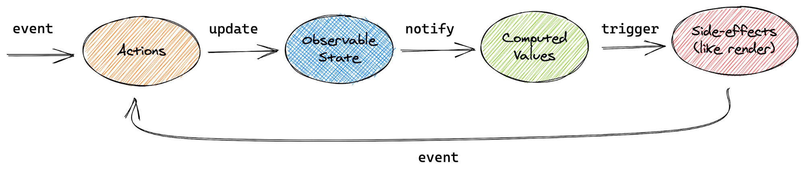
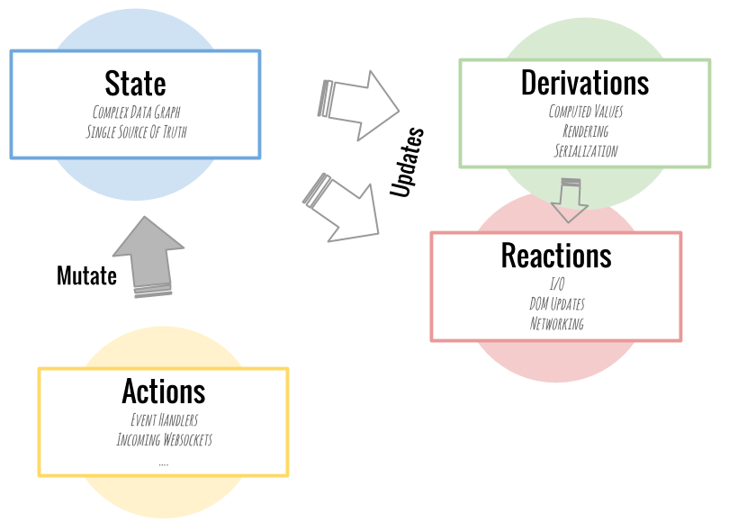
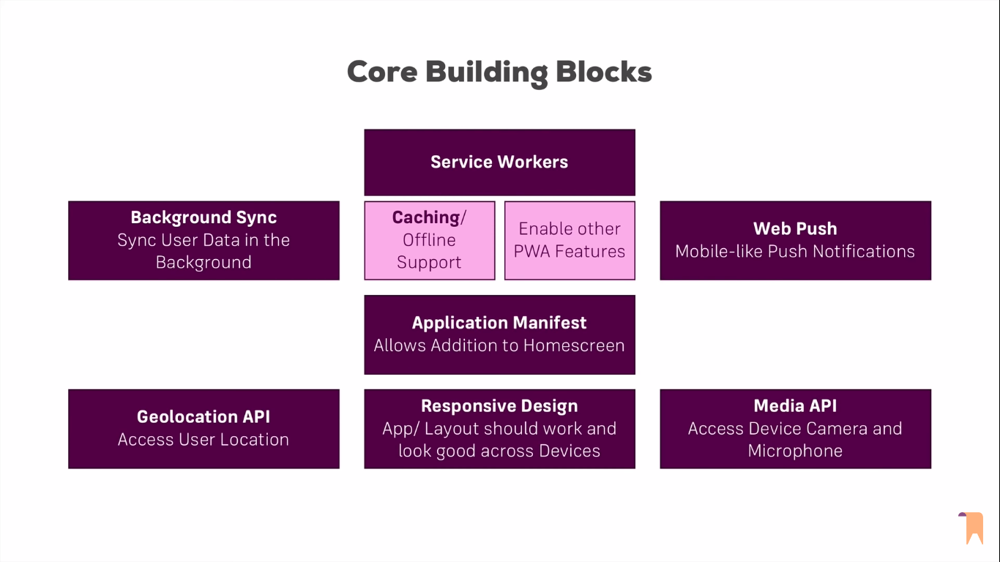

# Mobx for react


### MobX

**Ten minute introduction to MobX and React**

MobX is a simple, scalable and battle tested state management solution. This tutorial will teach you all the important concepts of MobX in ten minutes. MobX is a standalone library, but most people are using it with React and this tutorial focuses on that combination.

https://mobx.js.org/getting-started

https://mobx.js.org/README.html

https://doc.ebichu.cc/mobx/refguide/extend-observable.html





https://www.npmjs.com/package/mobx

https://mobx.js.org/getting-started

https://github.com/mobxjs/mobx

**Mobx Getting started :**

**mobxjs/mobx-react-boilerplate:**

https://github.com/mobxjs/mobx-react-boilerplate



https://www.youtube.com/watch?v=dap6yIe1uK4&t=932s&ab_channel=Academind

#### Observer :

(recommended way is to wrap all stateful components in observer func for real time change detection)

Observer in mobx is like a observable which is use for change detection in mobx if any thing change in mobx store it will automatically rerender this component like this.setState does when state change

We have to wrap our component in observer() (HOF higher order function)
A component in which we want to real time change detection work needed like in state full components.

Example :

```jsx showLineNumbers
import { observer } from "mobx-react";
function TemporaryDrawer(props) {
  return (
    <div>
      {["left", "right", "top", "bottom"].map((anchor) => (
        <React.Fragment key={anchor}>
          <Button onClick={toggleDrawer(anchor, true)}>{anchor}</Button>
          <Drawer
            anchor={anchor}
            open={drawerState[anchor]}
            onClose={toggleDrawer(anchor, false)}
          >
            {list(anchor)}
          </Drawer>
        </React.Fragment>
      ))}
    </div>
  );
}

export default observer(TemporaryDrawer);
```

Note:

**Observer is wrong**

**O must be small otherwise wont work**

### Create React JS PWA app :

https://betterprogramming.pub/build-a-realtime-pwa-with-react-99e7b0fd3270

Tutorials :

https://www.youtube.com/watch?v=Dp75-DnGFrU&list=PL8fumNHsC-3O0iQ_KP2Gz5f8ib2jP5rPv&ab_channel=LeighHalliday
