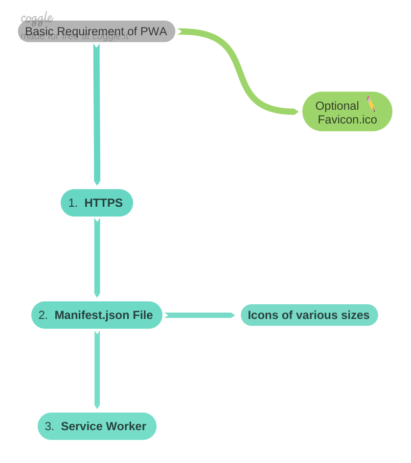

# ReactJs PWA



**Making a Progressive Web App :**

To create create react app with PWA template (with service worker file and manifest.json)

```jsx showLineNumbers
npx create-react-app my-app --template cra-template-pwa
```

https://create-react-app.dev/docs/making-a-progressive-web-app/

Not getting service worker with create-react-app

https://stackoverflow.com/questions/65060150/not-getting-service-worker-with-create-react-app

https://www.youtube.com/watch?v=MMXKjrBWgPo&t=729s&ab_channel=RahulAhire

**Sample projects**

Live url : https://festive-beaver-e033bf.netlify.app/

Source code : https://github.com/MeRahulAhire/react-tel-input-tutorial
