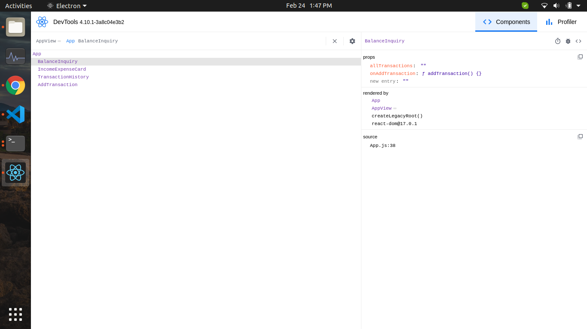

# ReactJs

### Debugging React JS



```bash showLineNumbers
npm install -g react-devtools
```

react-devtools

Add this script tag in your index.html

```jsx showLineNumbers
<script src="http://localhost:8097"></script>
```

Ref : https://www.npmjs.com/package/react-devtools


## React Developer Tools

### Testing in ReactJs

references :

**Unit, Component and remote testing**

https://github.com/react-boilerplate/react-boilerplate/tree/master/docs/testing

**Unit testing in react basic guide using jest**

https://github.com/facebook/jest
https://jestjs.io/docs/tutorial-react

**React unit testing with Jest & React-testing-library ( Unit testing, component testing and snapshot testing code example )**

https://www.youtube.com/watch?v=3e1GHCA3GP0&ab_channel=techsith

**Unit Testing React Components**

https://medium.com/javascript-scene/unit-testing-react-components-aeda9a44aae2

**Unit Test your React app with Jest, Jest-dom & Enzyme**

https://javascript.plainenglish.io/are-you-not-testing-your-react-app-instantly-test-with-jest-enzyme-a-reactjs-2020-tutorial-e9ce0182d66d

**Testing Library**

Simple and complete testing utilities that encourage good testing practices

https://github.com/testing-library

extra

https://github.com/testing-library/jest-dom

### React boilerplate

react-boilerplate

https://www.reactboilerplate.com/

### Courses

advance react

https://www.youtube.com/watch?v=mrTPrbSoAx0&list=PL8fumNHsC-3P7SYHKwDu55n_9_1v1owzI&ab_channel=LeighHalliday

### Deployment react app

mostly all methods for react deploy create-react-app

https://create-react-app.dev/docs/deployment/

Test react production build locally

https://medium.com/@samratshaw/test-react-production-build-locally-434907be9e49

Deploy React Apps in less than 30 Seconds

https://www.netlify.com/blog/2016/07/22/deploy-react-apps-in-less-than-30-seconds/

### UI Styling

- loader in material ui table

Add progress bar in Material-UI table

mui loader

https://codesandbox.io/s/upbeat-lamport-ct3k4?file=/src/Hello.tsx

https://stackoverflow.com/questions/69135179/add-progress-bar-in-material-ui-table

- toast in react material ui

  https://material-ui.com/components/snackbars/ `npm i @material-ui/lab`

- react toastify

  https://www.npmjs.com/package/react-toastify

### ContextAPI ReactJS

**How to optimize your context value**

https://kentcdodds.com/blog/how-to-optimize-your-context-value

### ADVANCED GUIDES

Bundling
Most React apps will have their files “bundled” using tools like Webpack, Rollup or Browserify. Bundling is the process of following imported files and merging them into a single file: a “bundle”. This bundle can then be included on a webpage to load an entire app at once.

Example
App:

```jsx showLineNumbers
// app.js
import { add } from "./math.js";

console.log(add(16, 26)); // 42

// math.js
export function add(a, b) {
  return a + b;
}
```

Bundle:

```jsx showLineNumbers
function add(a, b) {
  return a + b;
}

console.log(add(16, 26)); // 42
```

If you’re using Create React App, Next.js, Gatsby, or a similar tool, you will have a Webpack setup out of the box to bundle your app.

**Gatsbyjs**

The static dynamic site generator for dynamic web developers

Gatsby provides development teams an open source frontend framework for creating dynamic, optimized websites and a cloud platform for delivering them on a blazing fast edge network.

**Code Splitting**

Code-splitting your app can help you “lazy-load” just the things that are currently needed by the user, which can dramatically improve the performance of your app. While you haven’t reduced the overall amount of code in your app, you’ve avoided loading code that the user may never need, and reduced the amount of code needed during the initial load.

**React.lazy**

The React.lazy function lets you render a dynamic import as a regular component.

Before:

```jsx showLineNumbers
import OtherComponent from "./OtherComponent";
```

After:

```jsx showLineNumbers
const OtherComponent = React.lazy(() => import("./OtherComponent"));
```

This will automatically load the bundle containing the OtherComponent when this component is first rendered.

**Error boundaries :**

If the other module fails to load (for example, due to network failure), it will trigger an error. You can handle these errors to show a nice user experience and manage recovery with Error Boundaries. Once you’ve created your Error Boundary, you can use it anywhere above your lazy components to display an error state when there’s a network error.

```jsx showLineNumbers
import React, { Suspense } from "react";
import MyErrorBoundary from "./MyErrorBoundary";

const OtherComponent = React.lazy(() => import("./OtherComponent"));
const AnotherComponent = React.lazy(() => import("./AnotherComponent"));

const MyComponent = () => (
  <div>
    <MyErrorBoundary>
      <Suspense fallback={<div>Loading...</div>}>
        <section>
          <OtherComponent />
          <AnotherComponent />
        </section>
      </Suspense>
    </MyErrorBoundary>
  </div>
);
```

**Route-based code splitting**

Deciding where in your app to introduce code splitting can be a bit tricky. You want to make sure you choose places that will split bundles evenly, but won’t disrupt the user experience.

Here’s an example of how to setup route-based code splitting into your app using libraries like React Router with React.lazy.

```jsx showLineNumbers
import React, { Suspense, lazy } from "react";
import { BrowserRouter as Router, Route, Switch } from "react-router-dom";

const Home = lazy(() => import("./routes/Home"));
const About = lazy(() => import("./routes/About"));

const App = () => (
  <Router>
    <Suspense fallback={<div>Loading...</div>}>
      <Switch>
        <Route exact path="/" component={Home} />
        <Route path="/about" component={About} />
      </Switch>
    </Suspense>
  </Router>
);
```

**Render Props**

The term “render prop” refers to a technique for sharing code between React components using a prop whose value is a function.

A component with a render prop takes a function that returns a React element and calls it instead of implementing its own render logic.

```jsx showLineNumbers
<DataProvider render={(data) => <h1>Hello {data.target}</h1>} />
```

Libraries that use render props include React Router, Downshift and Formik.

**Use Render Props for Cross-Cutting Concerns**

Components are the primary unit of code reuse in React, but it’s not always obvious how to share the state or behavior that one component encapsulates to other components that need that same state.

For example, the following component tracks the mouse position in a web app:

```jsx showLineNumbers
class MouseTracker extends React.Component {
  constructor(props) {
    super(props);
    this.handleMouseMove = this.handleMouseMove.bind(this);
    this.state = { x: 0, y: 0 };
  }

  handleMouseMove(event) {
    this.setState({
      x: event.clientX,
      y: event.clientY,
    });
  }

  render() {
    return (
      <div style={{ height: "100vh" }} onMouseMove={this.handleMouseMove}>
        <h1>Move the mouse around!</h1>
        <p>
          The current mouse position is ({this.state.x}, {this.state.y})
        </p>
      </div>
    );
  }
}
```

**More concretely, a render prop is a function prop that a component uses to know what to render.**

**Static Type Checking :**

Static type checkers like Flow and TypeScript identify certain types of problems before you even run your code. They can also improve developer workflow by adding features like auto-completion. For this reason, we recommend using Flow or TypeScript instead of PropTypes for larger code bases.

**Refs and the DOM**
Refs provide a way to access DOM nodes or React elements created in the render method.

## create-react-app

**How to disable file watching in a react app**

https://stackoverflow.com/questions/59112564/how-to-disable-file-watching-in-a-react-app

**System limit for number of file watchers reached #7612**

this sol works
"I have had this error too. Try

$ echo fs.inotify.max_user_watches=524288 | sudo tee -a /etc/sysctl.conf
and

```bash showLineNumbers
$ sudo sysctl -p
```

This document helped me
https://github.com/guard/listen/wiki/Increasing-the-amount-of-inotify-watchers#the-technical-details"
https://github.com/facebook/create-react-app/issues/7612

## React

**Build forms in React, without the tears 😭**

https://github.com/formium/formik

1 IS checkbox is controlled element in react

https://www.google.com/search?q=checkbox+is+controlled+element+in+react&oq=checkbox+is+controlled+element+in+react&aqs=chrome..69i57j33i160l4.9244j0j7&sourceid=chrome&ie=UTF-8

"What are controlled components in React?

A controlled component is a component that renders form elements and controls them
by keeping the form data in the component's state. In a controlled component,

the form element's data is handled by the React component (not DOM) and kept in the component's state.15 Sep 2020"

https://stackoverflow.com/questions/61559675/react-checkbox-controlled-component

Q how to start react project in a new port

```
>     PORT=3001 npm start			run this command in terminal
```

**What is react helmat and its purpose**

"react-helmet allows to set meta tags that will be read by search engines and social media crawlers.
This makes server-side rendering and React Helmet a dynamic duo for creating apps that are SEO and social media friendly."
eg:

```jsx showLineNumbers
import { Helmet } from "react-helmet";

<Helmet>
  <title>Turbo Todo</title>
  <meta name="description" content="test on react-helmet" />
  <meta name="theme-color" content="#ccc" />
</Helmet>;
```

https://stackoverflow.com/questions/52690820/what-is-the-purpose-of-react-helmet

**background image in antd background image in react**

https://www.codegrepper.com/code-examples/javascript/antd+background+image

**React JS imports made easy with Absolute paths using jsconfig.json**

https://saurabhshah23.medium.com/react-app-with-absolute-paths-using-jsconfig-json-2b07b1cb24d4

**const Context = React.createContext();**

The React.createContext creates a Context object. What happens here is when React is rendering a component that subscribes to this object, it will read the context value currently in the closest matching Provider just above it. You can also provide a default value here as ‘en’ but it’s not necessary as we are using a language navigator.

https://reactjs.org/docs/context.html

**Strict mode in react**

https://reactjs.org/docs/strict-mode.html

`<React.StrictMode>`

StrictMode is a tool for highlighting potential problems in an application. Like Fragment, StrictMode does not render any visible UI. It activates additional checks and warnings for its descendants

**"What’s coming in React 18**

When it’s released, React 18 will include out-of-the-box improvements (like automatic batching), new APIs (like startTransition), and a new streaming server renderer with built-in support for React.lazy."

https://reactjs.org/blog/2021/06/08/the-plan-for-react-18.html#:~:text=When%20it's%20released%2C%20React%2018,re%20adding%20in%20React%2018.

https://github.com/reactwg/react-18/discussions/65#

custom hooks

https://reactjs.org/docs/hooks-custom.html

sementic-ui-react

sementic-ui-react is all about compound react components

https://youtu.be/HK0ufAkQCW8?t=262

https://www.youtube.com/watch?v=taLD-US7SUk&ab_channel=DevEd

flexible compound components or react.context

better version of compound component (React.children is componund component)

**Advanced patterns in building React Components - Manjula Dube - reactjsday 2018**

best tutorial for react concepts and best practices

https://www.youtube.com/watch?v=HK0ufAkQCW8&ab_channel=GrUSP

learning react

Advanced React Patterns rocket EpicReact.Dev

https://github.com/manjula-dube/react-advanced-patterns
https://github.com/kentcdodds/advanced-react-patternshttps://kentcdodds.com/workshops/advanced-react-patterns
https://epicreact.dev/

sementic-ui-react is all about compound react components

https://www.youtube.com/watch?v=HK0ufAkQCW8&ab_channel=GrUSP
https://youtu.be/HK0ufAkQCW8?t=262

What are compound components in react ?

Enclose the state and behaviour for a group of components but still givest the rendering control for its variable parts back to the external user.
e.g think of something like the `<select>` and `<option>` element in html.

## react project setup

**Setting up a React app from scratch withWebpack, Babel and Eslint**

https://medium.com/geekculture/setting-up-a-react-app-from-scratch-withwebpack-babel-and-eslint-57eb3dcaf2e9

**Server Side Rendering(SSR) Vs Client Side Rendering(CSR): #shorts**

https://youtu.be/r98sQ8oXtUI

**Tech Talk: Client Side vs. Server Sider Rendering**

https://www.youtube.com/watch?v=Y2spCNZDt84&ab_channel=FullstackAcademy

**react is client side or server side**

React along with other framework like angular and vue. js are traditional client side framework ,they run in browser but there are technology to run this framework on server side, and next.

**ReactJS server-side rendering vs client-side rendering**

https://stackoverflow.com/questions/27290354/reactjs-server-side-rendering-vs-client-side-rendering

### Server side rending in React

what is the content type in server side rendering

Server-side rendering (SSR) is an application's ability to convert HTML files on the server into a fully rendered HTML page for the client. The web browser submits a request for information from the server, which instantly responds by sending a fully rendered page to the client.

**Server-Side Rendering Definition**

**What is Server-Side Rendering?**

Server-side rendering (SSR) is an application’s ability to convert HTML files on the server into a fully rendered HTML page for the client. The web browser submits a request for information from the server, which instantly responds by sending a fully rendered page to the client. Search engines can crawl and index content prior to delivery, which is beneficial for Search Engine Optimization purposes.

‍

Popular examples of server-side rendering JavaScript frameworks include: Angular server side rendering, ejs server side rendering, server side rendering Express, Gatsby server side rendering, Google server side rendering, NestJS server side rendering, Next server side rendering, Nuxt server side rendering, React server side rendering, and Vue server side rendering.

**What are the Benefits of Server-Side Rendering?**

Some server-side rendering advantages include:

- A server-side rendered application enables pages to load faster, improving the user experience.
- When rendering server-side, search engines can easily index and crawl content because the content can be rendered before the page is loaded, which is ideal for SEO.
- Webpages are correctly indexed because web browsers prioritize web pages with faster load times.
- Rendering server-side helps efficiently load webpages for users with slow internet connection or outdated devices.

**What are the Risks of Server-Side Rendering?**

Server-side rendering disadvantages may include:

- Rendering server-side can be costly and resource-intensive as it is not the default for JavaScript websites, and the server takes on the full burden of rendering content for users and bots.
- While rendering static HTML server-side is efficient, rendering bigger, more complex applications server-side can increase load times due to the bottleneck.
- Server-side rendering may not be compatible with third-party JavaScript code.
- Rendering server-side may be ideal for static site generation, but frequent server requests and full page reloads can result in overall slower page rendering in more complex applications.

**Server-Side Rendering vs Client-Side Rendering**

In client-server rendering, rather than receiving all of the content from the HTML document, content is rendered in the browser using the client-side JavaScript library. The browser does not make a new request to the server when a new page is loaded. Search engine rankings may be negatively impacted as the content is not rendered until the page is loaded on the browser, however, website rendering tends to be faster in client-side rendered app. In considering server side vs client side rendering, the developer will assess factors such as the scale of the project, the complexity of the application, the number of users, and user experience priorities.

https://www.heavy.ai/technical-glossary/server-side-rendering#:~:text=Server%2Dside%20rendering%20(SSR),rendered%20page%20to%20the%20client.

**Invalid PDF Exception ! #527**

invalid pdf structure react-pdf-viewer
solution:

Invalid PDF structure

React PDF viewer

```
so I tried importing them as module and it loaded the pdf !!!

import myPdf from ''.../assets/pdfs/myDoc.pdf
and then storing it in a var and passing that var to Document
const pdf = myPdf
<Document file={pdf}>
<Page pageNum...></Page>

BUT then it will have so many imports in the component one for each pdf and the application I am working on can have more pdfs added to them later on and path is stored in JSON related to the current directory structure

so may be I will look into if I can do dynamic imports based on props -- that's the route I am looking to and asking for if you know any solution for that cause again as I said don't want imports for each and every pdf

Thanks
```

https://github.com/wojtekmaj/react-pdf/issues/527

## Bookmarks

### KIDNAPPED

### Scrollview Animation like movie app

- [Building a Cool Horizontal Scroll Interaction in React](https://medium.com/dailyjs/horizontal-scroll-animation-fc39ae43cbe5)

### Jawad React

- [Dropbox - V3 - Simplify your life](https://www.dropbox.com/sh/0r65vs57a1wdj0z/AAAgYTEIP6pB7ftDJqHZ32HJa?dl=0&preview=02+UC_Exchange_home_modal_V3.psd)

- [UnitedCoin](https://unitedex.io/home.html)
- [UnitedCoin](https://family-tracking-app.firebaseapp.com/)

- [fahad-hussain-eng / coin-foundation / src / components / Sidebar.js —](https://bitbucket.org/fahad-hussain-eng/coin-foundation/src/master/src/components/Sidebar.js)

- Lynda React: Lifecycles | Lynda Free Courses Online Download Torrent
- [FreeCoursesOnline.Me](https://www.freecoursesonline.me/lynda-react-lifecycles/)

- UnitedCoin

- [FAQ – Genymotion Android Emulator](https://www.genymotion.com/help/desktop/faq/#windows-ten-start-impossible)

- [Fullstack React Course Resources ](https://docs.google.com/document/d/1ZVLphlOH0PEOUCd5v2UJVHiRSKuYjJI-AS4xQWYXmq8/edit)

### OCA APP

### oca-admin-panel

- [ngx-admin - Angular 8, Bootstrap 4 Admin dashboard template](https://www.akveo.com/ngx-admin/pages/dashboard?utm_campaign=ngx_admin%20-%20demo%20-%20ngx_admin%20docs&utm_source=ngx_admin&utm_medium=referral&utm_content=landing_main_section)

- [Bootstrap ngx-admin: Free Open Source admin dashboard template based on Angular](https://akveo.github.io/ngx-admin/)

- [akveo/ngx-admin at ng2-admin-demo](https://github.com/akveo/ngx-admin/tree/ng2-admin-demo)

- [admin template based on Bootstrap 4](https://github.com/coreui/coreui-free-angular-admin-template)

### Syed Mustafa links

- [35+ Best Free Ecommerce WordPress Themes 2018 - aThemes](https://athemes.com/collections/free-ecommerce-wordpress-themes/?fbclid=IwAR1C6l7qQDezvA4W_U1hVjwb63F6qwjkYy4avJEeUkS5P-ifY9V6sth8Vpg)

- [How to Install MAMP and WordPress on your computer](https://www.youtube.com/watch?v=nwLLVgFgTEI&fbclid=IwAR1mBXNnwjAsooK0lMUfoHVXP0-8ARRWxNw1HIDgBJRo3vCCG87xuTQ6TKM)

- [How To Create eCommerce Website In WordPress](https://www.youtube.com/watch?v=IVaLdnGN9Nc&fbclid=IwAR1gexlktwSI5WSJpuRkuo1DXRlhJk72tGYxGh9m31Xmt3DAC20WO5Pqjto)

- [eStore – WordPress Store Theme](https://demo.theme-grill.com/estore/)

- [eCommerce Gem – Multipurpose e-Commerce WP Theme](https://www.prodesigns.com/wordpress-themes/demo/ecommerce-gem/)

1. [Installation & Updating Archives - WooCommerce Docs](https://docs.woocommerce.com/documentation/plugins/woocommerce/getting-started/installation-and-updating/)

- [Learn React.js - Full Course for Beginners - Tutorial](https://www.youtube.com/watch?v=DLX62G4lc44)

- [Stunning Free Images · Pixabay](https://pixabay.com/en/)

- [Dashboard ‹ GBaji Website — WordPress](http://localhost/wordpress/wp-admin/)

- [wordpress theme customization step by step | WordPress for Beginners | #4](https://www.youtube.com/watch?v=IIJN6a_lWdQ)

- [Complete React Tutorial Using Axios](https://www.youtube.com/watch?v=4uzEUATtNHQ)

- [React Cheatsheet](http://www.developer-cheatsheets.com/react)

- [Sign in or Register | edX](https://courses.edx.org/register?course_id=course-v1%3AHarvardX%2BCS50M%2BMobile&enrollment_action=enroll&email_opt_in=false)

- [Git & GitHub Crash Course For Beginners](https://www.youtube.com/watch?v=SWYqp7iY_Tc)

- [Example of using RN FlatList component with pagination and pull-refreshing · GitHub](https://gist.github.com/SergeyLipko/eb97ee28fbbee8c92704cdc0fb6475a5)

- [How to Get a Software Engineer Job at Google and Other Top Tech Companies](https://medium.freecodecamp.org/how-to-get-a-software-engineer-job-at-google-and-other-top-tech-companies-efa235a33a6d)

- [How a 13 year old completed the freecodecamp – Hooria Ishtiaq – Medium](https://medium.com/@hooria.hic/how-a-13-year-old-completed-the-freecodecamp-c0a0b5a6f8a)

### recaptcha

- [react-google-recaptcha 1.0.0 e-CodeSandbox](https://codesandbox.io/s/1y4zzjq37l)

- [react-google-recaptcha](https://www.npmjs.com/package/react-google-recaptcha)

- [reCAPTCHA: Easy on Humans, Hard on Bots](https://www.google.com/recaptcha/admin#site/343196409?setup)

- [UnitedCoin](https://www.facebook.com/groups/205747229871444/)
-
- [Files Folder](https://family-tracking-app.firebaseapp.com/my-accounts.html)

- [Files Folder](https://www.facebook.com/groups/205747229871444/)

- [Research-and-development-documentation-v1](https://muhammadmoiz-research-and-dev-doc.netlify.app/)

- [Research-and-development-documentation-v1 — Visual Studio Code —](https://github.dev/abdulmoizshaikh/Research-and-development-documentation-v1/tree/personal-notes-app)

- [my OKR's and Life Goals - Google Sheets](https://docs.google.com/spreadsheets/d/1zwMa_QHivF6XQmy0_9HRCwlP_4W94jywCFrZRDOYUXI/edit#gid=0)

- [Learn freelancing guides/ blogs/ others experience pro tips ](https://docs.google.com/document/d/1fiuHXCS9Tnmjc9fyLl0tgi5e9hfsrK21L4ym2Iq3NXE/edit?ouid=100977419383219313036&usp=docs_home&ths=true)

### react

- [GitHub - haideralishah/saylani-react: This repository belongs to saylani batch 4.1 and 4.2 lectures and class codes.](https://github.com/haideralishah/saylani-react)

- [You searched for advance javascript | FreeTutorials.Us](https://www.freetutorials.us/?s=advance+javascript&asl_active=1&p_asid=1&p_asl_data=cXRyYW5zbGF0ZV9sYW5nPTAmc2V0X2ludGl0bGU9Tm9uZSZzZXRfaW5wb3N0cz1Ob25lJnNldF9pbnBhZ2VzPU5vbmUmY2F0ZWdvcnlzZXQlNUIlNUQ9MTM0JmNhdGVnb3J5c2V0JTVCJTVEPTQmY2F0ZWdvcnlzZXQlNUIlNUQ9MTQxJmNhdGVnb3J5c2V0JTVCJTVEPTcmY2F0ZWdvcnlzZXQlNUIlNUQ9MyZjYXRlZ29yeXNldCU1QiU1RD0yOSZjYXRlZ29yeXNldCU1QiU1RD0xMSZjYXRlZ29yeXNldCU1QiU1RD01JmNhdGVnb3J5c2V0JTVCJTVEPTc2NyZjYXRlZ29yeXNldCU1QiU1RD04ODImY2F0ZWdvcnlzZXQlNUIlNUQ9OCZjYXRlZ29yeXNldCU1QiU1RD0xMCZjYXRlZ29yeXNldCU1QiU1RD05JmNhdGVnb3J5c2V0JTVCJTVEPTYmY2F0ZWdvcnlzZXQlNUIlNUQ9MTgwJmNhdGVnb3J5c2V0JTVCJTVEPTE5OSZjYXRlZ29yeXNldCU1QiU1RD0x)

- [What are some websites to download paid courses for free? : Piracy](https://www.reddit.com/r/Piracy/comments/6ecwu8/what_are_some_websites_to_download_paid_courses/)

- [sites for downloading all paid courses for free - Google Search](https://www.google.com.pk/search?rlz=1C1CHBD_enPK768PK768&ei=cVzzWfKMEcbUwALvzq64Aw&q=sites+for+downloading+all+paid+courses+for+free&oq=sites+for+downloading+all+paid+courses+for+free&gs_l=psy-ab.3...7072.8158.0.8779.5.5.0.0.0.0.298.298.2-1.1.0....0...1.1.64.psy-ab..4.0.0....0.2CIppn0pywI)

- [Home](https://mark-sheet-generator.firebaseapp.com/home/index.html)

- [LifeLine - The Blood Application](https://github.com/Maaaz-Shaheen)
- [Maaaz-Shaheen](https://lifeline-b81f6.firebaseapp.com/index.html#)

- [Learn ReactJS: Part I | Codecademy](https://www.codecademy.com/courses/react-101/lessons/react-jsx-intro/exercises/hello-world?action=lesson_resume)

- [A Pen by Muhammad Moiz](https://codepen.io/pen/)

- [Learn JavaScript for Web Development | Udemy](https://www.udemy.com/javascript-learn-javascript-essentials-and-build-project/?couponCode=BBHF2017&site_ref=mrtechmyth.com)

- [Web Design Responsive Website Template from Scratch HTML CSS | Udemy](https://www.udemy.com/responsive-website-template-from-scratch-html-css/?couponCode=LEARNFREE2)

### Mubeeb React Bookmarks

- [muneebkhan7737/React-Bookmarks](https://github.com/muneebkhan7737/React-Bookmarks)

**The Complete Guide to Micro Frontend with React.js for 2022**

**What is a micro frontend?**

The Micro Frontend style of architecture design does for the frontend of an application what microservices do for the backend, breaking monolithic structures into smaller components that can then be assembled on a single page.

https://dev.to/devsmitra/the-complete-guide-to-micro-frontend-with-reactjs-for-2022-36b2
