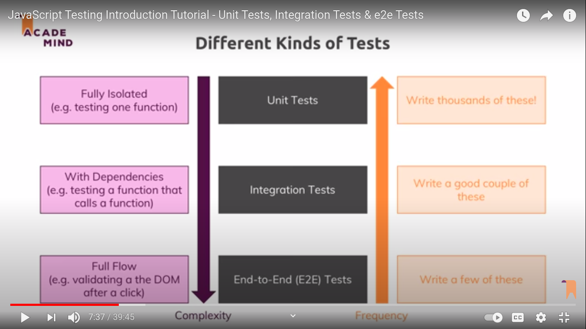
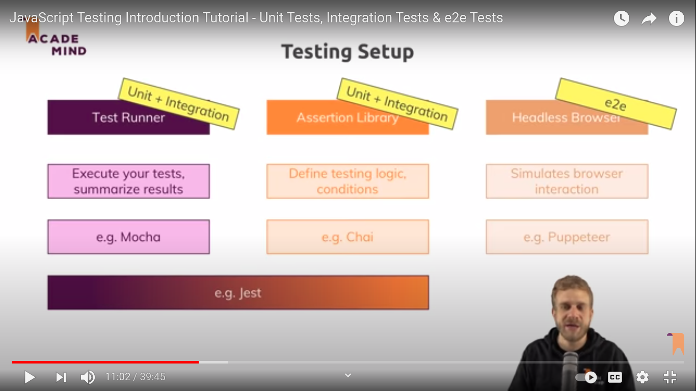

# Testing in Javascript and React

testing react `kent c dodds` course
Slides with repo url : https://slides.com/kentcdodds/testing-react-apps

**Using jest**

Testing fundamentals

1. static code analysis (ESLint)
2. flow-typed
3. typescript
4. prettier (its amazing recommend by kentcdodds)

**Types of testing**

1. Static (ESLint)
2. Unit tests (flow-typed)
3. Integration testing
4. End to End test (not jest this is for cypress) (how user intract to the application and change the state of application)



https://youtu.be/r9HdJ8P6GQI?t=468



https://www.youtube.com/watch?v=r9HdJ8P6GQI&ab_channel=Academind

https://testingjavascript.com/

**Testing in react (basic crash course):**

https://www.youtube.com/watch?v=U_Q7ss7wvoo&list=PL8fumNHsC-3NaPNxh2bous6bBDWwJ4r1-&ab_channel=LeighHalliday

**React Testing Library :**

https://create-react-app.dev/docs/running-tests/

https://testing-library.com/docs/react-testing-library/intro/

**Kent C Dodds course project source code :**

https://github.com/kentcdodds/testing-workshop

**Other project for react testing**

https://github.com/kentcdodds/testing-react-apps/tree/main/src

**Jest**:

https://jestjs.io/docs/getting-started

optional

Visual Regression Testing with Jest

continue from 2. Test Configurations

continue from install-configure-and-script-cypress-for-javascript-web-applications-8184

**Second course:**

its looking for file that ends with .test.js in all working dir file or sub/child files

jest uses it or test

```jsx showLineNumbers
it("render without crasing", () => {});
or;
test("render without crasing", () => {});

test("renders learn react link", () => {
  render(<App />);
  const linkElement = screen.getByText(/learn react/i);
  expect(linkElement).toBeInTheDocument();
});
```

use test because it is used in official test of create react app or in the jest api docs

test(description of test, function that will run)

**Intro to Enzyme**

create virtual DOM for testing

Allows testing without a browser

react uses react DOM for virtual DOM

enzyme uses react dom under that hood some the end some interface gives us a much more extensive tool kit to work with our virtual dom
Enzyme has better toolkit

> search through DOM (using jquery style selector)
> simulate simple events (you could blur an element for example)

Enzyme has concept of shallow rendering

> Which allows you to render components only one level deep
> render parent but use placeholders for children components

> finally Enzyme provides
> Access to components props and state
> so you can manipulate the props and state and you also check to see what they are as part of your testing

lets start enzyme:

npm i ajv
npm i --save-dev enzyme jest-enzyme enzyme-adapter-react-16

const wrapper = shallow(<App />);
shallow is actually making sure the it renders without crashing

.debug returns the DOM as a string

https://enzymejs.github.io/enzyme/docs/api/shallow.html

for mocha there is chai an assersion library and many more
but jest has its own assertions builtin and we use expect the same way you work with chai

https://jestjs.io/

expect() through error when the assertion fails

**Types of tests**

**1. Unit tests**

> test one piece (usually one function)

**2. Integration tests**

> How multiple units work togather

**3. Acceptance / End to End (E3E) tests**

> How a user would intract with the app (and often use something like silinium here to run an actual browser and see weather or not the user intraction works from end to end user interface down to databaseand back again)

server testing with jest
browser based testing with silinium or any other no of tools

Refactor should not affect tests

> Donot want to re-write tests after refactor
> Keep in mind when writing tests

**snapshot testing**

Jest includes snapshot testing

> A way to freeze a component
> Test fails if there are any changes

than the test will always compare any future output against the snapshot or the frozen output
and the test will fails if there have been any changes

No snapshot here

bea

> No TDD (test driven development) you can't the output of your component exactly and write your codebase on that
> Brittle (any change to component will break the snapshot test)
> to easy to ignore the failures and update the snapshot
> No test intent
> if there's a failure, does code still meet spec?
> If used, it's alongside traditional tests
> You decide what's right for you

Continue with lession 14: setup Enzyme and write test

continue with lession 15

**JavaScript Testing Introduction :**

https://academind.com/tutorials/javascript-testing-introduction/
