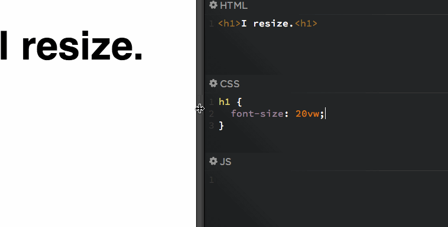

# CSS responsive design guideline | styling concepts

Difference between rem vs em vs px vs percentage ? which to use and where to use ?

**CSS Font Sizing: Pixels vs Em vs Rem vs Percent vs Viewport Units:**

1.  `Pixels (not recommended)` : Before the advent of responsive design, pixel was widely used as THE font sizing for everything from typography to width, padding and height. However, `pixels are fixed-size units and do not change based on the size of the viewport or are scalable`.

2.  `Em` ( better than pixel ) :
    Em is a flexible, scalable unit that is converted by the browser into pixel values. If the default font size in chrome is 16 px, 1 em = 16 pixels. One big misconception about em is that it is relative to the font size of the parent element. As per the W3 spec, em is relative to the font size of the element on which they are used. This article here has done a wonderful job explaining the concept of em in a clear and detailed manner. If you really want to learn how em works, do not skip the above mentioned article. `Ems are commonly used for typography such as headings, texts , paragraphs and the elements associated with typography such as margins, padding etc`. If you set your base html and body elements font size in pixels and your typography element’s properties are defined using ems, for responsive design all you need to do is change the default font-size at the base level such as

    ```css showLineNumbers
    @media (max-width: 400px) {
      html,
      body {
        font-size: 15px;
      }
    }
    ```

    and all em values will automatically re-compute to the base level.

    `Downside of EM` :

    `However, ems have a major caveat, Inheritance!! For example, a <div> with a font-size of 16px containing a <p> with a font-size of 2em translates to 32 px for the <p> element. Now add a <div> inside the <p> with a font size of 0.5em too, the result of the div will be 16px, half of 32 px, not 8px. This is where rems come into the picture.`

3.  `Rem` ( better than EM / simpler than EM ) :
    Rem is relative to the font size of the root element (html element). If the font-size of the html element is 16 px, then 1rem = 16 px. `Rem will ALWAYS be relative to the root element, irrespective of how nested the elements are.` However, using only rems and no ems can have its own share of troubles as the typography can either become too big or too small and this can lead to scaling issues. This [article](https://css-tricks.com/rems-ems/) explains a great way to solve this problem.

    The article explains that :

    **Font Size Idea: px at the Root, rem for Components, em for Text Elements:**

    https://css-tricks.com/rems-ems/

4.  `Percents:` ( Relative to the parent element ) `Percent value is always relative to another value`, be it the element’s parent value or from another property of the element itself. `Percentages are used widely in responsive design`. A great example would be Twitter’s Bootstrap framework. Bootstrap’s 12-Column layout has it’s widths set in percentages, so they’re always fluid and sized relative to their parent element
    `Percentages are commonly used for width and height of containers, divs and for sizing responsive images.`

5.  `Viewport units:` Viewport width and height properties are relative to the width/height of the current viewport size.

    1vw = 1% of viewport width

    1vh = 1% of viewport height

    Viewport here means the browser’s window size. If you want to size your element based on the viewport width and not the parent element/root element, then viewport units is the font sizing unit you need to use. vw/vh units work great with typography and are commonly used for the same.
    Here is a great [article](https://css-tricks.com/viewport-sized-typography/) that explains how to use this property.

    

    Not just font-size

    For the record, these are just units. Just like em, px, whatever. You can use them on anything, not just font-size.

    I think font-size is the most compelling use case, since things like margin, padding, and width can already essentially react to browser window size by using % units. There is the case where perhaps a more deeply-nested element needs to react to the browser window size instead of its direct parent size.

    https://css-tricks.com/viewport-sized-typography/

    `Final Verdict`: Since I use bootstrap frequently, my default base size is in pixels. I use percent to set the width and height of images, containers and divs, ems and rems for typography and elements related to typography such as margin, padding etc. I am currently playing with viewport units for responsive typography and find it awesome. Experiment with these font properties a lot and you will soon fall into a style tailor made for you.

**Summary** :

When Should You Use One Unit Over Another?

Ultimately, there isn’t a perfect answer for this question. In general, it is often best to choose one of the relative units over PX so that your web page has the best chance of rendering a beautifully responsive design. Choose PX however, if you need to ensure that an element never resizes at any breakpoint and remains the same regardless of whether a user has chosen a different default size. PX units ensure consistent results even if that’s not ideal.

**EM** is relative to the parent element’s font size, so if you wish to scale the element’s size based on its parent’s size, use EM.

**REM** is relative to the root (HTML) font size, so if you wish to scale the element’s size based on the root size, no matter what the parent size is, use REM. If you’ve used EM and are finding sizing issues due to lots of nested elements, REM will probably be the better choice.

**VW** is useful for creating full width elements (100%) that fill up the entire viewport’s width. Of course, you can use any percentage of the viewport’s width to achieve other goals, such as 50% for half the width, etc.

**VH** is useful for creating full height elements (100%) that fill up the entire viewport’s height. Of course, you can use any percentage of the viewport’s height to achieve other goals, such as 50% for half the height, etc.

**%** is similar to VW and VH but it is not a length that is relative to viewport’s width or height. Instead, it is a percentage of the parent element’s width or height. Percentage units are often useful to set the width of margins, as an example.

Elementor makes it easy to choose the option that is best suited for your design. Ultimately, it’s your choice.

Reference:

https://medium.com/@madhum86/css-font-sizing-pixels-vs-em-vs-rem-vs-percent-vs-viewport-units-b1485716afe7
https://www.linkedin.com/pulse/pixels-vs-em-rem-percent-when-why-use-each-milan-savov/
https://trentwalton.com/2011/05/10/fit-to-scale/

**Display grid vs Display flex:**

Grid and flexbox. The basic difference between CSS Grid Layout and CSS Flexbox Layout is that flexbox was designed for layout in one dimension - either a row or a column. Grid was designed for two-dimensional layo ut - rows, and columns at the same time.
