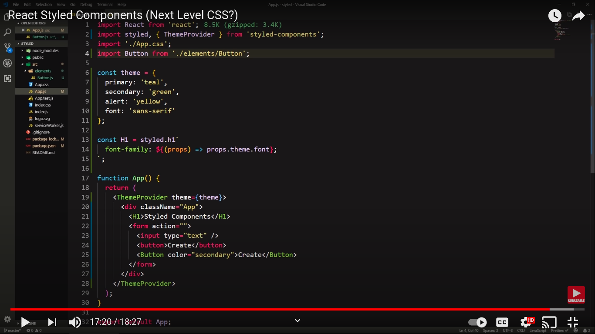
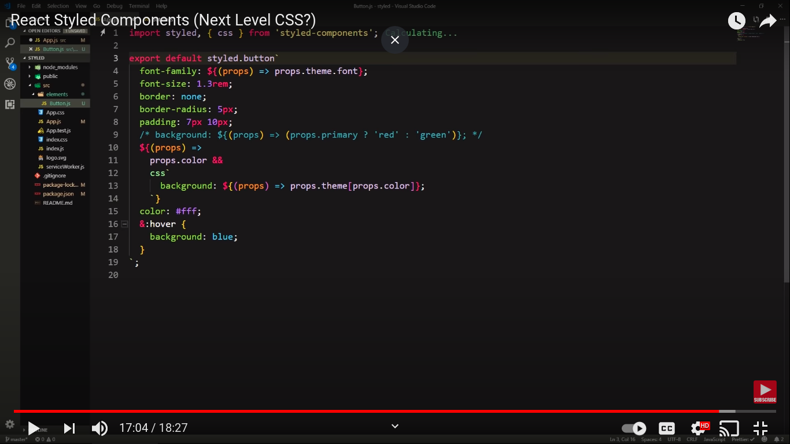
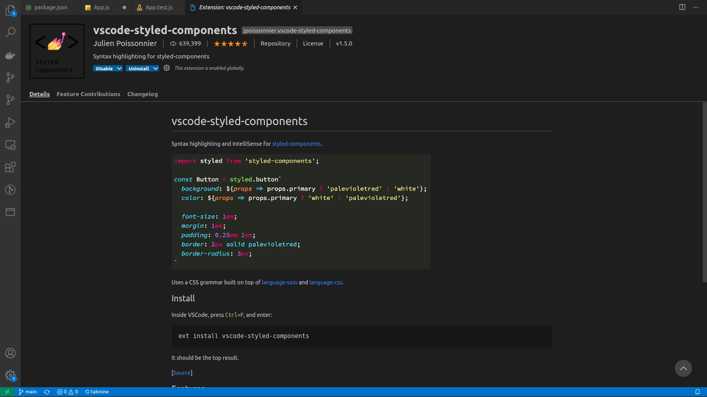

# Styled components

**How to wrap up Ant Design with Styled Components and TypeScript?**

https://stackoverflow.com/questions/52704785/how-to-wrap-up-ant-design-with-styled-components-and-typescript

**Multiple inheritance (Composition) #773**

https://github.com/styled-components/styled-components/issues/773

https://styled-components.com/docs/advanced

**Styled Components: To Use or Not to Use?**

https://medium.com/building-crowdriff/styled-components-to-use-or-not-to-use-a6bb4a7ffc21

**how to select first child in style component using css selector**

```jsx showLineNumbers
const Text = styled.p`  font-size: 12px;
  color: blue;
  &.colors {
    margin-bottom: 20px;
    color: red !important;
  }`;

 <div>
    <p>I am just regular text</p>
    <p>Me too</p>
    <Text className=""colors"">Hello Joe</Text>
    <Text>Goodbye</Text>
</div>
```

https://stackoverflow.com/questions/54008865/target-first-child-css-styled-components

Not target last element in styled component
OR how can I not select last element of styled component

```js showLineNumbers
const ListItem = styled.div`
display: flex;
justify-content: space-between;
align-items: center;
padding: 10px;
background-color: ${themeColor.white};
border-radius: 5px;
p {
margin-bottom: 0px;
font-size: 14px;
}
&:not(:last-of-type) {
margin-bottom: 10px;
}
```

https://stackoverflow.com/questions/63608257/how-can-i-not-select-last-element-of-styled-component

## styled components


Visual primitives for the component age. Use the best bits of ES6 and CSS to style your apps without stress

```jsx showLineNumbers
Example;

import React from "react";

import styled from "styled-components";

// Create a <Title> react component that renders an <h1> which is
// centered, palevioletred and sized at 1.5em
const Title = styled.h1`
  font-size: 1.5em;
  text-align: center;
  color: palevioletred;
`;

// Create a <Wrapper> react component that renders a <section> with
// some padding and a papayawhip background
const Wrapper = styled.section`
  padding: 4em;
  background: papayawhip;
`;

// Use them like any other React component – except they're styled!
<Wrapper>
  <Title>Hello World, this is my first styled component!</Title>
</Wrapper>;
```

Example: 2;




Reference:
https://www.youtube.com/watch?v=3SpAg5tr7Ws&ab_channel=Classsed
https://github.com/styled-components/styled-components

Install this greate Vscode extension for styled components styling intellisense:


