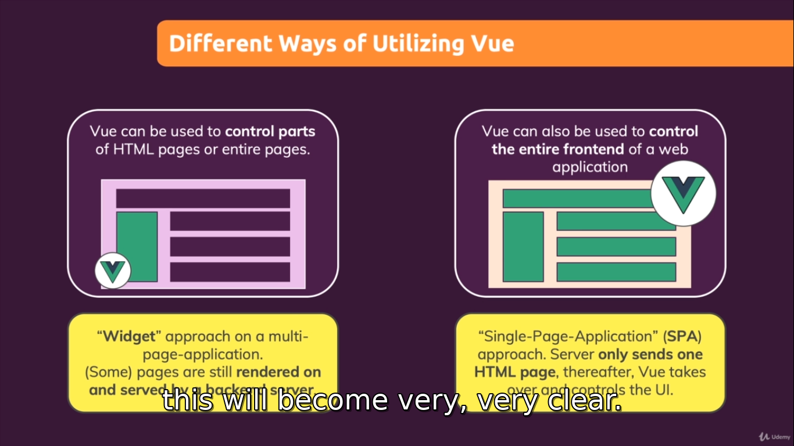
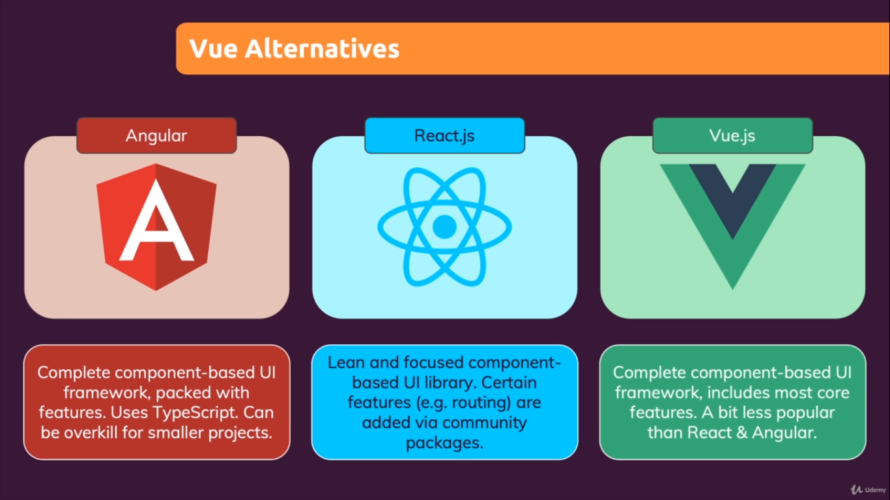
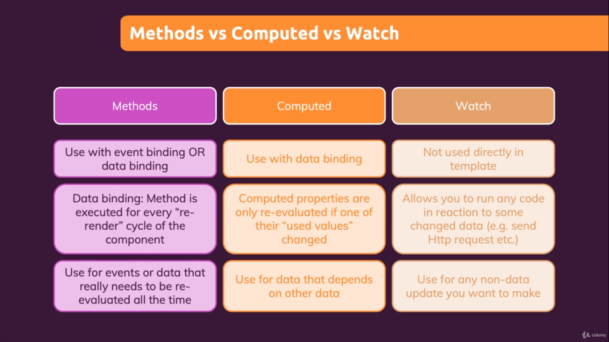
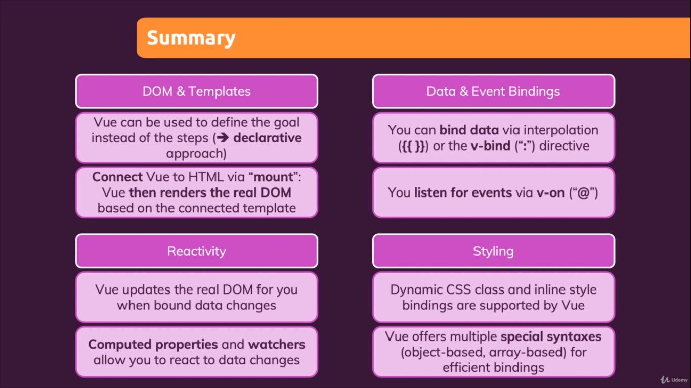
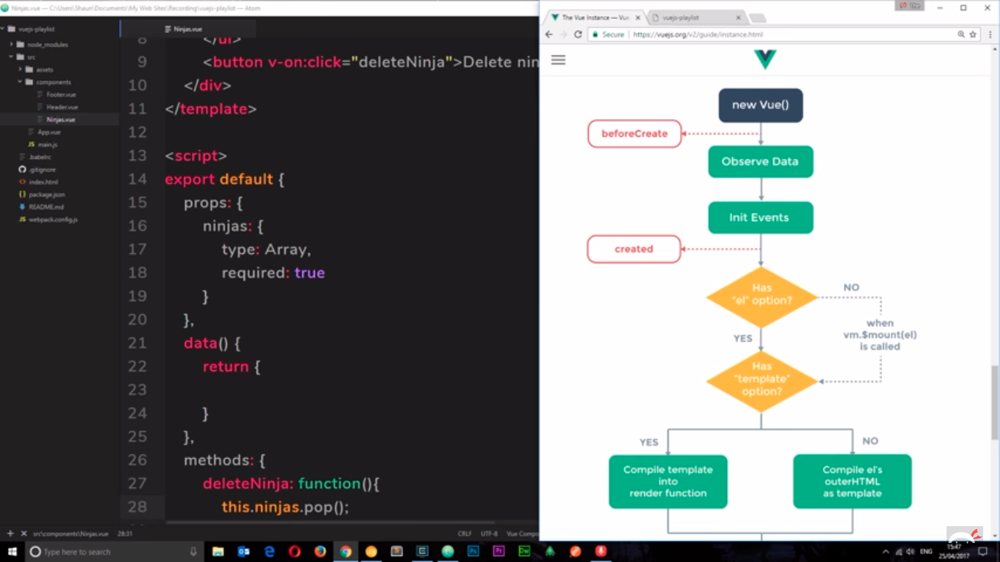
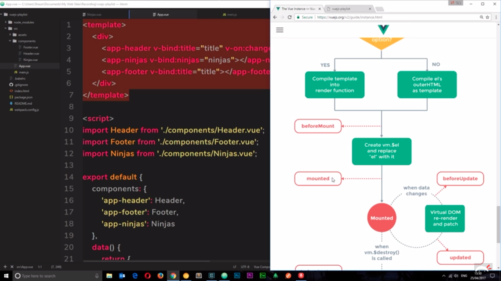
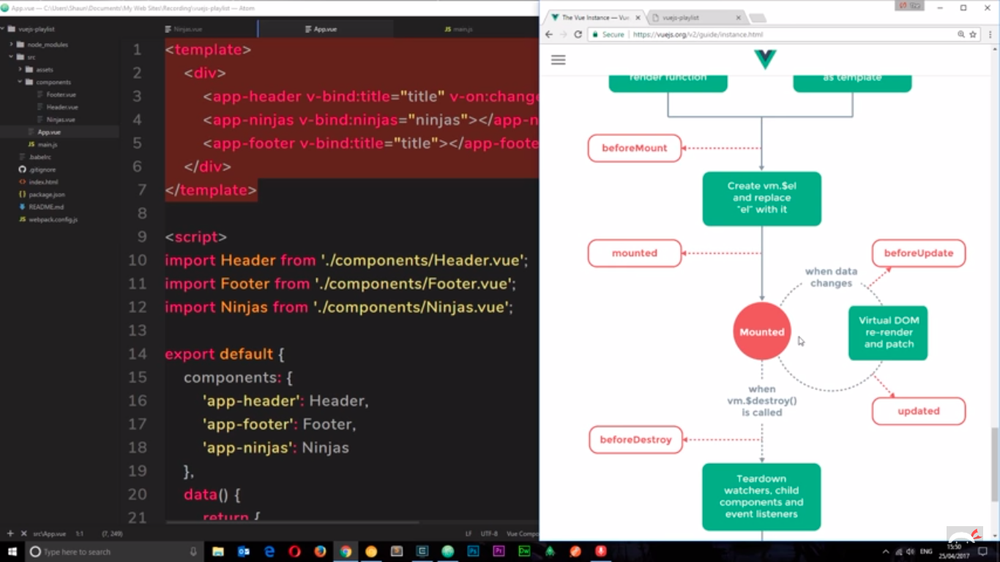
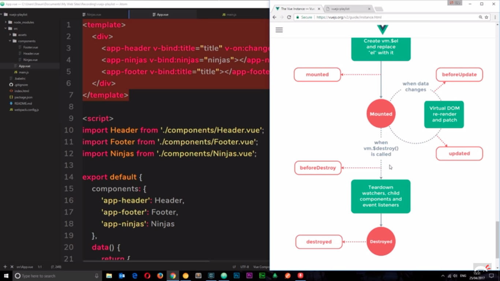

# VueJs Interview Questions

https://github.com/sudheerj/vuejs-interview-questions

**Vue js:**

Vue js is a complete reactive (live changes on DOM) web application framework
Framework means it have its complete modules for routing and state management etc
Just like Angular is a complete framework

**For Learning Vuex :**

[Vuex Learning](./vuex.md)





### Cheat sheet Vue js:

1. One Vue app can control one part in the html code and all its child elements but not outside the html element.

2. **Vue uses a declarative approach** ( We just declare the goal we don't care about the steps of getting it there)
   We mark the parts which are dynamic using directives and etc and Vue will then do the rest for us it does all the things behind the scenes and updates the real dom on our behalf

3. you dont wanna use computed and data property with the same name but in watchers both are same

4. sequence of defining data , watch and computed properties doesn’t matter in Vue JS you can define anyone in any sequence it won’t affect on execution.

**Vue supports two way data binding:**

via the v-model property. In the below example, if you type in the input, Vue will display your changes in the h1 element.03-Jul-2019

In order to use Vue Js first we have to createApp in Vue Js and mount it.

```jsx showLineNumbers
const app = Vue.createApp({
  data: () => {
    return {
      courseGoal: "Finish the course and learn Vue!",
    };
  },
});

app.mount("#user-goal"); //to establish connection of Vue to html page
```

{{ }} this syntax is called interpolation (if string in it then string interpolation means we can ref the properties that are part of the object in data )

> One imp thing it is only available in the component /element of html that you have mount in Vue not available outside of that element in html

### Vue Directives:

If you want to use dynamic variable in element attribute value like href in anchor tag then we will have to use Vue directive for bind the value to element property

#### V-bind: (to bind the values of attributes)

The directive name is `v-bind`

e.g v-bind:property-name=”var”

```jsx showLineNumbers
v-bind:href="vueLink"
```

#### All Vue directives start with v-

We can also called functions in html as we call in app.js
Only those methods are accessible in html that are defined in methods object only
We can't do any condition within interpolation syntax in html
E.g

```jsx showLineNumbers
   <h2>{{outputGoal()}}</h2
```

#### THIS:

Vue js bind all the properties in data function in this.name behind the scene and this is done by Vue js doing some magic you can access these data properties in all Vue App like in methods

By default Vue does not support html interpretation because of security related issue of cross site scripting attack issues so this is good.

#### V-html: (to interpret the content as html)

E.g
It can both accept var and functions in it and text and html

index.html

```jsx showLineNumbers
   <p v-html="courseGoalC"></p>
   <p v-html="outputGoal()"></p>

   courseGoalC: "<h3>Course Goal HTML interpreted</h3>",


app.js
data() {
   return {
     courseGoal: "Course Goal",
     courseGoalA: "Finish the Basic course of Vue!",
     courseGoalB: "Finish the Master course of Vue!",
     courseGoalC: "<h3>Course Goal HTML interpreted</h3>",
     vueLink: "https://vuejs.org/",
   };
 },
 //methods is an object
 methods: {
   outputGoal() {
     let randomNumber = Math.random();
     if (randomNumber < 0.5) {
       return this.courseGoalA;
     } else {
       return this.courseGoalC;
     }
   },
```

#### Understand Event Binding :

#### V-on:

```jsx showLineNumbers
<button v-on:click="counter++">Add</button>

<!-- both syntax are allowed in Vue js -->

<button v-on:click="add">Add</button>
<button v-on:click="add()">Add</button>
```

#### Passing params

```jsx showLineNumbers
<button v-on:click="add(5)">Add 5</button>
```

#### v-on:input=”function”:

```jsx showLineNumbers
   <input type="text" v-on:input="setName" placeholder="Enter your name" />


setName(event) {
     this.name = event.target.value;
   },
```

OR

**$event** : (dollar sign event) **or passing multiple params**

```jsx showLineNumbers
<input type="text" v-on:input="setName($event,'Khan')" placeholder="Enter your name" />

 setName(event, surname) {
     this.name = event.target.value + surname;
 },
```

#### v-on:submit=”function”

```jsx showLineNumbers

Form directive we can use in form

  <form v-on:submit="submitForm">
     <input type="text" />
     <button>Sign Up</button>
   </form>

 submitForm(event) {
     event.preventDefault();
     alert("submit");
   },

```

    				OR

**We can use event modifier like .prevent**

```jsx showLineNumbers
  <form v-on:submit.prevent="submitForm">

 submitForm(event) {
     console.log("submit");
   },
```

Here we have stop modifier for stopping propagation :

```jsx showLineNumbers
<form v-on:submit.stop="submitForm">

```

Button action/click called with mouse left right and middle click

```jsx showLineNumbers
<button v-on:click.right="add(5)">Add 5</button>
<button v-on:click.left="add(5)">Add 5</button> // be default
<button v-on:click.middle="add(5)">Add 5</button>
```

#### V-on:keyup=”function”

(called when any key press)

```jsx showLineNumbers
<input
  type="text"
  v-on:input="setName($event,'Khan')"
  v-on:keyup="confirmInput"
  placeholder="Enter your name"
/>
```

#### v-on:keyup.enter="confirmInput"

```jsx showLineNumbers
Called when enter key pressed we can change keyboard keyname

<input type="text" v-on:input="setName($event,'Khan')" v-on:keyup.enter="confirmInput"
placeholder="Enter your name" />
```

#### V-once: to log the initial state of a variable on Vue

Directive to preserve the initial state of a property / variable
It will not be changes or updating after getting initial first value

```jsx showLineNumbers
#### <p v-once>Starting Counter: {{ counter }}</p>
```

#### v-bind:value="name"

To reset input value on btn click we have to bind input value with some variable

```jsx showLineNumbers
<input type="text" v-on:input="setName($event,'Khan')" v-on:keyup.enter="confirmInput" v-bind:value="name" />
<p>Your name : {{ name }}</p>
<p>Your confirm name : {{ confirmName }}</p>
<button v-on:click="resetInput">Reset input</button>

resetInput() {
this.name = "";
},

```

**reactivity feature :**

#### 2 way binding in Vue js using v-model

Because we are listening to events coming out of the input element and at the same time we are writing value back to the input element through its value attribute/property.

**V-model:**

We can get rid of all of that
**v-bind:value=”var” and v-on:input=”func”**

By using
v-model=”take data prop which we need to manage to”

#### Not recommended :

Not better approach (not recommended)

```jsx showLineNumbers
 <p>{{outputFullName()}}</p>

outputFullName()
console.log("outputFullName");
if (this.name === "") {
return "";
}
return this.name + " " + "Shah";
},
```

Because this func called whenever any thing change in DOM which is performance issue

2nd solutions :
To fix this issue we can use like this this will only change when name var changes

```jsx showLineNumbers
<p>{{name + " " + "Shah"}} </p>
```

But now we have more login in our HTML which is not recommended

reactivity feature :

3rd solution :

#### Computed Properties :

Computed properties change when any property in computer properties changes only
So in computed properties vue is aware of the dependencies of the computed properties so in this case name is a dependency and it will cache the computed properties value and only recalculate and reevaluate it if one of the dependencies is change
For performance its better to use computed properties in methods for outputting values

We have to pass directly without calling functions

```jsx showLineNumbers
   <p>{{fullname}} </p>


 computed: {
fullname() {
     console.log("fullname");
     if (this.name === "") {
       return "";
     }
     return this.name + " " + "Shah";
   },
 },
```

When you need to change the data you use methods
And when you need to change the presentation of existing data you use computer properties

https://vueschool.io/lessons/vuejs-computed-properties?friend=vuejs

**Reactivity feature :**

#### Watchers: (it automatically detect the changes for you)

It’s an object which have functions in it
You can use watchers instead of computer properties
Watcher is just a function you can tell Vue to execute when one of its dependencies changed
Ok that sounds like computer properties

If you wanna execute code when something change then watchers is helpful than computed properties

E.g

```jsx showLineNumbers

data() {
return {
counter: 0,
name: "",
confirmName: "",
completeName: "",
};
},
watch: {
// whenever name property change in data this watcher function will run
name(newVal, oldVal) {
// console.log("newVal, oldVal in watch", newVal, oldVal);
if (newVal === "") {
this.completeName = "";
} else {
this.completeName = newVal + " " + "Khan";
}
},
},
```

Q. Can you watch a computed property vue using a watch ?
`Watching computed properties:`

You can put a watcher on any reactive property. This includes computed props, props, as well as data that is specified inside of data() on your Vue component. ... Watched props are really powerful, but many times I accidentally use a watcher when all that I needed was a computed property.
Ref: https://stackoverflow.com/questions/41067378/watching-computed-properties

E.g : 1

```jsx showLineNumbers

const app = Vue.createApp({
data() {
return {
counter: 0,
name: "",
confirmName: "",
completeName: "",
};
},
watch: {
number(newVal, oldVal) {
alert("number changed");
},
},
computed: {
number() {
return this.name + " " + "lastname";
},
},
}
```

E.g: 2

```jsx showLineNumbers
// Yes, you can set up a watcher on computed property, see the fiddle.

// Following is the code to set watch on computed property:

const demo = new Vue({
el: "#demo",

data() {
return {
age: "",
};
},

computed: {
doubleAge() {
return 2 \* this.age;
},
},

watch: {
doubleAge(newValue) {
alert(`yes, computed property changed: ${newValue}`);
},
},
});
```

**Recap:**



**Shortcuts for v-on and v-bind:**

v-on: -> can be replaced with @
v-bind: -> can be replaced with just colon : (omit v-bind)

E.g

```jsx showLineNumbers
<input type="text" v-on:input="setName($event,'Khan')" v-on:keyup.enter="confirmInput" v-bind:value="name" />

```

Can be written as

```jsx showLineNumbers
<input type="text" @input="setName($event,'Khan')" @keyup.enter="confirmInput" :value="name" />
```

These shortcuts provided by vue js in order to make code easier and prettier
So if you do use it, use it for all events, not just some , and I’m going to use it through out the course btw

There is not shortcut for `v-model` btw

#### Dynamic styling:

v-bind:style=”” OR :style=””

Usage

```jsx showLineNumbers
<div class="demo" :style="{'border-color':'red'}" @click="boxSelected('A')"></div>
```

Or

This is recommended:

```jsx showLineNumbers
<div class="demo" :style="{borderColor:'red'}" @click="boxSelected('A')"></div>
```

Both ways are acceptable

**Ternary operator in styling:**

```jsx showLineNumbers
<div class="demo" :style="{borderColor: boxASelected ? 'red' : '#ccc'}" @click="boxSelected('A')"></div>
```

Inline styles not recommended. Because its making our code unreadable and cumbersome and code is not optimized. Rather than class usage is preferred for reusability

Dynamic classes using ternary operator : not recommended in Vue

```jsx showLineNumbers
<div class="demo" :class="boxASelected ? 'demo active' : 'demo'" @click="boxSelected('A')"></div>
```

We have another proper nice syntax to write this

```jsx showLineNumbers
<div :class="{demo:true, active:boxASelected}" @click="boxSelected('A')"></div>
```

`:class` bind dynamic class to html element

More improve
class=”demo” this one is not dynamic class binded

```jsx showLineNumbers
<div class="demo" :class="{active:boxASelected}" @click="boxSelected('A')"></div>
```

#### SUMMARY OF 2. Basics & Core Concepts - DOM Interaction with Vue



`I have stopped learning from 18 Feb 2021 because I moved to react for interviews and build sample projects using react advance concepts.`

Continue from this place
Training Vuejs

1. Vue Behind the scenes 9\*10=90/60=1.5hr
   made branch named as

2. Rendering Conditional Content & Lists

#### Environment variables in Vue Js .

Prefix should be ( VUE*APP* )
No need to install any other extra dotenv library
E.g

VUE_APP_TITLE=My App (staging)

https://cli.vuejs.org/guide/mode-and-env.html#environment-variables

#### Vue js Lifecycle methods

1. beforeCreate()
2. created() It's better to done some side effect in created life cycle hook //good for fetching data
3. beforeMount()
4. mounted() //it's a good to manipulate a DOM once its been mounted
5. beforeUpdate : if vue detects a change that is gonna occur in this component and it will run this before the change is updated in the DOM
6. updated ():run after the DOM has been updated and it has been rerendered

Ref https://www.youtube.com/watch?v=8rn3SK4N8Go&ab_channel=TheNetNinja

OR

```jsx showLineNumbers
export default {
  beforeCreate() {
    console.log("beforeCreate");
  },
  created() {
    console.log("created");
  },
  beforeMount() {
    console.log("beforeMount");
  },
  mounted() {
    console.log("mounted");
  },
  beforeUpdate() {
    console.log("beforeUpdate");
  },
  updated() {
    console.log("updated");
  },
  beforeDestroy() {
    console.log("beforeDestroy");
  },
  destroyed() {
    console.log("destroyed");
  },
};
```









Ref: https://v3.vuejs.org/api/options-lifecycle-hooks.html
