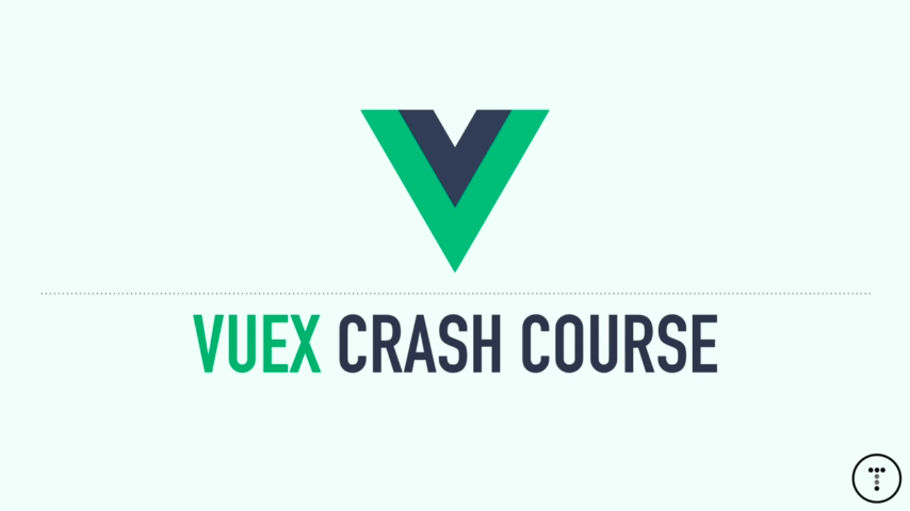
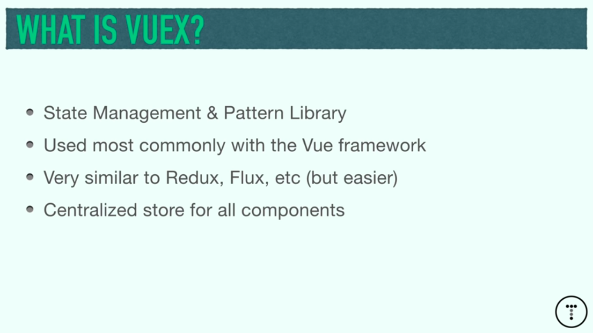
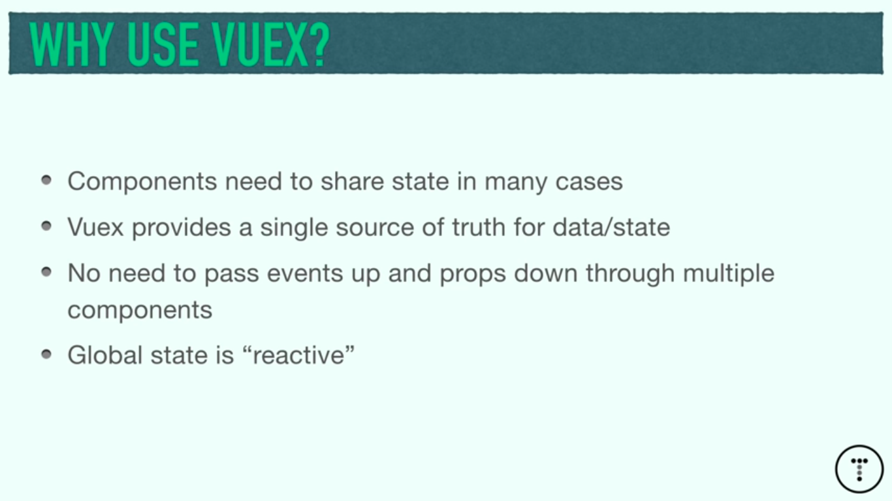
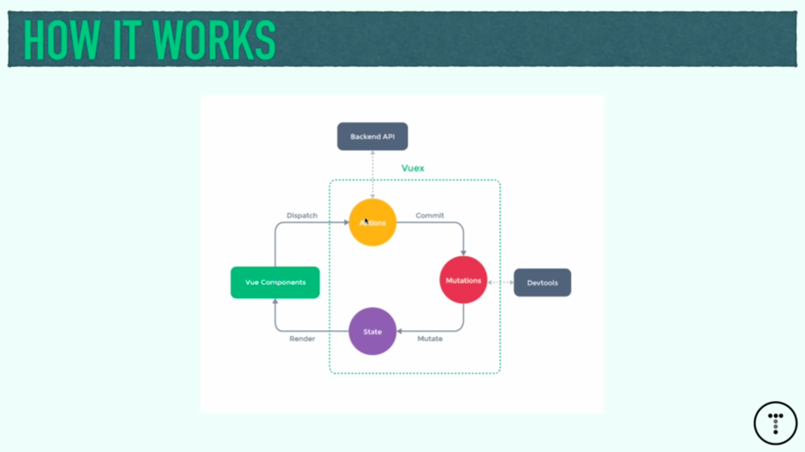
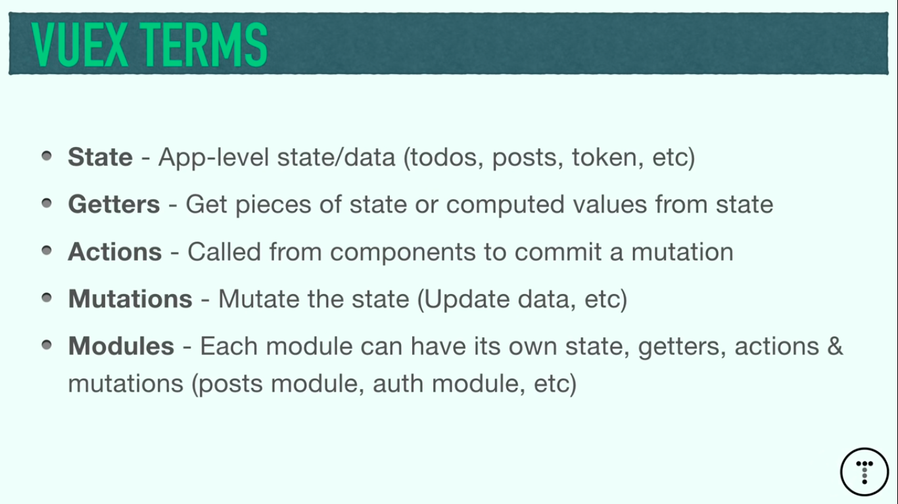
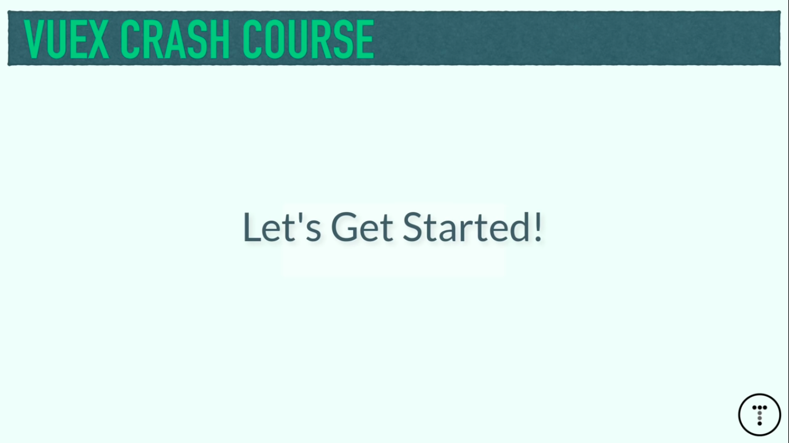
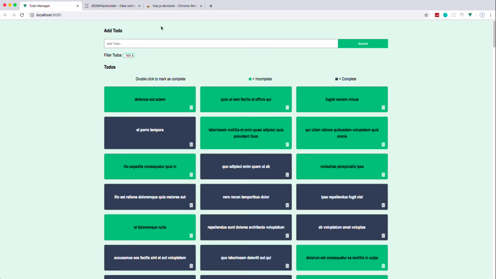
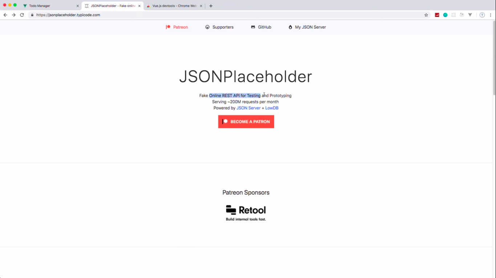
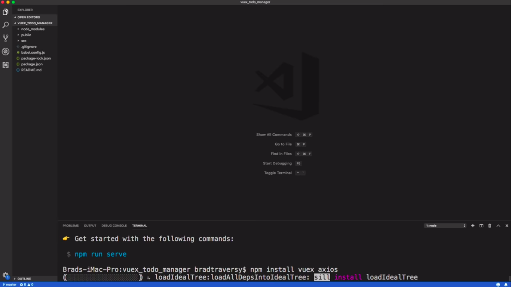

# VueJs



















## Vue js cheat sheet | commands

v-model="enteredvalue" //for input
v-on:click="addGoal" // for button

```jsx showLineNumbers
<li v-for="goal in goals">{{ goal }}</li>
```

{{courseGoal}} //interpulation for outputing variable value
v-bind href=""

vuex statemanagement like redux
vue cdn (for small apps)
vue cli (use for build big apps) like react cli recommended

npm install -g vue/cli
vue ui
vetur for highlighting and code formatting vue js
https://github.com/octref/veturpack
a component made of three things
1-template
2-script tag
3-style component

vue js life cycle events
1.created :when componnets loads make http req

```jsx showLineNumbers
onDelete(id){
this.#emit('delete-task',id)
}

:class="[task.reminder ? 'reminder' : '', 'task']"

npm run build

server for serving prod build
npm install -g serve
open new terminal
serve -s ./dist/
```

                                    │

│ Serving! │
│ │
│ - Local: http://localhost:5000 │
│ - On Your Network: http://192.168.0.101:5000 │
│ │
│ Copied local address to clipboard! │
│ │

~backend

```jsx showLineNumbers
npm install json-server
"backend": "json-server --watch db.json --port 5000"

devServer proxy(in vue.config.js)
```

create vue.config.js

```jsx showLineNumbers
module.exports = {
  devServer: {
    proxy: {
      "^/api": {
        target: "http://localhost:5000",
        changeOrigin: true,
        logLevel: "debug",
        pathRewrite: { "^/api": "/" },
      },
    },
  },
};
```

**restart frontend server**

routing in vue

its install with vue/cli when you create boilerplate
if not installed before then do manually like
npm i vue-router@next

next deploy this app to github pages

### learning material

1. **Vue school.io**

https://vueschool.io/lessons/what-do-i-need-to-take-the-vue-3-masterclass

2. **Vue js crash course**

https://www.youtube.com/watch?v=qZXt1Aom3Cs&ab_channel=TraversyMedia highly recommeded I have learned vue js from this video

### Vuejs devtool

Devtool not detecting

Finally I found an answer: If you still have this problem, you can try to uninstall the current version of Vue extension and install beta version:

https://stackoverflow.com/questions/41215867/why-is-vue-js-chrome-devtools-not-detecting-vue-js

https://chrome.google.com/webstore/detail/vuejs-devtools/ljjemllljcmogpfapbkkighbhhppjdbg/related

open app again in new tab and it works

doesn't requires and code configuration

## Vuejs R&D

### Packages

https://next.vuex.vuejs.org/#what-is-a-state-management-pattern

https://www.npmjs.com/package/qs

### Vuejs Frontend Libraries

`No Vuejs Frontend Libraries Github stars`

1. Element UI 49.6k https://element.eleme.io/#/en-US/component/drawer
2. vuetify 30k
3. iview 23.8k
4. vuepress 18.6k
5. quasar 18.1k
6. vux 17.4k
7. mint-ui 16.3k
8. bootstrap-vue 13k
9. vue-material / Vue Material 9.3k
10. cube-ui 8.7K
11. buefy 8.5k
12. OnsenUI 8.3k
13. Muse UI 8.2k
14. vuesax 4.9k
15. Keen-UI 4k
16. eagle.js 4k
17. vue-antd Archived 1.7K
18. Vueblu / vue-blu 1.6K
19. VueTailwind 1.2k
20. PrimeVue 1.1k
21. at-ui 2.3k
22. vuikit 1.5k
23. Semantic-UI-Vue 915
24. uiv 883
25. fish-ui 864
26. Framework 7 Vue 682 framework7-vue Archived
27. coreui-vue 324
28. vue-material-kit 233 https://github.com/creativetimofficial/vue-material-kit | Vue Material Kit

References:

https://x-team.com/blog/11-top-vue-libraries/
https://blog.logrocket.com/top-10-vue-component-libraries-for-2020/

Top 10 Vue component libraries for 2020 : https://www.codeinwp.com/blog/vue-ui-component-libraries

15 of the Most Interesting Vue UI Component Libraries for 2021 : https://athemes.com/collections/vue-ui-component-libraries/

14 Best Vue UI Component Libraries 2021 : https://hackernoon.com/21-top-vue-js-ui-libraries-for-your-app-4556e5a9060e

21 Top Vue.js UI Libraries For Your App : https://www.esparkinfo.com/vue-component-library.html

The Top Vue Component Library For Developers :
https://javascript.plainenglish.io/top-10-vue-libraries-fe191b13ff1e
