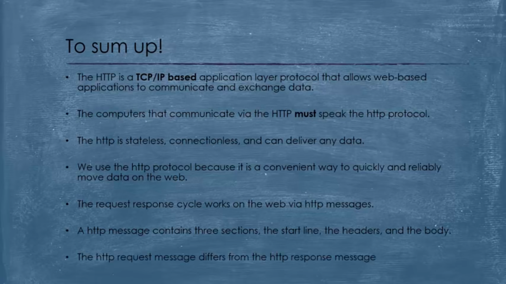

# How web works | web interview questions

**Live mock Technical interview Javascript**

https://www.youtube.com/watch?v=057Rs6CgJnY&ab_channel=Codementor

Questions he ask in this interview and he also answer the questions

**Explain Http request :**

secure sockets layer

SSL Stands for secure sockets layer. Protocol for web browsers and servers that allows for the authentication, encryption and decryption of data sent over the Internet.

https negotiation steps

https://medium.com/@kasunpdh/ssl-handshake-explained-4dabb87cdce

How http and https works

https://www.codecademy.com/articles/http-requests
https://www.youtube.com/watch?v=hExRDVZHhig&ab_channel=PowerCertAnimatedVideos
https://www.youtube.com/watch?v=CFzgKfnmG-Q&ab_channel=PrettyPrinted
https://www.youtube.com/watch?v=eesqK59rhGA&ab_channel=TheTechCave

**Explain CORS :**

**What is web hooks**

**Webhook**

Description
A webhook in web development is a method of augmenting or altering the behavior of a web page or web application with custom callbacks. These callbacks may be maintained, modified, and managed by third-party users and developers who may not necessarily be affiliated with the originating website or application

https://zapier.com/blog/what-are-webhooks/
